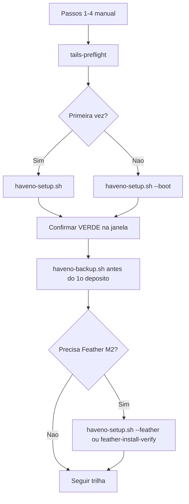

# Manual dos scripts de automação

> **Para quem?** Aluno **novato** que quer usar os scripts com segurança — sem precisar ser expert em Linux.
>
> **Não substitui** a [trilha linear](README.md#trilha-linear) nem o [livro](MANUAL-DO-CURSO.md). Use este manual **junto** com o passo do hub em que você está.

**Mapa rápido:** [README — trilha script-first](README.md#trilha-script-first) · [Scripts Tails](Tails-OS-Expert/Scripts/README.md) · [Scripts Whonix](Whonix-Online/Scripts/README.md)

---

## Antes de qualquer script (sempre manual)

Nenhum script grava o pendrive nem cria a persistência por você. **Termine isto na mão** (Playbooks §1–4):

| # | O quê | Por quê |
|---|--------|---------|
| 1 | Tails gravado no USB + boot | Os scripts só rodam **dentro** do Tails |
| 2 | Tor conectado | Download e Haveno dependem do Tor |
| 3 | Armazenamento persistente + **Dotfiles** | Scripts e carteira ficam em `~/Persistent/` |
| 4 | Senha de **administrador** na sessão (+ Mais opções no boot) | `install.sh` e onion-grater precisam de admin |

**Checagem automática:** `~/Persistent/tails-preflight.sh` — só **lê** o ambiente; não altera nada.

---

## Regra de ouro (leia uma vez)

| Os scripts **fazem** | Os scripts **não fazem** |
|----------------------|---------------------------|
| Instalar/verificar Haveno e Feather (PGP) | Gravar USB, criar persistência, ativar admin |
| Abrir o Haveno e corrigir onion-grater | Garantir indicador **verde** (você confirma na janela) |
| Criar **novos** backups cifrados (com data no nome) | Anotar **seed** no papel (só na interface do app) |
| Atualizar o `.deb` do Haveno (com backup antes) | Atualizar o **sistema Tails** (use Tails Upgrader) |
| Verificar imagem Whonix no PC host (Linux) | Importar VM, cold-signing, trades, disputas |

**Instalar ≠ tradear.** Verde = instalação OK. Tradear é decisão sua, com cautela.

---

## Instalar os scripts (uma vez por persistência)

1. Abra **Arquivos** → pasta `Tails-OS-Expert/Scripts`.
2. Selecione **todos** os arquivos `*.sh` + `haveno-backup.desktop`.
3. **Copiar** → colar em **Casa → Persistent** (`/home/amnesia/Persistent`).
4. No Terminal:

```bash
chmod +x ~/Persistent/*.sh
```

**OK se:** `ls ~/Persistent/haveno-setup.sh` existe e `~/Persistent/tails-preflight.sh` roda sem “permission denied”.

> Copiar de novo por cima **só substitui os scripts** — não mexe em `~/Persistent/haveno/Data/` nem em carteiras Feather.

---

## Comando principal: `haveno-setup.sh`

Use este **orquestrador** se você é novato. Ele chama os outros scripts na ordem certa.

### Sem flags (1ª vez — Haveno ainda não instalado)

```bash
~/Persistent/haveno-setup.sh
```

**O que acontece:**

1. `tails-preflight.sh` — valida passos 1–4  
2. `haveno-auto.sh` — baixa (se preciso), instala, abre Haveno, corrige onion-grater  
3. Pergunta se quer rodar **backup** agora (responda `s` ou `N`)

**Quando usar:** passo **2** da trilha — primeira instalação até o verde.  
**Rodar 2× por acidente:** na 2ª vez o Haveno **já está instalado** — o auto **pula** o download (não apaga `Data/`). Pode abrir **outra** janela do Haveno; feche duplicatas no menu. **Nada é sobrescrito** na pasta de dados.

---

### `--boot` (cada nova sessão no Tails)

```bash
~/Persistent/haveno-setup.sh --boot
```

**O que acontece:** preflight → `haveno-boot.sh` (Playbook §7: `install.sh` + `exec.sh` + onion-grater).

**Quando usar:** passo **7** — todo boot depois que o Haveno já foi instalado **uma vez**.  
**Por quê:** o Tails é amnésico; cada sessão precisa do ritual de boot do Haveno.  
**Rodar 2×:** seguro para dados; pode pedir admin de novo e abrir o app outra vez. Feche janelas extras.

---

### `--feather` (Feather no Tails — passo 5 / pré-requisito M2)

```bash
~/Persistent/haveno-setup.sh --feather
```

**Combinações:**

| Comando | Significado |
|---------|-------------|
| `haveno-setup.sh --feather` | 1ª vez Haveno **+** verificar/instalar Feather |
| `haveno-setup.sh --boot --feather` | Sessão normal **+** Feather (se ainda não verificou) |
| `haveno-setup.sh --skip-backup --feather` | 1ª vez sem perguntar backup **+** Feather |

**Antes de `--feather`:** baixe pelo **Tor Browser** em [featherwallet.org/download](https://featherwallet.org/download):

- `featherwallet.asc`
- `feather-…AppImage` + `feather-…AppImage.asc` (par da mesma versão)

O script **move** os arquivos de `~/Tor Browser/Browser/Downloads/` para `~/Persistent/feather/` e verifica PGP. **Não cria carteira** — isso é na interface do Feather (seed no papel).

**Rodar 2×:** se os arquivos já estão em `~/Persistent/feather/`, a 2ª execução **re-verifica** o mesmo par — não apaga carteiras em `wallets/`.

---

### `--skip-backup`

```bash
~/Persistent/haveno-setup.sh --skip-backup
```

Pula a pergunta “rodar backup agora?”. Use se você **já** fez backup ou fará logo depois com `haveno-backup.sh`.

**Não desativa** backup em `haveno-update.sh` — atualizar sem backup continua bloqueado lá (a menos que use `--no-backup` no update, **não recomendado**).

---

## Tabela: todos os scripts Tails

| Script | Quando executar | Por quê | Rodar 2× sem apagar dados? |
|--------|-----------------|---------|----------------------------|
| **`tails-preflight.sh`** | Antes de qualquer outro; ou deixe o `haveno-setup` fazer | Garante USB/Tor/persistência/admin | **Sim** — só leitura |
| **`haveno-setup.sh`** | Novato: use sempre em vez dos scripts soltos | Ordem correta | **Sim** — ver seções acima |
| **`haveno-auto.sh`** | 1ª instalação (ou se preferir script direto) | Install → verde | **Sim** — pula reinstall se já instalado |
| **`haveno-boot.sh`** | Cada sessão (equivalente a `--boot`) | Playbook §7 | **Sim** — pode abrir 2 janelas |
| **`haveno-backup.sh`** | Antes do 1º depósito; periodicamente | Proteger `Data/` | **Sim** — cada run gera arquivo **novo** com data/hora |
| **`haveno-update.sh`** | Release novo da rede | `.deb` novo com PGP | **Sim** — faz backup **antes**; aborta se backup falhar |
| **`feather-install-verify.sh`** | Após download no Tor Browser | PGP do Feather | **Sim** — não mexe em `wallets/` |
| **`feather-backup.sh`** | Após criar carteira Feather | Backup `wallets/` | **Sim** — arquivo novo com timestamp |
| **`haveno-verify-deb.sh`** | Dúvida se o `.deb` é autêntico | Auditoria Vol II §3 | **Sim** — só leitura |
| **`haveno-switch-network.sh`** | Trocar rede Haveno (ex. Aloha) | Vol II §8 | Cuidado: reinstall — **backup antes** (script pede) |
| **`post-session-check.sh`** | Depois de atualizar o **Tails** (SO) | Tor + onion-grater OK? | **Sim** — só checagens |

### Flags dos scripts individuais

#### `haveno-auto.sh`

```bash
~/Persistent/haveno-auto.sh              # padrao: install se necessario + abrir
~/Persistent/haveno-auto.sh --boot-only  # igual haveno-boot.sh
~/Persistent/haveno-auto.sh --update     # forca reinstall do .deb (dados preservados)
~/Persistent/haveno-auto.sh --no-clock   # nao ajusta relogio via Tor
~/Persistent/haveno-auto.sh --watch 15   # monitora log 15 min
```

| Flag | Quando | Seguro 2×? |
|------|--------|------------|
| `--update` | Versão nova ou reparar install | Sim — preserva `Data/` |
| `--boot-only` | Já instalado; só esta sessão | Sim |
| `--no-clock` | Relógio do Tails já OK | Sim |

#### `haveno-boot.sh`

```bash
~/Persistent/haveno-boot.sh
~/Persistent/haveno-boot.sh --watch 8
```

#### `haveno-backup.sh`

```bash
~/Persistent/haveno-backup.sh                    # cifrado em ~/Persistent/Backups/
~/Persistent/haveno-backup.sh --usb              # escolhe USB montado
~/Persistent/haveno-backup.sh --dest /caminho    # pasta fixa
~/Persistent/haveno-backup.sh --no-encrypt       # NAO recomendado
~/Persistent/haveno-backup.sh --restore ARQUIVO  # SOBRESCREVE Data/ — pede confirmacao
```

| Ação | Perigoso? |
|------|-----------|
| Backup normal | **Não** — cria `haveno-data-AAAAMMDD-HHMMSS.tar.gz.gpg` |
| `--restore` | **Sim, se confirmar** — salva `Data.bak-*` antes, mas pede `s/N` |
| Rodar backup 10× seguidas | **Não** — 10 arquivos diferentes (ocupa espaço) |

**Sempre feche o Haveno** antes do backup (o script avisa se o app estiver aberto).

#### `haveno-update.sh`

```bash
~/Persistent/haveno-update.sh --url "URL_DO_DEB" --pgp "FINGERPRINT"
```

| Flag | Uso |
|------|-----|
| `--url` / `--pgp` | Obrigatórios para versão nova (**mesma rede**) |
| `--no-backup` | **Evite** — pula backup antes de atualizar |

#### `haveno-switch-network.sh`

```bash
~/Persistent/haveno-switch-network.sh --url "URL" --pgp "FP"
```

Pede confirmação, roda backup, depois `haveno-update`. **Feche trades** antes.

---

## Fluxo visual (novato)



---

## Whonix (host Linux — não é no Tails)

Rode no **computador onde você vai instalar VirtualBox/KVM** — Debian, Ubuntu, etc.

### `whonix-verify-image.sh` (passo 10)

```bash
chmod +x whonix-verify-image.sh
./whonix-verify-image.sh /caminho/Whonix-*.ova /caminho/Whonix-*.ova.asc
./whonix-verify-image.sh --kvm Whonix-*.libvirt.xz Whonix-*.libvirt.xz.asc
```

| O quê | Detalhe |
|-------|---------|
| **Faz** | Baixa `derivative.asc`, confere fingerprint, `gpg --verify` da imagem |
| **Não faz** | Importar `.ova` no VirtualBox (manual) |
| **Rodar 2×** | **Sim** — só verifica de novo; não altera a imagem |
| **OK se** | `Good signature` + fingerprint `916B8D99…2EEACCDA` com seus olhos |

Detalhe: [Whonix-Online/Scripts/README.md](Whonix-Online/Scripts/README.md)

---

## O que **não** tem script (e por quê)

| Tarefa | Por quê manual |
|--------|----------------|
| Seed no papel / metal | Segurança física — humano anota |
| Trades, disputas, fiat | Julgamento e risco financeiro |
| Cold-signing (passos 9/12) | Air-gap, USB entre máquinas, conferir destino antes de assinar |
| Upgrade do **Tails** (SO) | Oficial só via Tails Upgrader |
| BIOS, Kleopatra (Windows), USB passthrough | GUI / hardware |

---

## FAQ — novato

### Rodei o script duas vezes sem querer. Perdi a carteira?

**Em geral, não.** Os scripts de install/boot **preservam** `~/Persistent/haveno/Data/`. Backup **adiciona** arquivos novos. O único fluxo que **substitui** dados é `haveno-backup.sh --restore` — e ele **pergunta** antes.

### O script pediu senha admin / GPG

- **Admin:** normal no Tails (+ Mais opções no boot).  
- **GPG no backup:** senha **do arquivo de backup** que você escolheu — não é a seed.

### Preflight falhou

Corrija o item listado (Tor, Dotfiles, admin) nos Playbooks §1–4. **Não** use `--no-backup` ou atalhos para “pular” preflight.

### Haveno abriu mas não está verde

Amarelo 5–20 min na 1ª vez é **normal**. Se persistir: Playbooks §8 ou Cap. 7 FAQ. Rodar `haveno-boot.sh` de novo é seguro.

### Quero só Feather, Haveno já está verde

```bash
~/Persistent/tails-preflight.sh
~/Persistent/feather-install-verify.sh
```

Ou: `~/Persistent/haveno-setup.sh --boot --feather` se já está na sessão habitual.

### Posso combinar `--boot` e `--feather`?

**Sim.**

```bash
~/Persistent/haveno-setup.sh --boot --feather
```

Ordem: preflight → boot Haveno → verificar Feather.

### Expert: posso ignorar este manual?

Sim. Use [Scripts/README.md](Tails-OS-Expert/Scripts/README.md) (matriz técnica) e os cabeçalhos `#!/bin/bash` de cada `.sh`.

---

## Checklist de segurança antes de depositar XMR

- [ ] `tails-preflight.sh` OK  
- [ ] Indicador **verde** (ou amarelo temporário entendido)  
- [ ] `haveno-backup.sh` executado pelo menos uma vez  
- [ ] **Seed** anotada no papel (Account → Wallet seed) — **fora** do backup automático  
- [ ] Se for tradear: leu Cap. 4 (exploit) e canais oficiais da rede  

---

*Manual dos scripts · Privacy-OS-Hub · jun/2026. Trilha: [README.md#trilha-linear](README.md#trilha-linear).*
