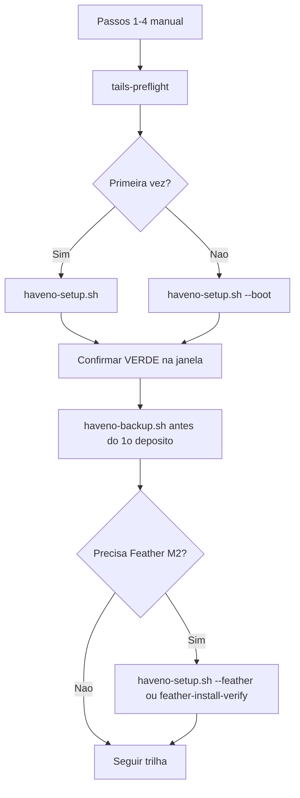

# Manual dos scripts de automação

> **Para quem?** Aluno **novato** que quer usar os scripts com segurança — sem precisar ser expert em Linux.
>
> **Não substitui** a [trilha linear](README.md#trilha-linear) nem o [livro](MANUAL-DO-CURSO.md). Use este manual **junto** com o passo do hub em que você está.
>
> **Primeira vez no hub?** Leia antes [README — Primeira visita?](README.md#primeira-visita). Só use scripts **depois** dos passos **1–4** manuais (Tails no USB, Tor, persistência, admin).

**Mapa rápido:** [README — trilha script-first](README.md#trilha-script-first) · [Scripts Tails](automacao/tails/README.md) · [Scripts Whonix](automacao/whonix-host/README.md) · [Matriz passo↔script (docs)](trilha/referencia/scripts-matriz.md)

> **Viu muitos `.sh` no gerenciador de Arquivos?** Abra o [**Apêndice A — Catálogo de cada arquivo**](#apêndice-a--catálogo-de-cada-arquivo-iniciante) — ficha de **todos** os arquivos da pasta `Scripts/`.

---

## Só estes comandos (iniciante)

Depois dos passos 1–4 manuais e de copiar os scripts para `~/Persistent/`:

| Situação | Comando |
|----------|---------|
| **1ª vez** (instalar Haveno) | `~/Persistent/haveno-setup.sh` |
| **Cada sessão** (novo boot no Tails) | `~/Persistent/haveno-setup.sh --boot` |
| **Feather** (passo 5 / pré-requisito M2) | `~/Persistent/haveno-setup.sh --feather` ou `--boot --feather` |

Os outros arquivos `.sh` existem para **avançado** ou são chamados **automaticamente** pelo `haveno-setup.sh`. Detalhe de cada um: [Apêndice A](#apêndice-a--catálogo-de-cada-arquivo-iniciante).

---

## Antes de qualquer script (sempre manual)

Nenhum script grava o pendrive nem cria a persistência por você. **Termine isto na mão** (Playbooks §1–4):

| # | O quê | Por quê |
|---|--------|---------|
| 1 | Tails gravado no USB + boot | Os scripts só rodam **dentro** do Tails |
| 2 | Tor conectado | Download e Haveno dependem do Tor |
| 3 | Armazenamento persistente + **Dotfiles** | Scripts e carteira ficam em `~/Persistent/` |
| 4 | Senha de **administrador** na sessão (+ Mais opções no boot) | `install.sh` e onion-grater precisam de admin |

**Checagem automática:** `~/Persistent/tails-preflight.sh` — só **lê** o ambiente; não altera nada.

**Validar com log:** rode com `--qa-log` (ou `haveno-setup.sh --qa-log`) e leia os `.txt` em `~/Persistent/qa-logs/` — [COMO-LER-SEUS-LOGS.md](automacao/docs-aluno/COMO-LER-SEUS-LOGS.md).

---

## Validar com logs (recomendado)

Depois de copiar os scripts para `~/Persistent/`:

```bash
chmod +x ~/Persistent/*.sh

# Exemplo — 1ª instalação com evidência:
~/Persistent/haveno-setup.sh --qa-log

# Após anotar seed no papel (passo 4):
~/Persistent/qa-confirm-seed-papel.sh

# Passo 9 — duas cópias físicas (Tails pode estar com Tor):
~/Persistent/qa-confirm-passo9.sh

# Passo 12 — depois do cold-signing offline:
~/Persistent/qa-confirm-passo12.sh

# Entregar à equipe (2º pendrive):
~/Persistent/qa-export-logs.sh --usb
```

| O log **contém** | O log **nunca contém** |
|------------------|------------------------|
| `RESULTADO: PASS` ou `FAIL` | As 25 palavras da seed |
| `Backup concluido:` · `Fingerprint OK:` | Senhas ou chaves completas |
| `CONFIRMACAO_HUMANA: ...=SIM` | TX ID completo |

**Glossário:** “offline” no hub pode ser **papel** (passo 4) ou **sem rede** (passo 12) — [README](README.md#trilha-linear).

---

## Regra de ouro (leia uma vez)

| Os scripts **fazem** | Os scripts **não fazem** |
|----------------------|---------------------------|
| Instalar/verificar Haveno e Feather (PGP) | Gravar USB, criar persistência, ativar admin |
| Abrir o Haveno e corrigir onion-grater | Garantir indicador **verde** (você confirma na janela) |
| Criar **novos** backups cifrados (com data no nome) | Anotar **seed** no papel (só na interface do app) |
| Atualizar o `.deb` do Haveno (com backup antes) | Atualizar o **sistema Tails** (use Tails Upgrader) |
| Verificar imagem Whonix no PC host (Linux) | Importar VM, cold-signing, trades, disputas |

**Instalar ≠ tradear.** Verde = instalação OK. Tradear é decisão sua, com cautela.

---

## Instalar os scripts (uma vez por persistência)

1. Abra **Arquivos** → pasta `modulos/m1-tails-haveno/Scripts`.
2. Selecione **todos** os arquivos `*.sh` + `haveno-backup.desktop`.
3. **Copiar** → colar em **Casa → Persistent** (`/home/amnesia/Persistent`).
4. No Terminal:

```bash
chmod +x ~/Persistent/*.sh
```

**OK se:** `ls ~/Persistent/haveno-setup.sh` existe e `~/Persistent/tails-preflight.sh` roda sem “permission denied”.

> Copiar de novo por cima **só substitui os scripts** — não mexe em `~/Persistent/haveno/Data/` nem em carteiras Feather.

---

## Comando principal: `haveno-setup.sh`

Use este **orquestrador** se você é novato. Ele chama os outros scripts na ordem certa.

### Sem flags (1ª vez — Haveno ainda não instalado)

```bash
~/Persistent/haveno-setup.sh
```

**O que acontece:**

1. `tails-preflight.sh` — valida passos 1–4  
2. `haveno-auto.sh` — baixa (se preciso), instala, abre Haveno, corrige onion-grater  
3. Pergunta se quer rodar **backup** agora (responda `s` ou `N`)

**Quando usar:** passo **2** da trilha — primeira instalação até o verde.  
**Rodar 2× por acidente:** na 2ª vez o Haveno **já está instalado** — o auto **pula** o download (não apaga `Data/`). Pode abrir **outra** janela do Haveno; feche duplicatas no menu. **Nada é sobrescrito** na pasta de dados.

---

### `--boot` (cada nova sessão no Tails)

```bash
~/Persistent/haveno-setup.sh --boot
```

**O que acontece:** preflight → `haveno-boot.sh` (Playbook §7: `install.sh` + `exec.sh` + onion-grater). *(Nota: `install.sh` e `exec.sh` são scripts internos do pacote Haveno `.deb`, não fazem parte deste repositório.)*

**Quando usar:** passo **7** — todo boot depois que o Haveno já foi instalado **uma vez**.  
**Por quê:** o Tails é amnésico; cada sessão precisa do ritual de boot do Haveno.  
**Rodar 2×:** seguro para dados; pode pedir admin de novo e abrir o app outra vez. Feche janelas extras.

---

### `--feather` (Feather no Tails — passo 5 / pré-requisito M2)

```bash
~/Persistent/haveno-setup.sh --feather
```

**Combinações:**

| Comando | Significado |
|---------|-------------|
| `haveno-setup.sh --feather` | 1ª vez Haveno **+** verificar/instalar Feather |
| `haveno-setup.sh --boot --feather` | Sessão normal **+** Feather (se ainda não verificou) |
| `haveno-setup.sh --skip-backup --feather` | 1ª vez sem perguntar backup **+** Feather |

**Antes de `--feather`:** baixe pelo **Tor Browser** em [featherwallet.org/download](https://featherwallet.org/download):

- `featherwallet.asc`
- `feather-…AppImage` + `feather-…AppImage.asc` (par da mesma versão)

O script **move** os arquivos de `~/Tor Browser/Browser/Downloads/` para `~/Persistent/feather/` e verifica PGP. **Não cria carteira** — isso é na interface do Feather (seed no papel).

**Rodar 2×:** se os arquivos já estão em `~/Persistent/feather/`, a 2ª execução **re-verifica** o mesmo par — não apaga carteiras em `wallets/`.

---

### `--skip-backup`

```bash
~/Persistent/haveno-setup.sh --skip-backup
```

Pula a pergunta “rodar backup agora?”. Use se você **já** fez backup ou fará logo depois com `haveno-backup.sh`.

**Não desativa** backup em `haveno-update.sh` — atualizar sem backup continua bloqueado lá (a menos que use `--no-backup` no update, **não recomendado**).

---

## Tabela resumo: scripts Tails

Visão rápida. **Ficha completa por arquivo:** [Apêndice A](#apêndice-a--catálogo-de-cada-arquivo-iniciante).

| Script | Quando executar | Por quê | Rodar 2× sem apagar dados? |
|--------|-----------------|---------|----------------------------|
| **`tails-preflight.sh`** | Antes de qualquer outro; ou deixe o `haveno-setup` fazer | Garante USB/Tor/persistência/admin | **Sim** — só leitura |
| **`haveno-setup.sh`** | Novato: use sempre em vez dos scripts soltos | Ordem correta | **Sim** — ver seções acima |
| **`haveno-auto.sh`** | 1ª instalação (ou se preferir script direto) | Install → verde | **Sim** — pula reinstall se já instalado |
| **`haveno-boot.sh`** | Cada sessão (equivalente a `--boot`) | Playbook §7 | **Sim** — pode abrir 2 janelas |
| **`haveno-backup.sh`** | Antes do 1º depósito; periodicamente | Proteger `Data/` | **Sim** — cada run gera arquivo **novo** com data/hora |
| **`haveno-update.sh`** | Release novo da rede | `.deb` novo com PGP | **Sim** — faz backup **antes**; aborta se backup falhar |
| **`feather-install-verify.sh`** | Após download no Tor Browser | PGP do Feather | **Sim** — não mexe em `wallets/` |
| **`feather-backup.sh`** | Após criar carteira Feather | Backup `wallets/` | **Sim** — arquivo novo com timestamp |
| **`haveno-verify-deb.sh`** | Dúvida se o `.deb` é autêntico | Auditoria Vol II §3 | **Sim** — só leitura |
| **`haveno-switch-network.sh`** | Trocar rede Haveno (ex. Aloha) | Vol II §8 | Cuidado: reinstall — **backup antes** (script pede) |
| **`post-session-check.sh`** | Depois de atualizar o **Tails** (SO) | Tor + onion-grater OK? | **Sim** — só checagens |

### Flags dos scripts individuais

#### `haveno-auto.sh`

```bash
~/Persistent/haveno-auto.sh              # padrao: install se necessario + abrir
~/Persistent/haveno-auto.sh --boot-only  # igual haveno-boot.sh
~/Persistent/haveno-auto.sh --update     # forca reinstall do .deb (dados preservados)
~/Persistent/haveno-auto.sh --no-clock   # nao ajusta relogio via Tor
~/Persistent/haveno-auto.sh --watch 15   # monitora log 15 min
```

| Flag | Quando | Seguro 2×? |
|------|--------|------------|
| `--update` | Versão nova ou reparar install | Sim — preserva `Data/` |
| `--boot-only` | Já instalado; só esta sessão | Sim |
| `--no-clock` | Relógio do Tails já OK | Sim |

#### `haveno-boot.sh`

```bash
~/Persistent/haveno-boot.sh
~/Persistent/haveno-boot.sh --watch 8
```

#### `haveno-backup.sh`

```bash
~/Persistent/haveno-backup.sh                    # cifrado em ~/Persistent/Backups/
~/Persistent/haveno-backup.sh --usb              # escolhe USB montado
~/Persistent/haveno-backup.sh --dest /caminho    # pasta fixa
~/Persistent/haveno-backup.sh --no-encrypt       # NAO recomendado
~/Persistent/haveno-backup.sh --restore ARQUIVO  # SOBRESCREVE Data/ — pede confirmacao
```

| Ação | Perigoso? |
|------|-----------|
| Backup normal | **Não** — cria `haveno-data-AAAAMMDD-HHMMSS.tar.gz.gpg` |
| `--restore` | **Sim, se confirmar** — salva `Data.bak-*` antes, mas pede `s/N` |
| Rodar backup 10× seguidas | **Não** — 10 arquivos diferentes (ocupa espaço) |

**Sempre feche o Haveno** antes do backup (o script avisa se o app estiver aberto).

#### `haveno-update.sh`

```bash
~/Persistent/haveno-update.sh --url "URL_DO_DEB" --pgp "FINGERPRINT"
```

| Flag | Uso |
|------|-----|
| `--url` / `--pgp` | Obrigatórios para versão nova (**mesma rede**) |
| `--no-backup` | **Evite** — pula backup antes de atualizar |

#### `haveno-switch-network.sh`

```bash
~/Persistent/haveno-switch-network.sh --url "URL" --pgp "FP"
```

Pede confirmação, roda backup, depois `haveno-update`. **Feche trades** antes.

---

## Fluxo visual (novato)



---

## Whonix (host Linux — não é no Tails)

Rode no **computador onde você vai instalar VirtualBox/KVM** — Debian, Ubuntu, etc.

### `whonix-verify-image.sh` (passo 10)

```bash
chmod +x whonix-verify-image.sh
./whonix-verify-image.sh /caminho/Whonix-*.ova /caminho/Whonix-*.ova.asc
./whonix-verify-image.sh --kvm Whonix-*.libvirt.xz Whonix-*.libvirt.xz.asc
```

| O quê | Detalhe |
|-------|---------|
| **Faz** | Baixa `derivative.asc`, confere fingerprint, `gpg --verify` da imagem |
| **Não faz** | Importar `.ova` no VirtualBox (manual) |
| **Rodar 2×** | **Sim** — só verifica de novo; não altera a imagem |
| **OK se** | `Good signature` (ou `Assinatura válida` em PT-BR) + fingerprint `916B8D99C38EAF5E8ADC7A2A8D66066A2EEACCDA` com seus olhos |

Detalhe: [automacao/whonix-host/README.md](automacao/whonix-host/README.md)

---

## O que **não** tem script (e por quê)

| Tarefa | Por quê manual |
|--------|----------------|
| Seed no papel / metal | Segurança física — humano anota |
| Trades, disputas, fiat | Julgamento e risco financeiro |
| Cold-signing (passos 9/12) | Air-gap, USB entre máquinas, conferir destino antes de assinar |
| Upgrade do **Tails** (SO) | Oficial só via Tails Upgrader |
| BIOS, Kleopatra (Windows), USB passthrough | GUI / hardware |

---

## FAQ — novato

### Rodei o script duas vezes sem querer. Perdi a carteira?

**Em geral, não.** Os scripts de install/boot **preservam** `~/Persistent/haveno/Data/`. Backup **adiciona** arquivos novos. O único fluxo que **substitui** dados é `haveno-backup.sh --restore` — e ele **pergunta** antes.

### O script pediu senha admin / GPG

- **Admin:** normal no Tails (+ Mais opções no boot).  
- **GPG no backup:** senha **do arquivo de backup** que você escolheu — não é a seed.

### Preflight falhou

Corrija o item listado (Tor, Dotfiles, admin) nos Playbooks §1–4. **Não** use `--no-backup` ou atalhos para “pular” preflight.

### Haveno abriu mas não está verde

Amarelo 5–20 min na 1ª vez é **normal**. Se persistir: Playbooks §8 ou Cap. 7 FAQ. Rodar `haveno-boot.sh` de novo é seguro.

### Quero só Feather, Haveno já está verde

```bash
~/Persistent/tails-preflight.sh
~/Persistent/feather-install-verify.sh
```

Ou: `~/Persistent/haveno-setup.sh --boot --feather` se já está na sessão habitual.

### Posso combinar `--boot` e `--feather`?

**Sim.**

```bash
~/Persistent/haveno-setup.sh --boot --feather
```

Ordem: preflight → boot Haveno → verificar Feather.

### Expert: posso ignorar este manual?

Sim. Use [MANUAL-EXPERT.md](MANUAL-EXPERT.md) (mapa do hub) · [Scripts/README.md](automacao/tails/README.md) (matriz técnica) · cabeçalhos `#!/bin/bash` de cada `.sh`.

---

## Apêndice A — Catálogo de cada arquivo (iniciante)

Use esta seção quando abrir `automacao/tails/` (ou `~/Persistent/` após copiar) e não souber **para que serve** cada arquivo.

### Mapa da pasta (mental — tudo na mesma pasta no Tails)

```text
automacao/tails/          (copie tudo p/ ~/Persistent/ — mesma lista)
│
├── haveno-setup.sh          ★ COMECE AQUI (novato)
│
├── Tails (ambiente)
│   ├── tails-preflight.sh
│   └── post-session-check.sh
│
├── Haveno (carteira / app)
│   ├── haveno-auto.sh
│   ├── haveno-boot.sh
│   ├── haveno-backup.sh
│   ├── haveno-backup.desktop   (atalho de menu — opcional)
│   ├── haveno-update.sh
│   ├── haveno-verify-deb.sh
│   └── haveno-switch-network.sh
│
├── Feather (carteira separada — passo 5 / M2)
│   ├── feather-install-verify.sh
│   └── feather-backup.sh
│
├── haveno-common.sh         ✗ NÃO EXECUTE (biblioteca interna)
│
├── Validação / QA (passos 4, 9, 12)
│   ├── qa-confirm-seed-papel.sh
│   ├── qa-confirm-passo9.sh
│   ├── qa-confirm-passo12.sh
│   ├── qa-export-logs.sh
│   └── COMO-LER-SEUS-LOGS.md   ← como saber se deu PASS
│
└── HomeLab/                 ✗ Outro PC (Debian/Ubuntu) — não use no Tails

automacao/whonix-host/       (outro módulo — host Linux, não o pendrive)
└── whonix-verify-image.sh
```

**Legenda das fichas:** **Novato roda sozinho?** = precisa digitar no terminal sem ser expert. **Rodar 2×** = apagar/sobrescrever carteira? **Disco** = pastas que o script mexe.

---

### ★ Orquestrador

#### `haveno-setup.sh`

| Campo | Detalhe |
|-------|---------|
| **Grupo** | Porta única do novato |
| **Passo hub** | **2** (1ª vez) · **7** (`--boot`) · **5** (`--feather`) |
| **Novato roda sozinho?** | **Sim** — é o script principal |
| **O que faz** | Chama os outros na ordem: preflight → auto **ou** boot → (opcional) backup → (opcional) Feather |
| **O que NÃO faz** | Não grava USB; não anota seed; não tradear |
| **Comando** | `~/Persistent/haveno-setup.sh` · `--boot` · `--feather` · `--skip-backup` · `--qa-log` |
| **Rodar 2×** | **Seguro** — ver seção [Comando principal](#comando-principal-haveno-setupsh) |
| **Disco** | Não apaga `~/Persistent/haveno/Data/` nem `feather/wallets/` |
| **Flags** | [Comando principal](#comando-principal-haveno-setupsh) (neste manual) |

---

### Tails — ambiente da sessão

#### `tails-preflight.sh`

| Campo | Detalhe |
|-------|---------|
| **Grupo** | Tails (checagem) |
| **Passo hub** | **1–4** (pré-requisito de todos os scripts) |
| **Novato roda sozinho?** | Pode, mas o `haveno-setup` já chama por você |
| **O que faz** | Confere: Tails, usuário amnesia, admin, persistência, Dotfiles, Tor, UTC |
| **O que NÃO faz** | Não cria persistência; não conecta Tor por você |
| **Comando** | `~/Persistent/tails-preflight.sh` |
| **Rodar 2×** | **Sim** — só leitura; zero alteração em carteira |
| **Disco** | Nenhuma pasta de dados Haveno/Feather |
| **Se falhar** | Corrija Playbooks §1–4 antes de continuar |

#### `post-session-check.sh`

| Campo | Detalhe |
|-------|---------|
| **Grupo** | Tails (pós-manutenção) |
| **Passo hub** | **7** (depois de atualizar o **SO** Tails) |
| **Novato roda sozinho?** | Sim, se acabou de usar Tails Upgrader |
| **O que faz** | Repete preflight + confere onion-grater; lembra de fazer backup |
| **O que NÃO faz** | Não atualiza o Tails (só o Upgrader oficial faz) |
| **Comando** | `~/Persistent/post-session-check.sh` |
| **Rodar 2×** | **Sim** — só checagens |
| **Disco** | Não mexe em `Data/` |

---

### Haveno — instalação, boot, backup, update

#### `haveno-auto.sh`

| Campo | Detalhe |
|-------|---------|
| **Grupo** | Haveno |
| **Passo hub** | **2** |
| **Novato roda sozinho?** | **Não** — prefira `haveno-setup.sh` |
| **O que faz** | Espera Tor → baixa/instala `.deb` com PGP → `install.sh` + `exec.sh` → corrige onion-grater → monitora log |
| **O que NÃO faz** | Não garante verde na janela; não inclui seed no backup |
| **Comando** | `~/Persistent/haveno-auto.sh` |
| **Rodar 2×** | **Sim** — se já instalado, **pula** download; `Data/` intacto |
| **Disco** | Escreve em `~/Persistent/haveno/` (App, Install); **preserva** `Data/` |
| **Flags** | [Flags — haveno-auto](#flags-dos-scripts-individuais) |

#### `haveno-boot.sh`

| Campo | Detalhe |
|-------|---------|
| **Grupo** | Haveno |
| **Passo hub** | **7** (cada sessão) |
| **Novato roda sozinho?** | **Não** — use `haveno-setup.sh --boot` |
| **O que faz** | Playbook §7: preflight → `sudo install.sh` → `exec.sh` → onion-grater |
| **O que NÃO faz** | Não baixa versão nova do `.deb` |
| **Comando** | `~/Persistent/haveno-boot.sh` · `--watch 8` |
| **Rodar 2×** | **Sim** — pode abrir 2 janelas Haveno; feche extras |
| **Disco** | Reaplica config em `/etc/onion-grater.d/`; **não apaga** `Data/` |

#### `haveno-backup.sh`

| Campo | Detalhe |
|-------|---------|
| **Grupo** | Haveno |
| **Passo hub** | **4**, **7** |
| **Novato roda sozinho?** | **Sim** — após 1ª instalação (ou quando o setup perguntar) |
| **O que faz** | Compacta `~/Persistent/haveno/Data/` → cifra com GPG → salva em `Backups/` ou USB |
| **O que NÃO faz** | **Seed não entra** no arquivo — anote no app (Account → Wallet seed) |
| **Comando** | `~/Persistent/haveno-backup.sh` · `--usb` · `--dest` · `--restore` |
| **Rodar 2×** | **Sim** — cada execução cria arquivo **novo** com data/hora |
| **Disco** | Lê `Data/`; grava em `Backups/`; `--restore` **substitui** `Data/` (pede `s/N`) |
| **Flags** | [Flags — haveno-backup](#flags-dos-scripts-individuais) |

#### `haveno-backup.desktop`

| Campo | Detalhe |
|-------|---------|
| **Grupo** | Haveno (atalho) |
| **Passo hub** | **4**, **7** |
| **Novato roda sozinho?** | Opcional — clique no menu em vez do terminal |
| **O que faz** | Atalho que chama `haveno-backup.sh` (igual ao script) |
| **Comando** | Instalar atalho: ver [Scripts/README](automacao/tails/README.md) |
| **Rodar 2×** | Igual ao `haveno-backup.sh` |
| **Disco** | Igual ao backup |

#### `haveno-update.sh`

| Campo | Detalhe |
|-------|---------|
| **Grupo** | Haveno |
| **Passo hub** | **7** · Vol II §8 |
| **Novato roda sozinho?** | Só quando sair **release novo** da sua rede |
| **O que faz** | Backup **obrigatório** → reinstala `.deb` com PGP → abre Haveno |
| **O que NÃO faz** | Não atualiza o sistema **Tails** |
| **Comando** | `~/Persistent/haveno-update.sh --url "…" --pgp "…"` |
| **Rodar 2×** | **Cuidado** — segunda vez reinstala de novo; `Data/` preservado se backup OK |
| **Disco** | Atualiza `Install/` e `App/`; **preserva** `Data/` |
| **Flags** | [Flags — haveno-update](#flags-dos-scripts-individuais) |

#### `haveno-verify-deb.sh`

| Campo | Detalhe |
|-------|---------|
| **Grupo** | Haveno (auditoria) |
| **Passo hub** | **5** (Vol II §3) |
| **Novato roda sozinho?** | Só se desconfiar do `.deb` |
| **O que faz** | Verifica assinatura GPG do `.deb` em `haveno/Install/` |
| **O que NÃO faz** | Não instala nem remove nada |
| **Comando** | `~/Persistent/haveno-verify-deb.sh` |
| **Rodar 2×** | **Sim** — só leitura |

#### `haveno-switch-network.sh`

| Campo | Detalhe |
|-------|---------|
| **Grupo** | Haveno (rede alternativa) |
| **Passo hub** | **5** (Vol II §8) |
| **Novato roda sozinho?** | **Não** — só se for mudar de rede Haveno de propósito |
| **O que faz** | Avisa → backup → chama `haveno-update` com URL+PGP da **nova** rede |
| **O que NÃO faz** | Não mistura URL de uma rede com PGP de outra |
| **Comando** | `~/Persistent/haveno-switch-network.sh --url "…" --pgp "…"` |
| **Rodar 2×** | Reinstala de novo — feche trades antes |
| **Disco** | Igual ao update; backup antes |

---

### Feather — passo 5 e pré-requisito M2

#### `feather-install-verify.sh`

| Campo | Detalhe |
|-------|---------|
| **Grupo** | Feather |
| **Passo hub** | **5** |
| **Novato roda sozinho?** | Sim, **depois** de baixar AppImage + `.asc` no Tor Browser |
| **O que faz** | Move downloads → importa chave PGP → verifica AppImage → `chmod +x` |
| **O que NÃO faz** | Não cria carteira; não grava seed — faça na UI do Feather |
| **Comando** | `~/Persistent/feather-install-verify.sh` |
| **Rodar 2×** | **Sim** — re-verifica; **não apaga** `~/Persistent/feather/wallets/` |
| **Disco** | `~/Persistent/feather/` (AppImage, chaves) |

#### `feather-backup.sh`

| Campo | Detalhe |
|-------|---------|
| **Grupo** | Feather |
| **Passo hub** | **5** |
| **Novato roda sozinho?** | Sim, após criar carteira no Feather |
| **O que faz** | Backup cifrado de `~/Persistent/feather/wallets/` |
| **O que NÃO faz** | Seed fora do tarball (papel/metal) |
| **Comando** | `~/Persistent/feather-backup.sh` · `--usb` · `--restore` |
| **Rodar 2×** | **Sim** — arquivos novos com timestamp |
| **Disco** | `wallets/` → `Backups/`; restore pede confirmação |

---

### Não execute / outro contexto

#### `haveno-common.sh`

| Campo | Detalhe |
|-------|---------|
| **Grupo** | Biblioteca interna |
| **Novato roda sozinho?** | **Nunca** — não é programa; outros scripts carregam sozinhos |
| **O que faz** | Funções compartilhadas (preflight, onion-grater, boot) |
| **Rodar 2×** | N/A — não rode como `./haveno-common.sh` |

#### `HomeLab/` (pasta)

| Campo | Detalhe |
|-------|---------|
| **Grupo** | Infraestrutura (Debian/Ubuntu) |
| **Passo hub** | Trilha opcional (nó, P2Pool, mineração) |
| **Novato no Tails?** | **Ignore** na 1ª passagem — **não roda no Tails** |
| **O que contém** | `00-verificar-requisitos.sh` … `04-setup-xmrig.sh` |
| **Onde ler** | [automacao/homelab/README.md](automacao/homelab/README.md) |

---

### Whonix — host Linux (não está em `automacao/tails/`)

#### `whonix-verify-image.sh`

| Campo | Detalhe |
|-------|---------|
| **Grupo** | Whonix (PC host) |
| **Passo hub** | **10** |
| **Onde fica** | `automacao/whonix-host/` — **não** copie para `~/Persistent/` do Tails |
| **Novato roda sozinho?** | Sim, no Linux onde vai instalar VirtualBox/KVM |
| **O que faz** | PGP da imagem `.ova` ou `.libvirt.xz` |
| **O que NÃO faz** | Não importa VM; não configura Tor na Gateway |
| **Comando** | `./whonix-verify-image.sh --qa-log imagem.ova imagem.ova.asc` |
| **Rodar 2×** | **Sim** — só verifica de novo |
| **Detalhe** | [Seção Whonix](#whonix-host-linux--não-é-no-tails) |

---

### Validação / QA — confirmações sem segredos

#### `qa-confirm-seed-papel.sh`

| Campo | Detalhe |
|-------|---------|
| **Passo hub** | **4** (após anotar seed no papel) |
| **O que faz** | Perguntas s/N → grava `04-seed-papel-*.txt` |
| **O que NÃO faz** | Nunca pede nem grava as 25 palavras |

#### `qa-confirm-passo9.sh`

| Campo | Detalhe |
|-------|---------|
| **Passo hub** | **9** |
| **Rede** | Tails **com Tor** OK |
| **O que faz** | Confirma 2× cópias físicas em locais separados |

#### `qa-confirm-passo12.sh`

| Campo | Detalhe |
|-------|---------|
| **Passo hub** | **12** (trilha A) |
| **Rede** | Tails **sem** Wi‑Fi/cabo |
| **O que faz** | Confirma cold-signing; TX ID só prefixo + `[BORRADO]` |

#### `qa-export-logs.sh`

| Campo | Detalhe |
|-------|---------|
| **Uso** | Copia `~/Persistent/qa-logs/*.txt` para pendrive `--usb` |
| **Quando** | Entregar evidências à equipe ou outro PC |

Guia completo: [COMO-LER-SEUS-LOGS.md](automacao/docs-aluno/COMO-LER-SEUS-LOGS.md)

---

### Índice rápido: “preciso rodar?”

| Arquivo | Iniciante precisa rodar manualmente? |
|---------|--------------------------------------|
| `haveno-setup.sh` | **Sim** (1ª vez + `--boot`) |
| `haveno-backup.sh` | **Sim** (antes do 1º depósito) |
| `feather-install-verify.sh` | **Sim** (passo 5), ou via `--feather` |
| `feather-backup.sh` | **Sim** (após carteira Feather) |
| `whonix-verify-image.sh` | **Sim** (passo 10, no PC host) |
| `qa-confirm-seed-papel.sh` | **Sim** (após passo 4) |
| `qa-confirm-passo9.sh` | **Sim** (passo 9) |
| `qa-confirm-passo12.sh` | **Sim** (após passo 12) |
| `qa-export-logs.sh` | Opcional (entregar logs) |
| Todos os outros `haveno-*` / `tails-*` | **Não** — o setup chama ou é avançado |
| `haveno-common.sh` | **Nunca** |
| `HomeLab/*` | **Não** (outro computador) |

---

## Checklist de segurança antes de depositar XMR

- [ ] `tails-preflight.sh` OK  
- [ ] Indicador **verde** (ou amarelo temporário entendido)  
- [ ] `haveno-backup.sh` executado pelo menos uma vez  
- [ ] **Seed** anotada no papel (Account → Wallet seed) — **fora** do backup automático  
- [ ] `qa-confirm-seed-papel.sh` → log com 3 confirmações `=SIM`  
- [ ] (M2) `qa-confirm-passo9.sh` antes de mover valor relevante  
- [ ] Se for tradear: leu Cap. 4 (exploit) e canais oficiais da rede  

---

*Manual dos scripts · Privacy-OS-Hub · jun/2026. Trilha: [README.md#trilha-linear](README.md#trilha-linear).*
