# Tails OS Expert — Curso completo (Haveno no Tails)

**Do pendrive vazio ao Haveno com indicador verde — fundamentos, instalação na mão, scripts e segurança, tudo em um só lugar.**

Este é o **livro** do curso. Tudo está aqui, em capítulos, na ordem. Sem ficar pulando entre dezenas de arquivos:

- **Este arquivo** = teoria + fundamentos + instalação passo a passo (o "porquê" e o "como").
- **`Playbooks/Playbooks.md`** = só os comandos, direto ao ponto.
- **Pasta `Scripts/`** = automação (`haveno-auto.sh`, `haveno-backup.sh`, `haveno-update.sh`) com um README explicando cada um.
- **Volume II:** [`Expansão Curso/`](Expansão%20Curso/Curso%20—%20Rede%20Descentralizada%20(Extensão).md) — livro + [`Playbooks — Rede Descentralizada.md`](Expansão%20Curso/Playbooks%20—%20Rede%20Descentralizada.md) (trades, Feather, home lab).

> **Alinhamento oficial:** procedimentos Haveno conforme `scripts/install_tails/` do repositório haveno-dex/haveno (branch `master`). Tails **7.8.1+**. Rede de exemplo da turma: **Reto** (`1.6.0-reto`).
> **Segurança:** o exploit do protocolo de trades (20/05/2026) foi **corrigido** na `1.6.0-reto` (24/05/2026). Detalhes no **Capítulo 4**.
> **Atualize o Tails:** use **7.8.1+** — o **7.8.1** (04/06/2026) é uma atualização **emergencial** de segurança (kernel Linux + cliente Tor). Atualize pelo **Tails Upgrader** ao conectar no Tor.

---

## Sumário

1. [🗺️ MAPA DO CURSO (visão geral)](#1-mapa-do-curso-visão-geral)
2. [FUNDAMENTOS DO TAILS](#2-fundamentos-do-tails) — amnésico, Tor, persistência/Dotfiles, admin, **onion-grater/authcookie**, portas 9050/9062
3. [INSTALAÇÃO E CONFIGURAÇÃO DO HAVENO (na mão)](#3-instalação-e-configuração-do-haveno-na-mão)
4. [SEGURANÇA (exploit corrigido na 1.6.0-reto)](#4-segurança-exploit-corrigido-na-160-reto)
5. [PRÓXIMOS PASSOS (pós-verde)](#5-próximos-passos-pós-verde) — carteira, backup, atualizar, redes, **comprar/vender com segurança**
6. [ECOSSISTEMA MONERO + TAILS (apêndice)](#6-ecossistema-monero--tails-apêndice)
   - 6.1 Tails (cliente) × Home Lab (infraestrutura)
   - 6.2 Rodar o seu próprio nó Monero (hardware + systemd + Docker)
   - 6.2.2 Minerar com P2Pool + xmrig
   - 6.3 Outros serviços + scripts bônus do Home Lab
7. [FAQ — ERROS POSSÍVEIS APÓS RODAR OS SCRIPTS](#7-faq--erros-possíveis-após-rodar-os-scripts)
8. [TODOS OS LINKS (referência única)](#8-todos-os-links-referência-única)
9. [DICAS E ALERTAS FINAIS — não cair em roubadas](#9-dicas-e-alertas-finais--não-cair-em-roubadas)

**Volume II (mão na massa):** [`Expansão Curso/Curso — Rede Descentralizada (Extensão).md`](Expansão%20Curso/Curso%20—%20Rede%20Descentralizada%20(Extensão).md) — Feather, seed, trades, home lab, ecossistema.

---

# 1. MAPA DO CURSO (visão geral)

## O que você vai conseguir

Sair do **pendrive vazio** e chegar ao **Haveno com indicador verde** dentro do Tails — de forma segura, com Tor, persistência e onion-grater configurados corretamente.

## Pré-requisitos

| Item | Requisito |
|------|-----------|
| Pendrive | Mínimo **8 GB** (será apagado) |
| Outro PC | Windows, macOS ou Linux para gravar o Tails |
| Internet | Para baixar Tails (~1,5 GB) e o Haveno |
| BIOS/UEFI | Capacidade de **iniciar pelo USB** |
| Terminal | Você vai **digitar/copiar comandos** no Terminal — copiar e colar basta (sem experiência prévia) |

O Tails **não funciona** em celular ou tablet.

## Como usar este material

| Você quer… | Use |
|------------|-----|
| Entender cada etapa (aula) | Este **livro**, capítulos 2 e 3 |
| Só os comandos, rápido | **`Playbooks/Playbooks.md`** |
| Automatizar (instalar/backup/atualizar) | Pasta **`Scripts/`** (leia `Scripts/README.md`) — **só após os passos 1–4** |
| Saber se pode tradear | **Capítulo 4** |
| Pós-verde (carteira, backup, redes) | **Capítulo 5** |
| Resolver um erro | **Capítulo 7 (FAQ)** |
| Trades, Feather, home lab (mão na massa) | **Volume II:** [`Expansão Curso/`](Expansão%20Curso/Curso%20—%20Rede%20Descentralizada%20(Extensão).md) |
| Só comandos Volume II | **`Expansão Curso/Playbooks — Rede Descentralizada.md`** |

**Regra de ouro:** avance **só** quando o "OK se" do passo atual for verdadeiro. Não pule Tor, persistência ou admin — o Haveno depende dos três.

## Os 10 passos (visão rápida)

| # | Faça | Confirme |
|---|------|----------|
| 0 | Grave o Tails no pendrive (8 GB+) | PC inicia pelo USB |
| 1 | Boot Tails + conecte à rede Tor | Navegador Tor abre |
| 2 | Crie persistência (**Dotfiles**) + reinicie | Pastas persistem após reboot |
| 3 | Senha **admin** na boas-vindas | `sudo echo ok` funciona |
| 4 | Obtenha URL + PGP da **sua rede** Haveno | Anotou os dois valores |
| 5 | Rode `haveno-install.sh` | Ícone em **Aplicações → Outros** |
| 6 | Abra **Haveno** → aceite `pkexec` | Sem erro vermelho |
| 7 | Aguarde conexão | Indicador **verde** |
| 8 | (Opcional) `journalctl` | `loaded filter: haveno` |
| 9 | Aprenda a rotina e o pós-verde | Sabe o que fazer a cada boot |

## Diagrama — a jornada

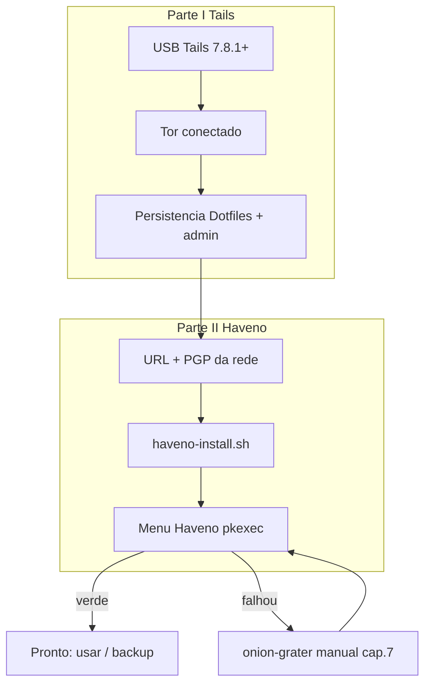

## Aviso de segurança (resumo)

O exploit do **protocolo de trades** Haveno (20/05/2026) **já foi corrigido** na **`1.6.0-reto`** (24/05/2026). Para **instalar** e estudar: tudo certo. Para **tradear com fundos**: use a `1.6.0-reto`+, confirme nos canais oficiais que o trading foi retomado e comece com valores pequenos. Detalhes no **Capítulo 4**.

---

# 2. FUNDAMENTOS DO TAILS

Antes de instalar o Haveno, entenda **onde** ele roda. Quase todo problema do curso vem de pular um fundamento desta seção.

## 2.1 O que é o Tails (e por que importa)

| Conceito | Explicação |
|----------|------------|
| **Amnésico** | Por padrão, o Tails **esquece tudo** ao desligar. Nada é gravado no disco — só na RAM. |
| **Tor por padrão** | Toda conexão sai pela rede **Tor** (anonimato). O Haveno depende disso. |
| **Volátil vs persistente** | O sistema em execução é volátil; só o **armazenamento persistente** (no USB, criptografado) guarda dados entre sessões. |
| **Usuário `amnesia`** | Usuário padrão, **sem** privilégios de administrador (a menos que você defina a senha admin). |

Consequência prática: o Haveno precisa de **persistência** (para a carteira sobreviver) e de **senha admin** (para instalar e configurar o onion-grater a cada sessão).

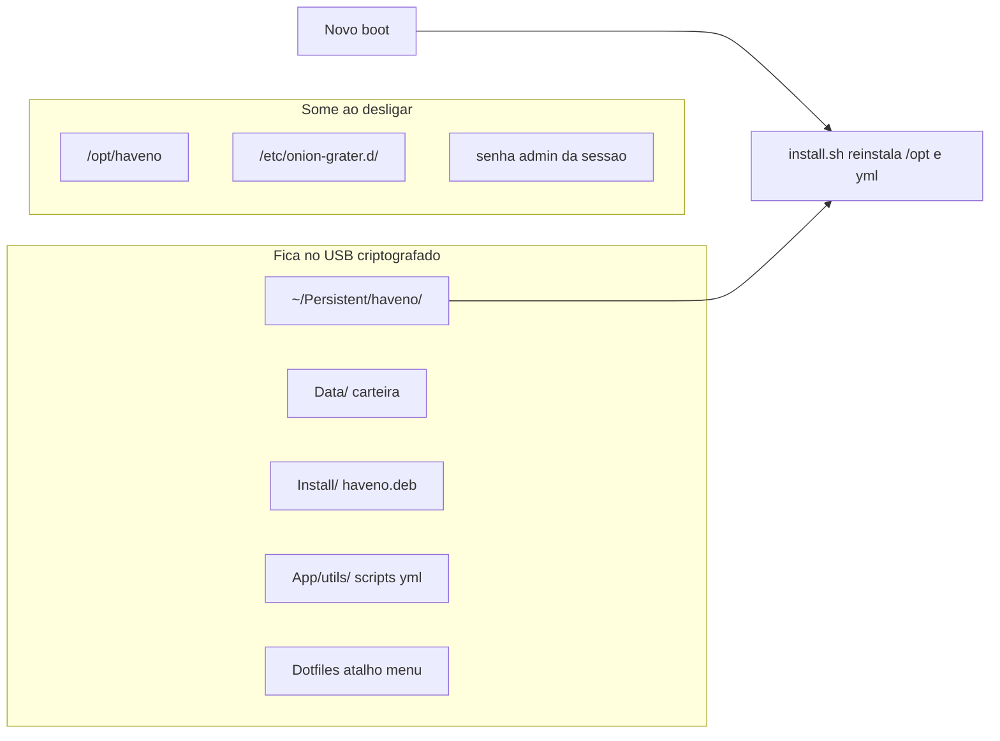

## 2.2 Gravar o Tails no pendrive

1. Em outro PC, abra **só** o site oficial: `https://tails.net/install/`
2. Baixe a versão atual (**Tails 7.8.1+**) e use o **Tails Installer** (Windows/macOS/Linux).
3. **Não** use imagens de fóruns, Telegram ou links de terceiros.
4. Conecte o pendrive (8 GB+) e escolha **Instalar**. Aguarde 100%.

**Iniciar pelo USB:** deixe o pendrive plugado **antes** de ligar; pressione a tecla de boot ao ligar (Dell/Lenovo/Acer: **F12/F11**; HP: **Esc** depois **F9**; ASUS: **Esc/F8**). Escolha o USB → **Tails**.

**OK se:** aparece a tela **Bem-vindo ao Tails** (cadeado). Se o Windows iniciar normal, o USB não foi escolhido — ajuste a BIOS (desative Fast Boot, ordem de boot USB primeiro).

## 2.3 Primeiro boot e conexão Tor

O Haveno **precisa** do Tor do Tails funcionando.

1. Boas-vindas → escolha idioma/teclado → **ainda não** defina admin (faremos em 2.5) → **Iniciar Tails**.
2. Abre o assistente **Conexão à rede Tor**. Aguarde até **Conectado**. O **Navegador Tor** abre sozinho.
3. Teste no Terminal (**Aplicações → Acessórios → Terminal**):

```bash
curl -s --max-time 30 https://check.torproject.org/api/ip | grep IsTor
```

**OK se:** a saída contém `"IsTor":true`.

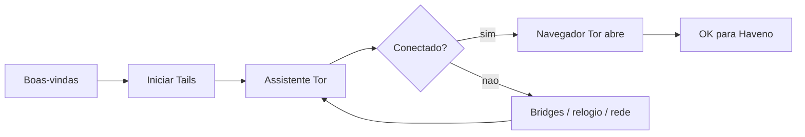

## 2.4 Armazenamento Persistente e Dotfiles

Sem isto, o Haveno **não mantém** carteira nem atalho entre sessões.

1. **Aplicações → Tails → Armazenamento persistente**.
2. **Criar** e definir uma **senha forte** (guarde-a; sem ela, perde os dados).
3. Marque:
   - **Arquivos pessoais**
   - **Dotfiles** ← **obrigatório** (guarda o atalho do Haveno no menu)
4. **Salvar** e **Reiniciar**.
5. Após o reboot: na boas-vindas, **desbloqueie** a persistência com a senha e reconecte o Tor.

**OK se:**

```bash
ls /home/amnesia/Persistent
```

mostra a pasta acessível.

> **Por que Dotfiles?** É a opção da persistência que guarda `~/.local/share/applications` — ou seja, o **ícone do Haveno** no menu sobrevive ao reinício. Sem Dotfiles, o atalho some.

## 2.5 Senha de administrador (a cada sessão)

São **duas senhas diferentes**:

| Senha | Onde define | Duração | Serve para |
|-------|-------------|---------|------------|
| **Persistência** | Ao criar o armazenamento | Para sempre (mesma a cada boot) | Desbloquear `~/Persistent/` |
| **Administrador** | Boas-vindas → **+ Mais opções** | **Só esta sessão** | Instalar `.deb`, editar `/etc/`, `pkexec` |

Como definir a admin: na **tela de boas-vindas** (antes de entrar), clique **+ Mais opções**, ative **Senha de administrador**, defina uma senha **só para hoje**, **Iniciar Tails**.

**OK se:**

```bash
sudo echo ok
```

pede a senha e imprime `ok`.

> Repita isto **a cada boot** — a senha admin **não** fica gravada.

## 2.6 onion-grater, porta de controle 951 e o authcookie (fundamento-chave)

Esta é a parte que mais confunde — e é onde mora a maioria dos erros. Leia com calma.

**O problema:** o Haveno precisa conversar com o **Tor** pela **porta de controle** (control port) para criar serviços onion. No Tails, por segurança, aplicativos **não** falam direto com o Tor — existe um filtro no meio chamado **onion-grater**.

**As peças:**

| Peça | O que é |
|------|---------|
| **Control port do Tor** | Canal administrativo do Tor. No Tails é exposto via onion-grater na **porta 951**. |
| **onion-grater** | Serviço do Tails que **filtra** os comandos enviados ao control port. Só libera o que um **perfil** permite. |
| **`haveno.yml`** | O **perfil** que diz ao onion-grater: "o app `/opt/haveno/bin/Haveno`, rodando como `amnesia`, pode usar estes comandos do Tor". Fica em `/etc/onion-grater.d/haveno.yml`. |
| **authcookie** (`/var/run/tor/control.authcookie`) | Arquivo de **autenticação** do control port. O Haveno precisa **ler** esse cookie para se autenticar no Tor (método SAFECOOKIE). |

**Por que `chmod o+r` no cookie?** Por padrão o `control.authcookie` não é legível pelo usuário `amnesia`. O Haveno roda como `amnesia` e precisa **ler** o cookie para autenticar. Por isso a instalação faz:

```bash
sudo chmod o+r /var/run/tor/control.authcookie
```

Isto dá permissão de leitura "para outros" (o `amnesia`). Sem isso → o Haveno não autentica → **não fica verde**.

**Por que copiar o `haveno.yml`?** Sem o perfil em `/etc/onion-grater.d/`, o onion-grater **bloqueia** os comandos do Haveno. No log você veria `loaded filter: None` e `command filtered: AUTHCHALLENGE` — e o Haveno mostra *No default Tor Instance configured*.

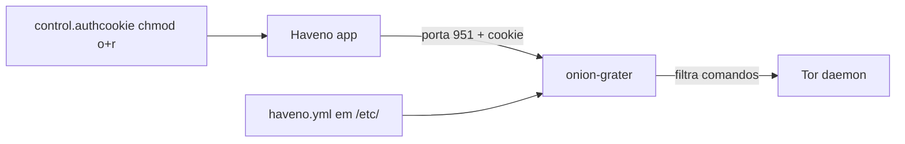

| Log (journalctl) | Significado |
|------------------|-------------|
| `loaded filter: haveno` | Perfil ativo — **bom** |
| `loaded filter: None` | Perfil não aplicado — **ruim** (ver Capítulo 7) |
| `command filtered: AUTHCHALLENGE` | Tor bloqueou o Haveno — **ruim** |

> **Boa notícia:** ao abrir o Haveno pelo menu, o `install.sh` faz `chmod o+r` no cookie e `cp` do `haveno.yml` **automaticamente**. Você só mexe nisso manualmente se algo falhar (Capítulo 7).

## 2.7 Portas: SOCKS 9050 vs proxy Monero 9062

Dois números que **não** se confundem no Tails:

| Porta | Para quê | Onde aparece |
|-------|----------|--------------|
| **9050** | SOCKS padrão do Tor (downloads, teste `IsTor`, `curl` via Tor) | Comandos de download |
| **9062** | Proxy **dedicado do Monero** no Tails (o Haveno usa para sincronizar XMR) | Parâmetro `--socks5ProxyXmrAddress` do `exec.sh` |

Regra: no Tails, o Monero do Haveno usa **9062**, **não** 9050. Scripts caseiros que trocam para 9050 quebram a sincronização.

## 2.8 Boas práticas de segurança no Tails

| Regra | Por quê |
|-------|---------|
| Baixe o Tails **só** de `tails.net` | Evita imagem adulterada |
| Senha de persistência **forte** e guardada | Sem ela, os dados são irrecuperáveis |
| Nunca compartilhe senha de persistência/admin | Acesso total ao USB / à sessão |
| Verifique **PGP** de todo `.deb` | Evita malware disfarçado de Haveno |
| Use **uma** rede de cada vez (URL + PGP do mesmo release) | Não misturar redes |

## Glossário rápido

| Termo | Significado |
|-------|-------------|
| **Persistência** | Partição criptografada no USB que guarda arquivos entre sessões |
| **Dotfiles** | Opção da persistência que guarda `~/.local`, atalhos, configs |
| **amnesia** | Usuário padrão do Tails (sem admin) |
| **onion-grater** | Filtro do Tails na porta de controle do Tor (porta 951) |
| **authcookie** | Arquivo de autenticação do control port do Tor que o Haveno precisa ler |
| **haveno.yml** | Perfil que libera o Haveno no onion-grater |
| **pkexec** | Janela que pede senha admin para uma ação pontual |
| **Rede Haveno** | Operador de terceiros que fornece `.deb` + nós seed |

---

# 3. INSTALAÇÃO E CONFIGURAÇÃO DO HAVENO (na mão)

Pré-requisitos desta parte (Capítulo 2): Tails no USB, **Tor conectado**, **persistência + Dotfiles**, **senha admin** desta sessão.

> **Atalho:** se quiser pular a digitação, a pasta `Scripts/` faz tudo isto sozinho — **(1)** copie os scripts para `~/Persistent/` uma vez (ver `Scripts/README.md` → "Ciclo de uso"); **(2)** rode `~/Persistent/haveno-auto.sh`. Abaixo é o caminho **manual**, para você entender cada etapa.

## 3.1 Antes de instalar — rede de terceiros, URL e PGP

O projeto **Haveno** (haveno-dex) **não opera rede mainnet** nem distribui instalador para "dinheiro real". Você precisa:

1. Escolher uma **rede Haveno de terceiros** (a turma usa a **Reto**).
2. Obter a **URL direta do `.deb`** dessa rede.
3. Obter a **impressão digital PGP** (fingerprint) de quem assina o release.

**Dados reais da turma (RetoSwap, ex-Reto):**

> A rede da turma agora se chama **RetoSwap** (mesmo operador e repositório `retoaccess1/haveno-reto`).
> A chave de assinatura é **TOFU** (sem cross-signatures, issue #25): **confira o fingerprint importando a chave**
> (`gpg --show-keys reto_public.asc`), não apenas copiando — e confirme o release atual na fonte oficial.

| Campo | Valor (conferir releases) |
|-------|---------------------------|
| URL do `.deb` | `https://github.com/retoaccess1/haveno-reto/releases/download/1.6.0-reto/haveno-v1.6.0-linux-x86_64-installer.deb` |
| PGP fingerprint | `DAA24D878B8D36C90120A897CA02DAC12DAE2D0F` |
| Chave pública | `https://retoswap.com/reto_public.asc` |

> O `.deb` é da **Reto**; o script `haveno-install.sh` é do **haveno-dex** (padrão oficial para Tails). **Nunca** misture PGP de uma rede com `.deb` de outra. O exemplo `FAA2...` da documentação é **fictício** — não é a Reto.

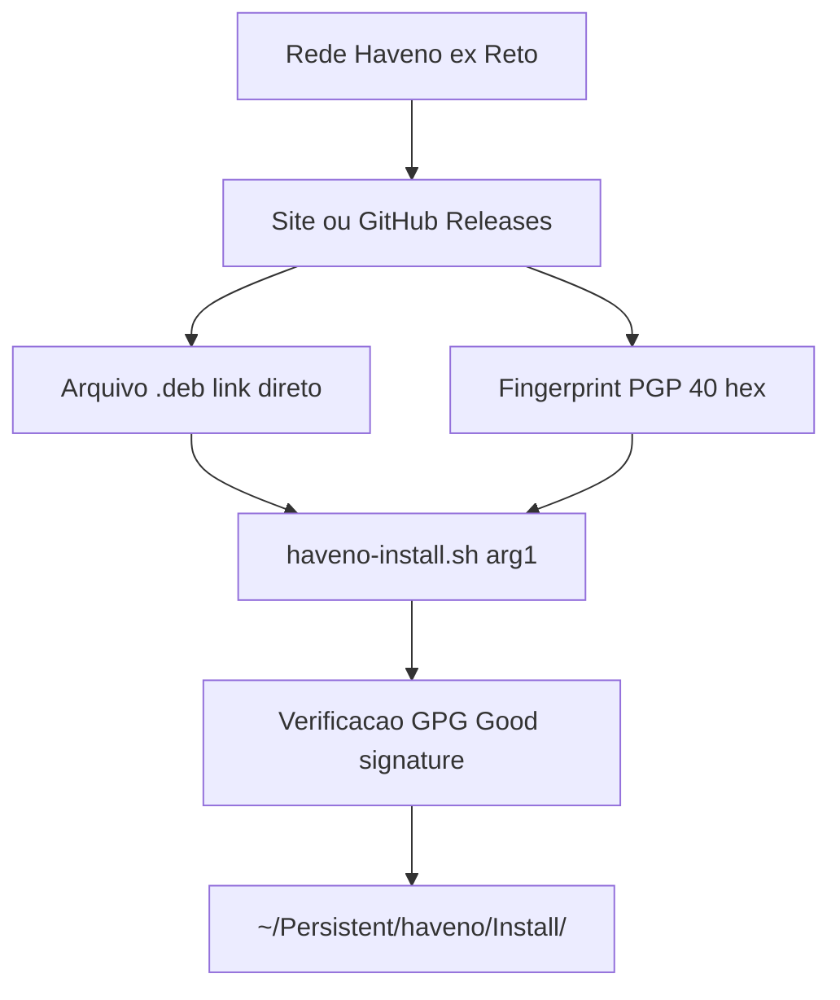

## 3.2 Baixar e verificar (`haveno-install.sh`)

O que este script oficial faz **por dentro**:

| Etapa | Ação | Mensagem típica |
|-------|------|-----------------|
| 1 | Baixa `exec.sh`, `install.sh`, `haveno.yml`, ícone | "Downloading resources…" |
| 2 | Baixa o `.deb` da URL que você passou | "Downloading Haveno from URL…" |
| 3 | Baixa `.sig` + chave PGP | "Importing GPG key" |
| 4 | `gpg --verify` (confere assinatura) | "Haveno binaries have been successfully verified" |
| 5 | Move para `Install/`, cria atalho no menu | "setup completed successfully" |

> O `.deb` **ainda não** é instalado em `/opt` aqui — isso ocorre na 3.3, ao abrir o Haveno.

No Terminal (Tor conectado + admin desta sessão), **rede Reto**:

```bash
curl -fsSLO https://github.com/haveno-dex/haveno/raw/master/scripts/install_tails/haveno-install.sh \
  && bash haveno-install.sh \
  "https://github.com/retoaccess1/haveno-reto/releases/download/1.6.0-reto/haveno-v1.6.0-linux-x86_64-installer.deb" \
  "DAA24D878B8D36C90120A897CA02DAC12DAE2D0F"
```

**Outra rede** (substitua URL e PGP do **mesmo** release):

```bash
curl -fsSLO https://github.com/haveno-dex/haveno/raw/master/scripts/install_tails/haveno-install.sh \
  && bash haveno-install.sh "SUA_URL_DO_DEB" "SEU_FINGERPRINT_PGP"
```

Se o `curl` falhar, tente via Tor:

```bash
curl -x socks5h://127.0.0.1:9050 -fsSLO https://github.com/haveno-dex/haveno/raw/master/scripts/install_tails/haveno-install.sh
bash haveno-install.sh "SUA_URL_DO_DEB" "SEU_FINGERPRINT_PGP"
```

**Árvore de pastas após este passo:**

```text
/home/amnesia/Persistent/haveno/
├── App/
│   └── utils/
│       ├── exec.sh          ← atalho do menu chama isto
│       ├── install.sh       ← pkexec instala deb + onion-grater
│       ├── haveno.yml       ← perfil Tor copiado para /etc/ na sessão
│       ├── haveno.desktop
│       └── icon.png
├── Data/                    ← carteira Haveno (persiste)
└── Install/
    ├── haveno.deb           ← pacote verificado
    ├── ....deb.sig          ← assinatura
    └── ....asc              ← chave PGP importada
```

**OK se:** terminal mostra `Haveno installation setup completed successfully.`, existem `App` `Data` `Install`, há `haveno.deb` em `Install/`, e o ícone **Haveno** aparece em **Aplicações → Outros**.

## 3.3 Abrir pelo menu e ficar verde

Na **primeira abertura**, o Haveno se instala em `/opt` e configura o onion-grater automaticamente.

**O que o `exec.sh` usa (parâmetros oficiais)** — *tabela de referência; pode pular na 1ª leitura:*

| Parâmetro | Valor | Função |
|-----------|-------|--------|
| `--torControlPort` | `951` | Porta onion-grater no Tails |
| `--torControlCookieFile` | `/var/run/tor/control.authcookie` | Autenticação Tor |
| `--torControlUseSafeCookieAuth` | (ativo) | Modo seguro (SAFECOOKIE) |
| `--userDataDir` | `~/Persistent/haveno/Data` | Carteira persistente |
| `--useTorForXmr` | `on` | Monero via Tor |
| `--socks5ProxyXmrAddress` | `127.0.0.1:9062` | Proxy Monero do Tails (**não** 9050) |

> **Nota técnica — pasta de dados e o symlink (verificado no `exec.sh` oficial):** o `exec.sh` lança o Haveno com **`--userDataDir=~/Persistent/haveno/Data`** (caminho explícito) e cria um symlink `~/.local/share/Haveno → ~/Persistent/haveno/Data`. Como o `--userDataDir` é explícito, a carteira **sempre** vai para a persistência — mesmo que a build Reto use como padrão `~/.local/share/Haveno-reto`. **Por isso, abra sempre pelo menu / `exec.sh`**; iniciar o binário direto (sem `--userDataDir`) usaria uma pasta volátil e **não persistiria**.

**Passos:**

1. **Aplicações → Outros → Haveno**.
2. Aceite a janela **pkexec** com a senha de administrador.
3. Aguarde mensagens azuis — o `install.sh` executa: `dpkg -i` do `.deb`, `chmod o+r` no cookie, `cp haveno.yml` → `/etc/onion-grater.d/`, `systemctl restart onion-grater`.
4. A janela do Haveno abre; o indicador fica **amarelo** → depois **verde** (na 1ª vez pode levar 5–20 min sincronizando).

**Confira (opcional) no terminal:**

```bash
sudo journalctl -u onion-grater --no-pager | tail -30
```

**OK se:** indicador **verde** e o log mostra `loaded filter: haveno`. **Não** deve repetir `loaded filter: None` nem `command filtered: AUTHCHALLENGE`.

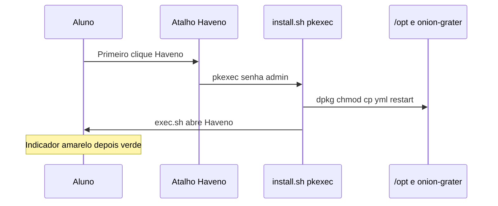

## 3.4 Se não ficou verde (onion-grater manual)

Use **apenas** se apareceu *No default Tor Instance configured* ou `loaded filter: None`. Feche o Haveno antes.

```bash
sudo cp /home/amnesia/Persistent/haveno/App/utils/haveno.yml /etc/onion-grater.d/haveno.yml
sudo chmod o+r /var/run/tor/control.authcookie
python3 -c "import yaml; yaml.safe_load(open('/etc/onion-grater.d/haveno.yml')); print('YAML OK')"
sudo systemctl restart onion-grater
```

Depois reabra: **Aplicações → Outros → Haveno**. Mais sintomas e causas no **Capítulo 7**.

## 3.5 Rotina a cada boot

`/opt/haveno` e `/etc/onion-grater.d/` **somem** ao desligar — é normal. A cada sessão (≈2 min):

1. Boot pelo USB Tails
2. Desbloqueie a **persistência**
3. **+ Mais opções** → senha **administrador**
4. Conecte ao **Tor**
5. **Aplicações → Outros → Haveno** → `pkexec`
6. Aguarde **verde**

**Frase para decorar:** *Tor → admin → menu Haveno → verde.* Os dados ficam em `~/Persistent/haveno/Data/`.

---

# 4. SEGURANÇA (exploit corrigido na 1.6.0-reto)

## O que aconteceu

| | |
|--|--|
| **O quê** | Falha no **protocolo de trades** do software Haveno (camada P2P), **não** na blockchain Monero, nem no Tails/Tor/onion-grater. |
| **Como** | Atacante enviou mensagens **ACK falsas** fingindo ser o **árbitro**; o cliente trocava o endereço do árbitro **antes** da multisig estar segura e, com 2 de 3 chaves, drenava o XMR depositado. |
| **Quando** | Detectado em 20/05/2026 por woodser (dev principal). |
| **Correção** | ✅ **Publicada na `1.6.0-reto` (24/05/2026)**: "Always verify peer identity against known public key rings" (PR #2315) + Tor 0.4.9.8. |
| **Taxas (pós-incidente)** | Maker inalterada; **crypto taker 0,8%**, **fiat taker 2%**. |

## Pode / Cautela

| Pode | Cautela |
|------|---------|
| Instalar Tails + Haveno até **verde** | Usar **só `1.6.0-reto`+** (versão antiga = risco) |
| Estudar, abrir o Haveno, fazer backup | Confirmar nos canais oficiais que o trading foi **retomado** |
| Tradear na versão corrigida, **valores pequenos** | Conferir as taxas novas antes de operar |
| Usar Feather só como carteira | Outra rede Haveno: só após **ela** publicar o mesmo fix |

**Resumo:** a falha está **corrigida** na versão do curso. O risco residual é usar versão antiga ou não confirmar a retomada oficial. **Instalar ≠ tradear** — tradear é decisão sua, na versão corrigida e com cautela.

---

# 5. PRÓXIMOS PASSOS (pós-verde)

Com o indicador **verde**, a instalação terminou. Daqui em diante é **uso** do Haveno — resumo no Capítulo 5; **passo a passo completo** no Volume II: [`Expansão Curso/Curso — Rede Descentralizada (Extensão).md`](Expansão%20Curso/Curso%20—%20Rede%20Descentralizada%20(Extensão).md).

## 5.1 Carteira — criar, restaurar, onde ficam os dados

| Local | Conteúdo |
|-------|----------|
| `~/Persistent/haveno/Data/` | Carteira, histórico, contas de pagamento, configuração |
| `~/Persistent/haveno/App/` | Binários e `haveno.yml` (reinstalados pelo `install.sh`) |

Na interface (após verde):

| Ação | Menu típico | Observação |
|------|-------------|------------|
| Primeira conta | Assistente na 1ª abertura ou **Account** | Defina senha forte da conta |
| Ver **seed** | **Account → Wallet seed** | Anote offline; quem tem a seed controla os fundos |
| Backup **completo** | **Account → Backup** | Exporta a **pasta de dados inteira** |
| Restaurar | **Account → Restore** ou copiar `Data/` | Em dúvida, peça suporte **antes** de apagar |

> **Importante:** a **seed sozinha não é backup completo** — não inclui histórico de trades nem contas de pagamento. Para restauração fiel, faça backup da **pasta de dados**.

> **Checklist na criação:** ritual completo (anotar seed offline, separar do USB, backup `Data/` **antes** do 1º depósito) → Extensão, [Capítulo 2](Expansão%20Curso/Curso%20—%20Rede%20Descentralizada%20(Extensão).md#2-haveno--primeira-conta-e-proteção-da-seed).

## 5.2 Backup (persistência + Data + cifrar)

> **Para a maioria:** use `Scripts/haveno-backup.sh` (cifrado e prático). As opções abaixo são complementares ou alternativas.

| Camada | Como |
|--------|------|
| **Pendrive Tails inteiro** | Guia oficial Tails de backup da persistência (link no Capítulo 8) |
| **Só o Haveno (prático)** | `Scripts/haveno-backup.sh` — compacta + **cifra (GPG)** + gera `.sha256`; `--usb` salva em pendrive |
| **Pela interface** | **Account → Backup** para um USB criptografado externo |
| **Manual** | Feche o Haveno → copie `~/Persistent/haveno/Data/` para mídia externa |
| **Seed** | **Account → Wallet seed** anotada em papel/metal, separada do backup |

Exemplo manual cifrado (com o Haveno **fechado**):

```bash
tar -czf haveno-data-backup.tar.gz -C /home/amnesia/Persistent/haveno Data
gpg -c haveno-data-backup.tar.gz
```

**O que nunca fazer:** enviar seed/backup por chat; guardar a seed só no mesmo USB; confiar só na seed como "backup completo"; restaurar backup de **outra** rede.

## 5.3 Atualizar o Haveno (com backup antes)

Quando a sua rede publicar versão nova:

1. **Backup primeiro** (`Scripts/haveno-backup.sh` ou Account → Backup).
2. Anote a **URL nova** do `.deb` e o **PGP** do mesmo release.
3. Reinstale (manual ou script) — os dados em `Data/` são **preservados**.

Manual:

```bash
curl -fsSLO https://github.com/haveno-dex/haveno/raw/master/scripts/install_tails/haveno-install.sh
bash haveno-install.sh \
  "https://github.com/retoaccess1/haveno-reto/releases/download/VERSAO-NOVA/haveno-vVERSAO-linux-x86_64-installer.deb" \
  "FINGERPRINT_DA_MESMA_REDE"
```

Automático (faz backup antes): `Scripts/haveno-update.sh` (veja `Scripts/README.md`). **Ao usar o script, o backup é feito automaticamente — você não precisa repetir o passo 1 acima.**

> **Tails (sistema):** atualize pelo **Tails Upgrader** (ao conectar no Tor) ou reinstalação oficial — **nunca** por script. Faça o backup primeiro.

## 5.4 Redes, Monero e moedas

- **Reto (turma):** releases e PGP no Capítulo 8. Confirme sempre no canal oficial.
- **Outras redes** (ex.: Aloha): só com URL + PGP **da própria rede**, e só tradear após elas publicarem o fix de segurança.
- **Monero (XMR)** é a moeda base; nas ofertas P2P aparecem pares com fiat/BTC conforme a rede. Nó Monero **local** é recomendado para sincronização (no Tails o proxy é **9062**).

Mais detalhes e outras ferramentas: **Capítulo 6**.

## 5.5 Guia rápido — comprar e vender com segurança (o fluxo da rede)

> Este curso foca a **instalação**; aqui vai um **guia geral** do fluxo P2P do Haveno para você não se perder. Siga sempre as **regras da sua rede** e o [Capítulo 9](#9-dicas-e-alertas-finais--não-cair-em-roubadas) (golpes). **Comece com valores pequenos.**

**Cartaz-resumo (imprimível):**

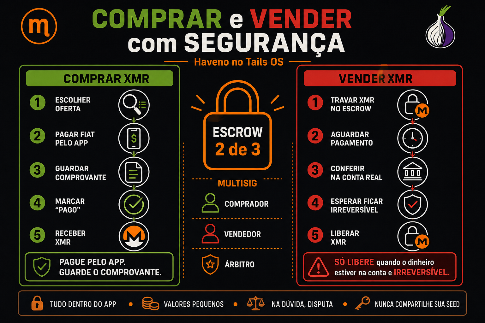

### Como funciona um trade (escrow multisig 2-de-3)

Todo trade no Haveno usa uma carteira **multisig 2-de-3**: chaves do **comprador**, do **vendedor** e do **árbitro**. Precisa de **2 das 3** assinaturas para mover os fundos — então **ninguém sozinho** rouba o XMR em custódia. O árbitro só entra **se houver disputa**. Cada lado também trava um **depósito de segurança** (devolvido ao fim), o que desincentiva calote.

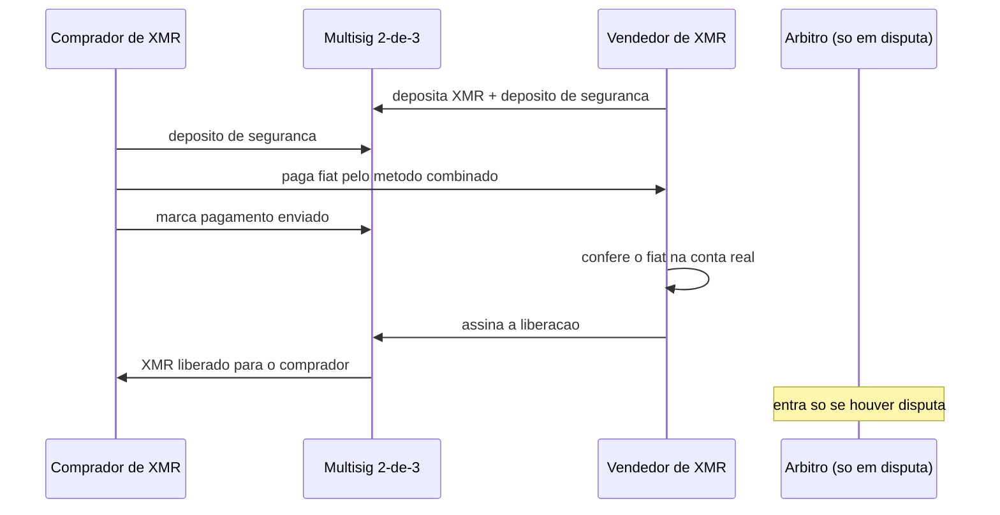

### Vocabulário rápido do trade

| Termo | Significado |
|-------|-------------|
| **Oferta** | Anúncio de compra ou venda (preço, valor, método de pagamento) |
| **Maker** | Quem **cria** a oferta e espera alguém aceitar |
| **Taker** | Quem **aceita** uma oferta já existente |
| **Depósito de segurança** | Valor em XMR que cada lado trava no escrow; **devolvido ao fim**. Desincentiva calote |
| **Escrow / multisig** | Carteira **2-de-3** que guarda os fundos durante o trade |
| **Árbitro** | Terceiro que decide **em caso de disputa** (não controla os fundos sozinho) |
| **Disputa** | Abertura de mediação quando algo dá errado |

### Antes de qualquer trade (preparação)

- Conta criada e **backup** feito (5.1 e 5.2).
- **Deposite XMR** na carteira do Haveno (a partir da sua **Feather**) para cobrir o depósito de segurança / a venda.
- Leia **regras, taxas e limites** da sua rede e configure a **conta de pagamento** com cuidado (nome/dados corretos).

> **Ainda não tem XMR?** Para negociar você precisa de um pouco de XMR (o **depósito de segurança** é em XMR). Formas de conseguir o **primeiro**: (a) **comprar XMR com fiat** numa oferta da sua rede que aceite **comprador sem depósito** para valores pequenos (algumas redes permitem); (b) converter outra cripto via **Trocador** no Tor Browser (Capítulo 6) e mandar para a sua **Feather**; (c) comprar uma pequena quantia de um **trader P2P de confiança**. Com XMR na carteira, você opera normalmente.

### 🟢 Comprando XMR (você paga fiat, recebe XMR)

1. Escolha uma oferta de **vendedor com boa reputação**; valor **pequeno** no início.
2. **Tome a oferta** — seu depósito de segurança entra no multisig.
3. **Pague o fiat** exatamente pelo método e dados mostrados **no app**; **guarde o comprovante**.
4. Marque **"pagamento enviado" só depois** de realmente enviar.
5. Aguarde o vendedor **liberar o XMR**. Se ele sumir ou recusar sem motivo → **abra disputa** (árbitro).

**Cuidados:** nunca combine "por fora"; toda comunicação no **chat do app**; confira nome e valor; não pague de **conta de terceiros**.

### 🔴 Vendendo XMR (você recebe fiat, entrega XMR) — exige MAIS cuidado

O ponto crítico: alguns métodos de pagamento são **reversíveis** (chargeback/estorno). O golpe clássico: o "comprador" paga, você libera o XMR, e **depois ele estorna** o pagamento.

1. Crie ou aceite uma oferta — seu **XMR + depósito** entram no multisig.
2. Aguarde o comprador **enviar o fiat** e marcar "enviado".
3. **Confirme o recebimento na sua conta real** — **não** confie só no print/comprovante do comprador.
4. Espere o dinheiro **compensar e ficar irreversível**. Prefira métodos **irreversíveis** (ex.: **PIX**, dinheiro em mãos) a métodos com estorno (cartão, PayPal, alguns boletos/transferências internacionais).
5. Confira **valor exato** e **nome do remetente** (deve bater com a conta do trade).
6. **Só então assine a liberação** do XMR.

**Cuidados:** **nunca** libere antes de o dinheiro estar **de fato na sua conta e irreversível**; desconfie de **pressa**; em dúvida → **disputa**, nunca "por fora".

### Depois do trade — guardar com segurança

- Após **comprar**, **saque o XMR** para a sua **Feather** (custódia). Não deixe saldo parado na exchange além do necessário.
- Atualize seu **backup** se mudou contas/histórico (5.2).

### Regras de ouro do trade (resumo)

| Situação | Regra |
|----------|-------|
| Sempre | Tudo **dentro do app** (escrow multisig + chat); valores **pequenos** primeiro |
| **Comprando** | Só marque "pago" **após pagar**; guarde o comprovante |
| **Vendendo** | Só libere após o fiat estar **na conta e irreversível** |
| Algo errado | **Abra disputa** (árbitro) — nunca resolva "por fora" |
| Reputação | Prefira contrapartes **bem avaliadas**; desconfie de ofertas "boas demais" |

### Disputa — como funciona (resumo)

Se a contraparte **some**, paga errado ou recusa sem motivo, **abra disputa** no app. O **árbitro** analisa o **chat** e as **provas** (comprovantes anexados) e decide para quem vão os fundos do escrow. Por isso: mantenha **toda** a conversa e os comprovantes **dentro do Haveno** — é a sua proteção. O árbitro **nunca** pede a sua seed ou senha (se pedir, é golpe — ver [Capítulo 9](#9-dicas-e-alertas-finais--não-cair-em-roubadas)).

---

# 6. ECOSSISTEMA MONERO + TAILS (apêndice)

Informativo. O curso ensina **Haveno no Tails** (P2P via rede de terceiros). A comunidade usa outras ferramentas — registradas aqui para você conhecer. **Mão na massa** (Feather, trades, Trocador, home lab integrado): Volume II [`Expansão Curso/`](Expansão%20Curso/Curso%20—%20Rede%20Descentralizada%20(Extensão).md).

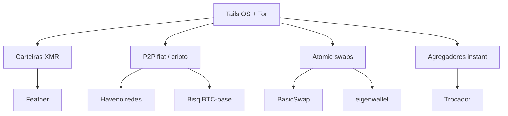

| Modalidade | Exemplos | Relação com Tails |
|------------|----------|-------------------|
| **P2P Monero-native** | **Haveno** + redes **Reto**, **Aloha** | Este curso (`install_tails`) |
| **P2P Bitcoin-base** | **Bisq / Bisq2** | Possível com Tor; outro app, sem script oficial |
| **Atomic swap** | **eigenwallet** (ex-UnstoppableSwap), **BasicSwap**, COMIT | AppImage / nós; BTC↔XMR sem P2P fiat |
| **Agregador / swap** | **Trocador**, Majestic Bank, SideShift | Tor Browser + carteira separada |
| **Carteira** | **Feather** (recomendada), Monero GUI, Cake | Feather tem guia Tails oficial |
| **Nó Monero** | `monerod` | Possível; pesado em RAM/disco |
| **Histórico** | **LocalMonero** (fechou 2023) | Substituído na prática pelo Haveno |

**Não é "uma empresa":** Haveno é um **protocolo** open source; as **redes** (Reto, Aloha) são operadores comunitários. Comparável ao Bisq + rede P2P, não a uma exchange centralizada (Binance/Kraken).

### Carteira (Feather) × Exchange (Haveno) — entenda a diferença

Esta é uma confusão comum, então vale deixar claro: **Feather e Haveno não são concorrentes** — têm finalidades diferentes e podem ser usados juntos.

| | **Feather** | **Haveno** |
|--|-------------|------------|
| O que é | Uma **carteira** Monero (leve) | Uma **exchange** descentralizada (P2P) |
| Para que serve | **Guardar, enviar, receber** XMR | **Comprar e vender** XMR (fiat/cripto) com outras pessoas |
| Tem carteira? | É a própria carteira | Tem carteira **integrada**, mas voltada ao **trading** |
| Quando usar | Dia a dia: custodiar seus XMR | Quando você quer **negociar** |
| No Tails | AppImage (guia oficial Feather/Tails) | Este curso (`install_tails`) |

**Analogia:** o **Haveno** é a "corretora" onde você compra/vende; a **Feather** é a "carteira" onde você guarda o que comprou.

**Por isso o "e/ou":**

- Só quer **guardar** XMR com privacidade → **Tails + Feather** (não precisa do Haveno).
- Quer **negociar** → **Tails + Haveno** (o foco deste curso).
- **Muitos usam os dois:** negociam no Haveno e, depois, **sacam o saldo para a Feather** (ou usam a Feather para enviar/receber fora de trades). É a **combinação mais comum** na comunidade.

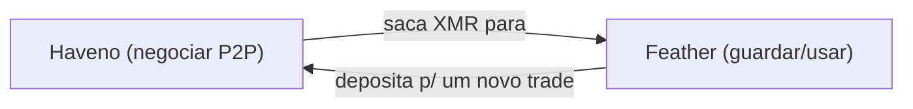

Para **entrar em XMR a partir de outra cripto** (ex.: BTC → XMR), alguns usam **Trocador** no Tor Browser — é um **agregador**, não uma carteira nem exchange P2P (cuidado: o parceiro final pode pedir KYC — explicado no [Capítulo 9](#9-dicas-e-alertas-finais--não-cair-em-roubadas)).

Links de todas estas ferramentas no **Capítulo 8**.

---

## 6.1 Tails (cliente) × Home Lab (infraestrutura) — o que rodar onde

> **Ideia central do Expert:** o **Tails** é o ambiente **efêmero e anônimo** para **usar** carteira/trade. Um **home lab** (uma máquina sempre ligada — mini PC, NUC ou Raspberry Pi) é onde faz sentido rodar a **infraestrutura** pesada e 24/7: nó Monero, mineração, swaps. **Eles se complementam.**

Quase nada disto é exclusivo do Tails. Os mesmos programas rodam em Linux/Windows/macOS comuns. O que muda é o **papel**: o Tails é o **cliente** descartável; o home lab é o **servidor** que fica online.

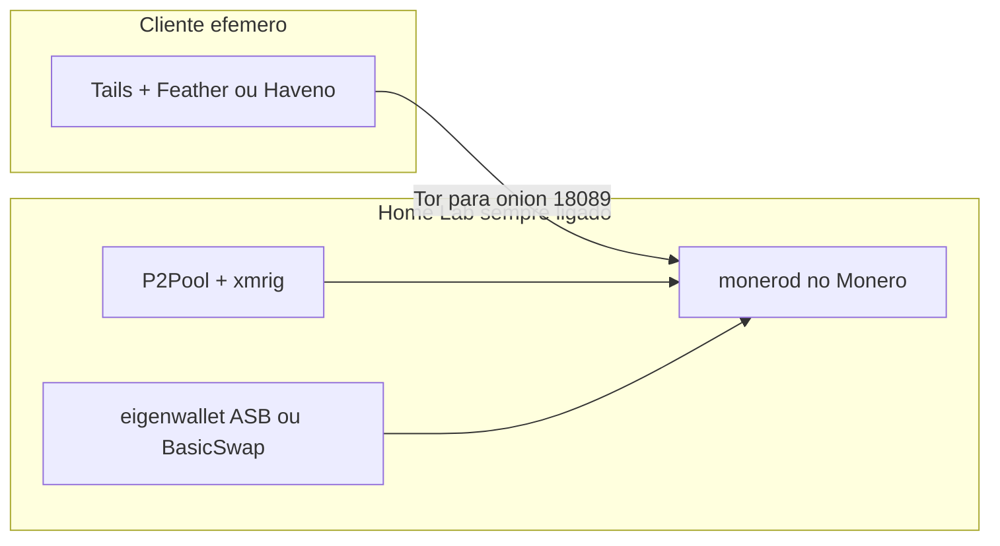

| Software | Roda no Tails? | Roda no home lab (24/7)? | Papel |
|----------|----------------|--------------------------|-------|
| Haveno (cliente) | **Sim** (foco do curso) | Sim (qualquer desktop) | Usar P2P |
| Haveno seednode / árbitro | Não (efêmero demais) | **Sim** (`systemd`) | Infra de rede (avançado) |
| `monerod` (nó Monero) | Inviável (amnésico, sync grande) | **Ideal** | Infra base |
| P2Pool + `xmrig` | Não | **Sim** | Mineração |
| BasicSwap | Pesado | **Sim** (docker, vários nós) | Atomic swaps |
| eigenwallet **ASB** | Cliente sim; ASB não | **Sim** | Market maker BTC↔XMR |
| Feather / Monero GUI | **Sim** | Conecta ao **seu** nó | Carteira |
| Trocador / SideShift | Via Tor Browser | Não se auto-hospeda | Swap instantâneo (web) |

> **Privacidade:** usar o seu próprio nó no home lab **só aumenta** a privacidade se a conexão for via **Tor** (hidden service) ou LAN confiável. Um nó exposto sem cuidado pode permitir correlação.

---

## 6.2 💡 Dica do Expert — rodar o seu próprio nó Monero

**Por quê:** soberania e privacidade (não depende de nó remoto de terceiros) + sincronização mais rápida e estável para Feather/Haveno. O nó fica no **home lab**; o **Tails** (ou Feather) conecta a ele.

### Requisitos de hardware (referência — pode pular na 1ª leitura)

> Os tamanhos de disco **crescem com o tempo** — sempre deixe folga. Valores verificados na fonte oficial (getmonero) no início de 2026.

| Perfil | CPU | RAM | Disco | Sync inicial |
|--------|-----|-----|-------|--------------|
| **Nó pruned** (recomendado p/ começar) | 2+ núcleos | **4 GB** (8 confortável) | **SSD** ~**100 GB** (chain pruned ~60–100 GB + folga) | 8–24 h (SSD) |
| **Nó full (arquival)** | 2+ núcleos | **8 GB** | **SSD** ~**250 GB+** (chain ~200 GB e crescendo) | 12–48 h (SSD) |
| **Raspberry Pi 4/5 (8 GB)** | Cortex-A72/A76 | 4–8 GB | **SSD USB 3.0** 128 GB (pruned) | 1–3 dias |
| **Nó + P2Pool + xmrig** (mineração) | 4+ núcleos | 8–16 GB | **SSD** (full preferível p/ P2Pool) | igual ao nó |

**Regras de ouro de hardware:**

- **SSD é obrigatório.** Em HDD a sincronização inicial vira **dias** e o uso fica lento. NVMe é ótimo; SATA SSD já serve.
- **Pruned vs full:** comece **pruned** (~1/3 do espaço, mesma privacidade de carteira). Migre para full só se for rodar serviços que exigem (alguns swaps; P2Pool prefere full).
- **Sempre ligado + baixo consumo:** mini PC/NUC ou **Raspberry Pi 4/5 (8 GB)** com SSD USB 3.0 é a escolha clássica (poucos watts, fica 24/7).
- **Banda:** ~50–150 GB no download inicial; depois ~20–100 GB/mês.

### Passo a passo (no home lab — Linux)

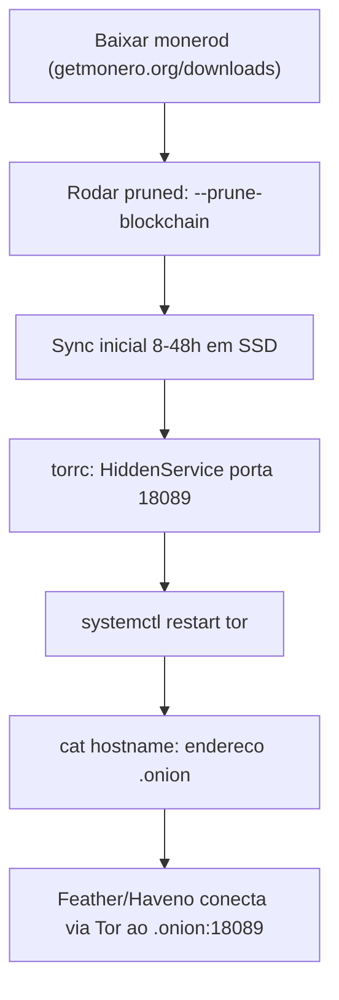

**1. Instalar e iniciar o nó (pruned, escutando local):**

```bash
# Baixe o monerod (CLI) de https://www.getmonero.org/downloads/ e descompacte
./monerod --prune-blockchain --sync-pruned-blocks \
  --rpc-restricted-bind-ip=127.0.0.1 --rpc-restricted-bind-port=18089 \
  --no-igd --out-peers 16
```

> **Importante:** o `monerod` **não sincroniza a blockchain pela Tor** (baixa a chain pela internet normal). O hidden service Tor abaixo serve **apenas para o seu wallet acessar o RPC do nó de forma privada**.

**2. Expor o RPC como hidden service Tor.** Instale o Tor (`sudo apt install tor`) e edite `/etc/tor/torrc`:

```text
HiddenServiceDir /var/lib/tor/monero-rpc/
HiddenServicePort 18089 127.0.0.1:18089
```

```bash
sudo systemctl restart tor
sudo cat /var/lib/tor/monero-rpc/hostname     # anote o endereco .onion
```

**3. Conectar o wallet (no Tails / Feather / Monero GUI):**

- **Feather/Monero GUI:** Settings → use SOCKS proxy `127.0.0.1:9050` (no Tails o Tor já está ativo) → adicionar nó remoto `SEU_ENDERECO.onion` porta **18089** → marcar como **trusted/daemon confiável**.
- Teste rápido (de outra máquina com Tor):

```bash
curl --socks5-hostname 127.0.0.1:9050 http://SEU_ENDERECO.onion:18089/get_info
```

**Persistência no home lab:** em vez de rodar o `monerod` à mão, deixe-o como **serviço `systemd`** (sobe sozinho no boot, reinicia se cair). Bloco pronto abaixo.

---

## 6.2.1 Bloco extra — `monerod` como serviço (systemd) + `torrc` comentado

Tudo abaixo roda **no home lab** (uma instalação Linux normal, ex.: Debian/Ubuntu), **não** no Tails. Copie, ajuste os 3–4 valores marcados e ative.

> **Verifique todo binário antes de confiar (caminho manual).** Os scripts em `Scripts/HomeLab/` já fazem
> isto e **abortam** se não conferir; no manual, verifique você mesmo: **monerod** → assinatura GPG de
> *binaryfate* (`81AC591FE9C4B65C5806AFC3F0AF4D462A0BDF92`) no `hashes.txt` do getmonero; **P2Pool** →
> `sha256sums.txt.asc` (o projeto usa *reproducible builds*); **xmrig** → `SHA256SUMS.sig` com a chave do
> xmrig (`9AC4CEA8E66E35A5C7CDDC1B446A53638BE94409`, em xmrig.com/docs/gpg-key). Nunca rode um binário sem
> conferir hash/assinatura.

### Passo A — usuário dedicado e pastas

Rodar o nó num **usuário próprio** (sem login, sem privilégios) é mais seguro do que no seu usuário.

```bash
# Cria um usuário de sistema só para o monerod (sem shell de login)
sudo useradd --system --home /var/lib/monero --shell /usr/sbin/nologin monero

# Pasta de dados (blockchain) — deve ficar num SSD com espaço
sudo mkdir -p /var/lib/monero
sudo chown monero:monero /var/lib/monero

# Pasta de log
sudo mkdir -p /var/log/monero
sudo chown monero:monero /var/log/monero
```

> **AJUSTE:** se o seu SSD está montado noutro caminho (ex.: `/mnt/ssd/monero`), use-o em `--home` e no `data-dir` da config. O importante é a blockchain ficar **no SSD**.

### Passo B — instalar o binário

```bash
# Baixe o pacote "Linux 64-bit" em https://www.getmonero.org/downloads/ e descompacte.
# Copie os binários para um lugar do PATH:
sudo cp monero-x86_64-linux-gnu-*/monerod /usr/local/bin/
sudo chmod +x /usr/local/bin/monerod
monerod --version    # confirma que instalou
```

> **AJUSTE:** o nome da pasta descompactada muda a cada versão (`monero-x86_64-linux-gnu-vX.Y.Z`). Use o caminho real do seu download.

### Passo C — arquivo de configuração `/etc/monerod.conf`

Crie `/etc/monerod.conf` com este conteúdo (comentado). Este exemplo é um **nó pruned, privado, pronto para servir via Tor**:

```ini
# ---- Dados e logs ----
data-dir=/var/lib/monero            # AJUSTE se a blockchain ficar noutro SSD
log-file=/var/log/monero/monerod.log
log-level=0                         # 0 = normal; aumente só para depurar
max-log-file-size=0                 # 0 = não rotaciona (o journald/systemd cuida)

# ---- Pruning (economiza ~2/3 do disco) ----
prune-blockchain=1                  # REMOVA esta linha p/ nó FULL (arquival)
sync-pruned-blocks=1                # baixa blocos já pruned (sync mais leve)

# ---- Rede P2P ----
p2p-bind-ip=0.0.0.0
p2p-bind-port=18080

# ---- RPC restrito (seguro p/ publicar; o Tor expõe isto) ----
rpc-restricted-bind-ip=127.0.0.1    # escuta só local; o hidden service publica
rpc-restricted-bind-port=18089

# ---- Diversos ----
no-igd=1                            # não tenta abrir portas via UPnP no roteador
out-peers=32                        # conexões de saída (estabilidade)
# no-zmq=1                          # DESCOMENTE se NÃO for minerar.
                                    # Para P2Pool/mineração, mantenha o ZMQ ativo
                                    # e adicione: zmq-pub=tcp://127.0.0.1:18083
```

```bash
sudo nano /etc/monerod.conf        # cole o conteúdo acima
sudo chown monero:monero /etc/monerod.conf
```

| Linha | O que faz | Quando mudar |
|-------|-----------|--------------|
| `data-dir` | Onde a blockchain é gravada | Aponte para o seu **SSD** com espaço |
| `prune-blockchain` / `sync-pruned-blocks` | Nó pruned (~100 GB) | **Remova as duas** para nó **full** (~250 GB) |
| `rpc-restricted-bind-port=18089` | Porta RPC segura | Mantenha; é a porta que o Tor publica |
| `no-zmq` / `zmq-pub` | Liga/desliga ZMQ | Para **minerar com P2Pool**, ative o ZMQ |

> **Firewall (home lab):** a porta **P2P 18080** existe para receber conexões da rede Monero (`p2p-bind-ip=0.0.0.0`) — expô-la é normal. Já o **RPC 18089** fica em `127.0.0.1` e só é publicado via Tor (Passo E). Atrás de roteador/firewall, exponha **apenas** a P2P intencionalmente e mantenha o RPC fora da internet aberta.

### Passo D — unit systemd `/etc/systemd/system/monerod.service`

```ini
[Unit]
Description=Monero Node (monerod)
After=network-online.target
Wants=network-online.target

[Service]
User=monero
Group=monero
Type=simple
ExecStart=/usr/local/bin/monerod --config-file /etc/monerod.conf --non-interactive
Restart=on-failure
RestartSec=30
# --- Endurecimento opcional (descomente se quiser; teste depois) ---
# NoNewPrivileges=true
# ProtectSystem=full
# PrivateTmp=true

[Install]
WantedBy=multi-user.target
```

| Campo | Explicação |
|-------|------------|
| `ExecStart` | **AJUSTE** o caminho do `monerod` e da config se você usou outros |
| `Type=simple` | O `monerod` fica em primeiro plano e o systemd o supervisiona (sem `--detach`) |
| `Restart=on-failure` | Sobe de novo sozinho se o processo cair |
| `User=monero` | Roda no usuário dedicado do Passo A |

Ative e acompanhe o sync:

```bash
sudo systemctl daemon-reload
sudo systemctl enable --now monerod
sudo systemctl status monerod
journalctl -u monerod -f          # acompanhar a sincronização (Ctrl+C p/ sair)
```

> A 1ª sincronização leva de **8 a 48 h** num SSD. O serviço continua mesmo após reiniciar a máquina.

### Passo E — `torrc` comentado (publicar o RPC via Tor)

Instale o Tor (`sudo apt install tor`) e **acrescente** ao fim de `/etc/tor/torrc`:

```text
## Hidden service para o RPC do seu no Monero
## (permite que carteiras acessem o no de forma privada, sem abrir portas no roteador)
HiddenServiceDir /var/lib/tor/monero-rpc/
HiddenServicePort 18089 127.0.0.1:18089
```

```bash
sudo systemctl restart tor
sudo cat /var/lib/tor/monero-rpc/hostname     # este e o seu endereco .onion
```

| Linha do torrc | O que faz |
|----------------|-----------|
| `HiddenServiceDir` | Pasta onde o Tor cria as chaves e o endereço `.onion` (não apague) |
| `HiddenServicePort 18089 127.0.0.1:18089` | Mapeia a porta onion **18089** para o RPC local do `monerod` |

> **Lembrete:** o `monerod` **baixa a blockchain pela internet normal** (não pela Tor). O hidden service é só para **servir o RPC** ao seu wallet com privacidade. Sincronizar a chain inteira pela Tor não é suportado.

### Passo F — conectar a carteira (Tails / Feather / Monero GUI)

1. No wallet, use **proxy SOCKS** `127.0.0.1:9050` (no Tails o Tor já está ativo).
2. Adicione **nó remoto**: endereço `SEU_ENDERECO.onion`, porta **18089**, marque como **confiável**.
3. Teste de outra máquina com Tor:

```bash
curl --socks5-hostname 127.0.0.1:9050 http://SEU_ENDERECO.onion:18089/get_info
```

**Resumo do que você troca:** caminho do binário (`/usr/local/bin/monerod`), caminho/disco do `data-dir`, e (full vs pruned) as duas linhas de pruning. O resto pode ficar como está.

### Alternativa — nó em Docker (opcional)

Se você prefere containers em vez de systemd, dá para rodar o nó com **docker compose**. Crie `docker-compose.yml`:

```yaml
services:
  monerod:
    image: sethsimmons/simple-monerod:latest   # imagem comunitária popular
    container_name: monerod
    restart: unless-stopped
    volumes:
      - bitmonero:/home/monero                 # blockchain persistente (use um SSD)
    ports:
      - "18080:18080"                          # P2P
      - "127.0.0.1:18089:18089"                # RPC restrito só local (Tor publica)
    command: >
      --prune-blockchain --sync-pruned-blocks
      --rpc-restricted-bind-ip=0.0.0.0 --rpc-restricted-bind-port=18089
      --no-igd --enable-dns-blocklist

volumes:
  bitmonero:
```

```bash
docker compose up -d        # sobe o nó
docker compose logs -f      # acompanha o sync
```

> **AJUSTE:** para nó **full**, remova `--prune-blockchain --sync-pruned-blocks`. O `torrc` (Passo E) continua igual — aponta para `127.0.0.1:18089`. Garanta que o volume `bitmonero` fique num **SSD** com espaço.
>
> **Sobre o `0.0.0.0` no compose:** dentro do container, `0.0.0.0` significa "todas as interfaces **do container**" — o que **restringe ao host** é o mapeamento `ports: 127.0.0.1:18089:18089`. Para fora, quem publica o RPC é só o hidden service Tor (Passo E).

---

## 6.2.2 Bloco extra — minerar XMR com P2Pool + xmrig (opcional)

Mineração **descentralizada**: em vez de um pool central, você minera no **P2Pool** (sidechain P2P) com o seu próprio nó. Recompensas caem **direto na sua carteira**, sem intermediário.

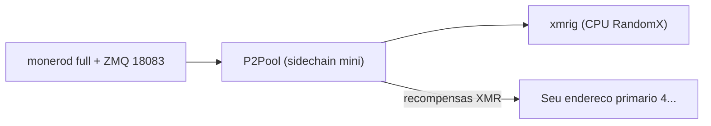

**Antes de começar — requisitos e avisos:**

| Item | Detalhe |
|------|---------|
| Nó | `monerod` **FULL** (não pruned) com **ZMQ** ligado — P2Pool precisa da chain completa |
| Carteira | Endereço **primário** (começa com **4**), **não** subendereço. Crie uma carteira **só para mineração** (endereços de P2Pool são públicos) |
| CPU | Monero usa **RandomX** (mineração por **CPU**, não GPU). Mais núcleos = mais hashrate |
| RAM | RandomX usa ~**2–3 GB** no modo rápido, além da RAM do nó |
| Realidade | Em um PC doméstico o ganho é pequeno; o valor aqui é **aprender** e **fortalecer a rede** |

### Passo 1 — `monerod` com as flags do P2Pool

Para minerar, o nó precisa de flags específicas (oficiais do P2Pool). Ajuste o `ExecStart` da unit do `monerod` (ou a config) para incluir:

```text
--zmq-pub tcp://127.0.0.1:18083
--out-peers 32 --in-peers 64
--add-priority-node=p2pmd.xmrvsbeast.com:18080
--add-priority-node=nodes.hashvault.pro:18080
--enable-dns-blocklist --enforce-dns-checkpointing
--rpc-bind-ip=127.0.0.1 --rpc-bind-port=18081
```

> **Notas:** use o nó **full** (sem `--prune-blockchain`). Se a sua banda de **upload** for menor que 10 Mbit, troque para `--out-peers 8 --in-peers 16`. O P2Pool conversa com o nó pelo RPC local **18081** e pelo **ZMQ 18083**.

### Passo 2 — instalar o P2Pool e rodar como serviço

```bash
# Baixe o P2Pool (Linux x64) de https://github.com/SChernykh/p2pool/releases e descompacte
sudo cp p2pool /usr/local/bin/ && sudo chmod +x /usr/local/bin/p2pool
sudo mkdir -p /var/lib/p2pool && sudo chown monero:monero /var/lib/p2pool
```

Crie `/etc/systemd/system/p2pool.service`:

```ini
[Unit]
Description=P2Pool (Monero)
After=monerod.service
Wants=monerod.service

[Service]
User=monero
Group=monero
Type=simple
WorkingDirectory=/var/lib/p2pool
ExecStart=/usr/local/bin/p2pool --host 127.0.0.1 --rpc-port 18081 --zmq-port 18083 --wallet SEU_ENDERECO_PRIMARIO_4xxxxx --mini
Restart=on-failure
RestartSec=30

[Install]
WantedBy=multi-user.target
```

| Campo | Explicação |
|-------|------------|
| `--wallet SEU_ENDERECO_PRIMARIO_4xxxxx` | **SUBSTITUA** pelo seu endereço Monero **primário** (começa com `4`) |
| `--mini` | Usa a sidechain **p2pool-mini** (ideal para hashrate menor / PC doméstico) |
| `--rpc-port 18081 --zmq-port 18083` | Portas locais do `monerod` (Passo 1) |

```bash
sudo systemctl daemon-reload
sudo systemctl enable --now p2pool
journalctl -u p2pool -f       # aguarde a sincronização do P2Pool
```

O P2Pool abre um **stratum** local na porta **3333** para os mineradores.

### Passo 3 — instalar o xmrig e rodar como serviço

```bash
# Baixe o xmrig (Linux x64) de https://github.com/xmrig/xmrig/releases e descompacte
sudo cp xmrig /usr/local/bin/ && sudo chmod +x /usr/local/bin/xmrig
```

Crie `/etc/systemd/system/xmrig.service`:

```ini
[Unit]
Description=xmrig (minerador RandomX)
After=p2pool.service
Wants=p2pool.service

[Service]
User=monero
Group=monero
Type=simple
ExecStart=/usr/local/bin/xmrig -o 127.0.0.1:3333 -u x --no-color
Restart=on-failure
RestartSec=30

[Install]
WantedBy=multi-user.target
```

| Campo | Explicação |
|-------|------------|
| `-o 127.0.0.1:3333` | Conecta ao stratum do P2Pool local |
| `-u x` | Usuário qualquer — **o endereço do xmrig é ignorado**; quem paga é o `--wallet` do P2Pool |
| (opcional) `-u x+50000` | Define dificuldade fixa só para estatísticas (não muda recompensa) |

```bash
sudo systemctl daemon-reload
sudo systemctl enable --now xmrig
journalctl -u xmrig -f        # deve mostrar "accepted" shares
```

> **Tuning (opcional):** para máximo hashrate o xmrig recomenda **hugepages** e ajustes de **MSR** (precisam de root). Sem isso ele minera igual, só um pouco mais devagar. Veja a doc do xmrig.

> **Privacidade:** os endereços usados no P2Pool são **públicos**. Use uma **carteira separada** só para mineração e mantenha-a longe da sua carteira principal do Haveno.

---

## 6.3 Outros serviços para explorar (mapa do "próximo passo")

Depois de dominar o Haveno no Tails e (opcionalmente) o seu nó, estes são os caminhos naturais:

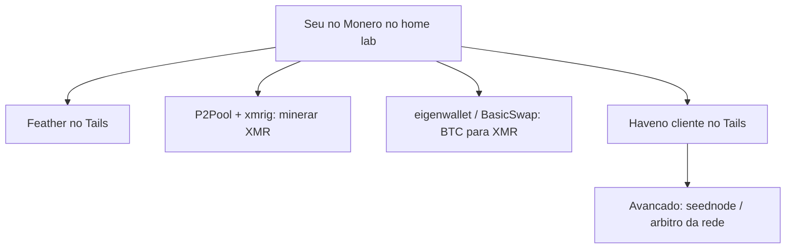

| Quer… | Explore | Onde roda | Nível |
|-------|---------|-----------|-------|
| Soberania total no Monero | **`monerod`** (nó próprio) | Home lab | Médio |
| Minerar XMR descentralizado | **P2Pool + xmrig** (precisa de nó full + ZMQ) | Home lab | Médio |
| Trocar BTC↔XMR sem intermediário | **eigenwallet** (cliente + ASB) ou **BasicSwap** | Cliente + home lab | Médio/Alto |
| P2P estilo Bisq (base Bitcoin) | **Bisq / Bisq2** | Desktop | Médio |
| Carteira leve e privada | **Feather** (ligada ao seu nó) | Tails / desktop | Fácil |
| Ser infraestrutura da rede Haveno | **seednode / árbitro** (`deployment-guide.md`) | Home lab | Alto |

**Mineração (resumo):** o P2Pool exige `monerod` **full** com flags específicas (`--zmq-pub`, `--out-peers`/`--in-peers`, `--disable-rpc-ban`), depois o **P2Pool** e o minerador **xmrig**. RandomX usa ~2–3 GB de RAM por instância no modo rápido. Links no Capítulo 8.

### Scripts bônus do Home Lab

Para quem quiser automatizar a infraestrutura, há scripts prontos em **`Scripts/HomeLab/`** (rodam no **home lab Debian/Ubuntu**, **não** no Tails):

| Script | Modalidade |
|--------|------------|
| `00-verificar-requisitos.sh` | **Pré-voo** (CPU, RAM, disco/SSD, rede) — só leitura, não muda nada |
| `01-setup-monero-node.sh` | Nó Monero (`monerod` + systemd; pruned ou `PRUNED=0` full) |
| `02-tor-hidden-service.sh` | Publica o RPC via Tor e mostra o `.onion` |
| `03-setup-p2pool.sh` | P2Pool (`WALLET=4xxx`, sidechain mini) |
| `04-setup-xmrig.sh` | Minerador xmrig → P2Pool |

Comece pelo **`00-verificar-requisitos.sh`** (diz se dá para nó pruned, full e/ou mineração). Cada script é **independente**, mostra o **SHA256** do que baixa (confira antes de confiar) e roda num usuário dedicado `monero`. Detalhes: `Scripts/HomeLab/README.md`.

> **Escopo:** tudo nesta seção é **pós-curso, opcional e avançado**. A "formatura" continua sendo o **Haveno verde no Tails**. Cada serviço tem o seu próprio modelo de segurança — leia a documentação oficial (Capítulo 8) antes de expor qualquer coisa à rede.

---

# 7. FAQ — ERROS POSSÍVEIS APÓS RODAR OS SCRIPTS

> Este FAQ é **focado no que pode acontecer depois de rodar os scripts num Tails 7.8.1+ real** (ou a instalação manual do Capítulo 3). É um resumo prático — não um dicionário de todos os erros.

Antes de tudo, lembre: **abra o Haveno pelo menu** (ou `exec.sh`), com **Tor conectado** e **senha admin** ativa.

## 7.1 Travou em "(1/4) Connecting to Tor network"

A barra do Haveno parou no passo **1 de 4**. Isso quase nunca é "a rede caiu" — é o **Tor local** que ainda não está pronto.

- Confirme o Tor do Tails: `curl -s --max-time 30 https://check.torproject.org/api/ip | grep IsTor` deve dar `true`.
- Relógio/data corretos (Tor falha com relógio muito errado). O `haveno-auto.sh` ajusta a hora via Tor.
- Aguarde 5–10 min na 1ª vez. Se passar de ~30 min preso no 1/4, feche e reabra.

## 7.2 Não fica verde + pop-up "No default Tor Instance configured"

Sintoma clássico de **onion-grater sem o perfil**. No log (`sudo journalctl -u onion-grater -b --no-pager | tail -30`) você vê `loaded filter: None` ou `command filtered: AUTHCHALLENGE`.

Correção (feche o Haveno antes):

```bash
sudo cp /home/amnesia/Persistent/haveno/App/utils/haveno.yml /etc/onion-grater.d/haveno.yml
sudo chmod o+r /var/run/tor/control.authcookie
python3 -c "import yaml; yaml.safe_load(open('/etc/onion-grater.d/haveno.yml')); print('YAML OK')"
sudo systemctl restart onion-grater
```

Reabra pelo menu. (O `haveno-auto.sh` faz exatamente isto sozinho se detectar o filtro `None`.)

## 7.3 `chmod: cannot access '/var/run/tor/control.authcookie'`

O Tor ainda não subiu. Aguarde o Tor conectar (7.1) e repita o `chmod o+r`.

## 7.4 `has bad YAML and was not loaded`

O `haveno.yml` em `/etc/onion-grater.d/` está corrompido (ex.: editado à mão, aspas curvas, ponto extra). **Não** edite manualmente — recopie o oficial:

```bash
sudo cp /home/amnesia/Persistent/haveno/App/utils/haveno.yml /etc/onion-grater.d/haveno.yml
sudo systemctl restart onion-grater
```

## 7.5 PGP não confere / "Verification failed"

A verificação de assinatura falhou no `haveno-install.sh`. Causas: URL de uma rede + PGP de outra, ou release/fingerprint trocados. Use **URL e PGP do mesmo release da mesma rede**. Confira o fingerprint na página oficial da rede.

## 7.6 Indicador amarelo por muito tempo (depois do 1/4)

Já passou do Tor e está sincronizando P2P/Monero. Na 1ª vez, 15–30 min pode ser normal. Se persistir muito: confirme Tor OK, `loaded filter: haveno` no log, e o status da **sua rede** (seed nodes) nos canais oficiais.

## 7.7 Carteira "nova" ou vazia após reboot

Quase sempre o Haveno foi aberto **sem** `--userDataDir` (ex.: rodando o binário direto). Resultado: usou pasta volátil em vez de `~/Persistent/haveno/Data`.

**Solução:** abra **sempre** por **Aplicações → Outros → Haveno** (ou `exec.sh`), que força o caminho persistente. Se tiver backup: `Scripts/haveno-backup.sh --restore SEU_BACKUP.tar.gz.gpg`.

## 7.8 Atalho do Haveno sumiu do menu

A persistência foi criada **sem Dotfiles**, ou o `haveno-install.sh` não rodou após um reset. Reative **Dotfiles** (Capítulo 2.4) e rode o `haveno-install.sh` de novo.

## 7.9 Estou no Debian comum (não Tails) e travou no 1/4

Este curso é para **Tails**. No Debian, o `.deb` da rede funciona **se** o Tor do sistema estiver instalado e ativo (`sudo apt install tor` + `systemctl enable --now tor`), e a porta SOCKS costuma ser **9050** (não 9062). Os scripts deste curso assumem **Tails**.

## 7.10 Quando reabrir / reinstalar do zero

Se nada resolver: feche o Haveno (`pkill -f Haveno` se preciso), confirme Tor OK e admin ativa, e rode novamente o `haveno-auto.sh` (ou o passo 3.2 manual). Seus dados em `Data/` são preservados.

---

# 8. TODOS OS LINKS (referência única)

Toda URL do curso reunida aqui — para o resto do livro ficar sem links saltando.

## Tails

| Tema | Link |
|------|------|
| Instalar Tails | https://tails.net/install/index.en.html |
| Persistência | https://tails.net/doc/persistent_storage/index.en.html |
| Backup da persistência | https://tails.net/doc/persistent_storage/backup/index.en.html |
| Senha de administrador | https://tails.net/doc/first_steps/welcome_screen/administration_password/ |
| Tor / Internet no Tails | https://tails.net/doc/anonymous_internet/index.en.html |
| onion-grater (conceito) | https://www.whonix.org/wiki/Dev/onion-grater |

## Haveno (projeto e scripts)

| Tema | Link |
|------|------|
| Site | https://haveno.exchange/ |
| FAQ | https://haveno.exchange/faq/ |
| Documentação | https://docs.haveno.exchange/ |
| Getting Started | https://docs.haveno.exchange/users/getting_started/ |
| Backup e restauração | https://docs.haveno.exchange/users/haveno-ui/backup_and_restore/ |
| Docs (espelho GitHub) | https://github.com/haveno-dex/haveno-docs |
| Repositório principal | https://github.com/haveno-dex/haveno |
| Scripts Tails (`install_tails`) | https://github.com/haveno-dex/haveno/tree/master/scripts/install_tails |
| `haveno-install.sh` | https://github.com/haveno-dex/haveno/blob/master/scripts/install_tails/haveno-install.sh |
| `haveno.yml` | https://github.com/haveno-dex/haveno/blob/master/scripts/install_tails/assets/haveno.yml |
| Correção do exploit (PR) | https://github.com/haveno-dex/haveno/pull/2315 |
| Criar rede própria (avançado) | https://github.com/haveno-dex/haveno/blob/master/docs/create-mainnet.md |

## Rede RetoSwap (turma, ex-Reto)

| Tema | Link |
|------|------|
| Releases (`.deb` amd64) | https://github.com/retoaccess1/haveno-reto/releases |
| Repositório | https://github.com/retoaccess1/haveno-reto |
| Chave PGP | https://retoswap.com/reto_public.asc |
| Fingerprint | `DAA24D878B8D36C90120A897CA02DAC12DAE2D0F` (TOFU — confira importando a chave) |
| Docs da comunidade | https://boldsuck.github.io/haveno-reto-docs/ |

## Monero e outras ferramentas (Capítulo 6)

| Tema | Link |
|------|------|
| Monero (site) | https://www.getmonero.org/ |
| Monero downloads | https://www.getmonero.org/downloads/ |
| Monero — começar | https://www.getmonero.org/get-started/ |
| Atomic swaps (anúncio) | https://www.getmonero.org/2021/08/20/atomic-swaps.html |
| Feather (Tails) | https://docs.featherwallet.org/guides/tails |
| Trocador | https://trocador.app/ |
| BasicSwap | https://basicswapdex.com/ |
| eigenwallet | https://eigenwallet.org/ |
| Bisq | https://bisq.network/ |
| Haveno Aloha | https://haveno-aloha.com/ |
| Paper P2P Monero | https://arxiv.org/html/2505.02392v2 |

## Home lab / nó próprio (Capítulo 6)

| Tema | Link |
|------|------|
| Rodar um nó Monero (docs oficiais) | https://docs.getmonero.org/running-node/ |
| `monerod` via systemd (sempre ligado) | https://docs.getmonero.org/running-node/monerod-systemd/ |
| Nó Monero sobre Tor / I2P (hidden service) | https://docs.getmonero.org/running-node/monerod-tori2p/ |
| Carteira local via Tor ao seu daemon | https://www.getmonero.org/resources/user-guides/tor_wallet.html |
| P2Pool (mineração descentralizada) | https://p2pool.io/ · https://github.com/SChernykh/p2pool |
| xmrig (minerador) | https://github.com/xmrig/xmrig |
| Haveno deployment (seednode / árbitro) | https://github.com/haveno-dex/haveno/blob/master/docs/deployment-guide.md |

---

# 9. DICAS E ALERTAS FINAIS — não cair em roubadas

Você chegou ao fim. Esta é a parte que **todo usuário Expert** deve ter gravada. Leia com atenção — privacidade e dinheiro andam juntos, e a maioria dos prejuízos vem de **erro humano**, não de falha técnica.

## 9.1 Regras de ouro (decore)

| Regra | Por quê |
|-------|---------|
| Baixe **só** de fontes oficiais (`tails.net`, `getmonero.org`, GitHub da rede) | Links de terceiros podem ser malware |
| **Verifique o PGP** de todo `.deb` (URL e PGP da **mesma** rede) | Garante que o instalador é autêntico |
| Use **`1.6.0-reto`+** (versão com o fix do exploit) | Versão antiga = risco no protocolo de trade |
| **Instalar ≠ tradear.** Comece com **valores pequenos** | Reduz perda se algo der errado |
| **Seed = controle total dos fundos.** Nunca compartilhe; anote **offline** | Quem tem a seed leva os fundos |
| **Seed ≠ backup completo** — faça backup da pasta `Data/` | A seed não guarda histórico/contas |
| **Abra sempre pelo menu** (força `--userDataDir`) | Senão a carteira vai para pasta volátil |
| **Senha admin a cada sessão**; a persistência guarda os dados | É assim que o Tails funciona |
| **Backup cifrado e offline**, em mídia separada | Protege contra perda/roubo do pendrive |

## 9.2 Golpes comuns e como não cair (roubadas)

| Golpe / armadilha | Sinal de alerta | Sua defesa |
|-------------------|-----------------|------------|
| **Instalador falso** | Link de fórum/Telegram/"versão modificada" | Só site/GitHub **oficial** + **verificar PGP** |
| **"Suporte" no DM** pedindo seed/senha/tela | Alguém te chama no privado oferecendo ajuda | **Ninguém** legítimo pede seed/senha. Ignore |
| **Site clone (phishing)** | Domínio parecido, erros sutis | Confira o domínio; salve favoritos; via Tor |
| **Negociar fora do app** | "Vamos resolver por fora", "manda primeiro" | **Toda** negociação dentro do Haveno (escrow/multisig) |
| **Preço bom demais / pressa** | Urgência, desconto irreal | Desconfie; use o fluxo normal do app |
| **Pagamento irreversível antecipado** | Pedem envio antes do escrow | Siga o passo a passo do Haveno; nunca antecipe |
| **"Mixer/serviço de privacidade extra"** | Promete "limpar" XMR por uma taxa | **Desnecessário** no Monero (já é privado); muitos são scam |
| **Falso árbitro** | "Sou o árbitro, me mande a chave" | O árbitro age **dentro** do app; nunca por fora |

> Regra única que resume tudo: **se envolve sua seed, sua senha, ou enviar fundos "por fora" do app — é golpe.**

## 9.3 KYC e agregadores de swap (a dúvida do "parceiro pode pedir KYC")

**O que é KYC?** *Know Your Customer* — verificação de identidade (documento, selfie, comprovante). Quem busca privacidade normalmente quer **evitar** KYC.

**Haveno é no-KYC por desenho:** é P2P; você é identificado apenas pelo **método de pagamento** que escolher, não por documentos.

**Mas e o Trocador (e outros agregadores)?**

| Camada | O que é | KYC? |
|--------|---------|------|
| **Trocador** | Um **agregador**: compara taxas e **encaminha** seu swap para um **parceiro** (ChangeNow, SideShift, Majestic Bank, etc.) | O Trocador em si não pede; ele **roteia** |
| **Parceiro final** | Quem **realmente** processa o swap | **Pode** exigir KYC se marcar a transação como "risco AML" |

Por isso a frase do Capítulo 6: *"o parceiro final pode pedir KYC"* — mesmo o Trocador sendo no-KYC, **quem executa** o swap pode congelar e pedir verificação. Você não controla isso.

**Como reduzir o risco (se for usar agregador):**

- Filtre por **"No KYC"** / boa reputação no Trocador antes de confirmar.
- Faça **valores pequenos** (transações grandes acionam mais checagens AML).
- Gere um **subendereço novo** do seu Monero para cada operação.
- Acesse **via Tor** (.onion do serviço).
- **Não** envie fundos com histórico "de risco" (vindos de mixers, etc.) — o parceiro recusa.
- Prefira um **par de confiança** (ex.: BTC→XMR) e parceiros bem avaliados.

**Resumo da diferença:**

| Caminho | Modelo | KYC |
|---------|--------|-----|
| **Haveno** (P2P) | Negocia direto com outra pessoa, escrow multisig | **No-KYC** por desenho |
| **Agregador/swap instantâneo** | Envia para um parceiro que devolve outra moeda | **Depende do parceiro** (pode pedir) |

## 9.4 Privacidade — bom senso

- No Tails, **tudo já passa pela Tor** — não tente "burlar" isso.
- **Não reutilize endereços**; o Monero usa **subendereços** novos automaticamente — use isso a seu favor.
- **Não misture** sua identidade da clearnet (e-mail real, redes sociais) com o uso do Haveno.
- Rodar **o seu próprio nó** (Capítulo 6) reduz a dependência de nós de terceiros — mas só ajuda se for acessado **via Tor/LAN confiável**.

## 9.5 Checklist final do Expert

- [ ] Haveno **verde** no Tails (`loaded filter: haveno`)
- [ ] (Recomendado) **Scripts instalados** em `~/Persistent/` (`haveno-auto/backup/update` prontos)
- [ ] **Backup** feito: pasta `Data/` cifrada + **seed** anotada offline (separadas)
- [ ] Sei **atualizar** com backup antes (`haveno-update.sh`)
- [ ] Li a tabela de **golpes** (9.2) e entendi **KYC/agregadores** (9.3)
- [ ] Uso **`1.6.0-reto`+** e confirmo a retomada do trading nos canais oficiais
- [ ] (Opcional) explorei o **home lab**: nó próprio, Tor, mineração

**Parabéns — você concluiu o Tails OS Expert.** O conhecimento aqui vale mais que qualquer atalho: **verifique tudo, desconfie de pressa, nunca entregue sua seed.**

> 📄 **Para imprimir / colar no grupo:** `Folheto — Regras e Golpes.md` (resumo de 1 página das regras de ouro e dos golpes).

---

*Tails OS Expert — Volume I. Tails 7.8.1+ · scripts `install_tails` (haveno-dex/haveno) · rede Reto `1.6.0-reto`. Revisão: jun/2026. Comandos: `Playbooks/Playbooks.md`; automação: `Scripts/`. Volume II: `Expansão Curso/`.*
