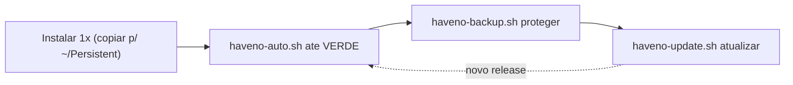

# Scripts — Tails OS Expert

Automação do curso. Há dois conjuntos:

**A) No Tails (cliente)** — ciclo de vida do Haveno:

| Script | Função |
|--------|--------|
| `haveno-auto.sh` | Instalar → abrir → **verde** (Tor, relógio UTC via Tor, PGP, onion-grater) |
| `haveno-backup.sh` | **Backup/restauração** cifrada da carteira (persistência ou USB) |
| `haveno-update.sh` | **Atualizar** o Haveno fazendo **backup antes** |
| `haveno-backup.desktop` | Atalho de menu para o backup (clique em vez de terminal) |

**B) No Home Lab (infraestrutura, bônus)** — pasta [`HomeLab/`](HomeLab/README.md), **não roda no Tails**:

| Script | Modalidade |
|--------|------------|
| `HomeLab/01-setup-monero-node.sh` | Nó Monero (`monerod` + systemd) |
| `HomeLab/02-tor-hidden-service.sh` | Publicar o nó via Tor (.onion) |
| `HomeLab/03-setup-p2pool.sh` | Mineração descentralizada (P2Pool) |
| `HomeLab/04-setup-xmrig.sh` | Minerador (xmrig → P2Pool) |

Teoria e fundamentos: `../Curso — Tails OS Expert.md` (Cap. 6 cobre o Home Lab). Comandos manuais: `../Playbooks/Playbooks.md`.

> Pré-requisitos (sempre manuais): Tails no USB, **Tor conectado**, **persistência + Dotfiles**, **senha admin** da sessão. Veja Capítulo 2 do livro.

## Ciclo de uso — a ordem dos scripts (comece por aqui)

Faça **uma vez**: copie os scripts para `~/Persistent/` (seção logo abaixo). Depois é só este ciclo:



| Quando | Rode |
|--------|------|
| **1ª vez** (uma vez só) | Copiar scripts → `~/Persistent/` + `chmod +x` (seção abaixo) |
| **A cada sessão** (após os passos 1–4) | `~/Persistent/haveno-auto.sh` → indicador **verde** |
| **Antes do 1º depósito / periodicamente** | `~/Persistent/haveno-backup.sh` (cifrado) |
| **Quando sair release novo** | `~/Persistent/haveno-update.sh` (faz o backup antes) |

---

## Instalar os scripts em `~/Persistent` (uma vez)

Os scripts precisam estar na **persistência** para rodar com caminho simples. Use **um** dos métodos.

### Método A — pelo gerenciador de Arquivos (simples)

1. Abra **Arquivos** e entre nesta pasta (`Tails OS Expert/Scripts`).
2. Selecione `haveno-auto.sh`, `haveno-backup.sh`, `haveno-update.sh`, `haveno-backup.desktop`.
3. **Copiar** → cole em **Casa → Persistent** (`/home/amnesia/Persistent`).
4. No Terminal:

```bash
chmod +x ~/Persistent/haveno-*.sh
```

### Método B — um comando (não depende do nome da pasta)

> Use o Método B se você **renomeou** a pasta do curso ou o caminho é diferente do padrão. Para a maioria, o **Método A** basta.

```bash
find ~/Persistent -type f \( -name 'haveno-auto.sh' -o -name 'haveno-backup.sh' -o -name 'haveno-update.sh' -o -name 'haveno-backup.desktop' \) -exec cp -t ~/Persistent {} +
chmod +x ~/Persistent/haveno-*.sh
```

Depois rode sempre por: `~/Persistent/haveno-auto.sh`, `~/Persistent/haveno-backup.sh`, `~/Persistent/haveno-update.sh`.

---

## 1. `haveno-auto.sh` — instalar até o verde

Depois da Persistência + Dotfiles + admin (passos 1–4 do Playbooks):

```bash
~/Persistent/haveno-auto.sh
```

O que faz (em ordem): confere ambiente → garante fuso **UTC** → espera **Tor** → ajusta relógio pela hora obtida **via Tor** (sem vazar local) → baixa e instala o Haveno (URL + PGP da **Reto**, com verificação) → abre pelo menu (`exec.sh`/`pkexec`) → verifica `loaded filter: haveno` e **corrige o onion-grater** se vier `None` → monitora.

Opções:

```bash
~/Persistent/haveno-auto.sh --no-clock   # não mexe no relógio
~/Persistent/haveno-auto.sh --update     # força reinstalar/atualizar o .deb
~/Persistent/haveno-auto.sh 15           # monitora o log por 15 min
```

**Para outra rede:** edite `HAVENO_DEB_URL` e `HAVENO_PGP_FPR` no topo do script.

**OK se:** ao final, a janela do Haveno fica **verde** (amarelo 5–20 min na 1ª vez é normal). Se não: veja Capítulo 7 (FAQ) do livro.

---

## 2. `haveno-backup.sh` — backup e restauração

**Feche o Haveno antes** (o script avisa). Para USB, **monte** o pendrive no gerenciador de Arquivos primeiro.

```bash
~/Persistent/haveno-backup.sh                 # cifrado, em ~/Persistent/Backups
~/Persistent/haveno-backup.sh --usb           # escolhe um USB montado
~/Persistent/haveno-backup.sh --dest /media/amnesia/MEU_USB
~/Persistent/haveno-backup.sh --no-encrypt    # sem cifrar (NÃO recomendado)
```

Faz: compacta `~/Persistent/haveno/Data/` → verifica integridade → **cifra com GPG** (pede senha) → salva + gera `.sha256`.

Restaurar (salva o estado atual antes de sobrescrever):

```bash
~/Persistent/haveno-backup.sh --restore ~/Persistent/Backups/haveno-data-AAAA....tar.gz.gpg
```

Conferir um backup:

```bash
sha256sum -c ~/Persistent/Backups/haveno-data-AAAA....tar.gz.gpg.sha256
```

> A **seed** (Account → Wallet seed) **não** entra no arquivo — anote-a à parte. Seed ≠ backup completo.

### Atalho de menu (clique)

```bash
mkdir -p ~/.local/share/applications
find ~/Persistent -type f -name 'haveno-backup.desktop' -exec cp -t ~/.local/share/applications {} +
chmod +x ~/.local/share/applications/haveno-backup.desktop
```

Com **Dotfiles** ativo, o atalho persiste entre sessões. Para backup direto no USB pelo atalho, acrescente ` --usb` na linha `Exec=` do `.desktop`.

---

## 3. `haveno-update.sh` — atualizar com backup antes

Quando a sua rede publicar versão nova:

```bash
~/Persistent/haveno-update.sh \
  --url "https://github.com/retoaccess1/haveno-reto/releases/download/VERSAO-NOVA/haveno-vVERSAO-linux-x86_64-installer.deb" \
  --pgp "FINGERPRINT_DA_MESMA_REDE"
```

Faz: confere ambiente → mostra a versão do Tails e **orienta o upgrade do sistema** (Tails Upgrader) → espera Tor → **BACKUP da carteira ANTES** (usa o `haveno-backup.sh`; se faltar, faz um backup cifrado simples) → reinstala o `.deb` novo com **verificação PGP** → abre e confere `loaded filter: haveno`. Os dados em `Data/` são **preservados**.

Sem `--url/--pgp`, reinstala os valores padrão (útil para "reparar" a versão atual). Se o backup falhar, a atualização é **abortada** (dados intactos).

> **Tails (sistema operacional):** este script **não** atualiza o Tails. Use o **Tails Upgrader** (aparece ao conectar no Tor) ou reinstalação oficial — sempre **depois** do backup.

---

## Segurança (resumo)

- Use **só `1.6.0-reto`+** (exploit de trades corrigido nessa versão). Cap. 4 do livro.
- **Instalar ≠ tradear.** Verde = instalação OK; tradear é decisão sua, com cautela e valores pequenos.
- Os scripts **não** tocam em fundos; preservam `~/Persistent/haveno/Data/`.

*Scripts do curso Tails OS Expert · Reto 1.6.0-reto · maio/2026.*
