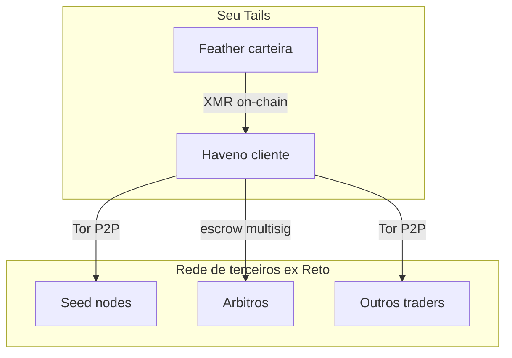
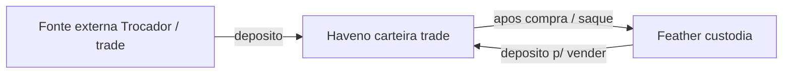

# Tails OS Expert — Extensão: Rede Descentralizada (mão na massa)

**Volume II do curso.** Tudo que o livro principal menciona como mapa, conceito ou apêndice — aqui vira **passo a passo**, com comandos e checklists.

> **Capturas de tela:** prints da UI Haveno estão **pendentes** (manifesto em [`../imagens/screenshots-haveno/README.md`](../imagens/screenshots-haveno/README.md)). Os passos textuais são suficientes para concluir; cada capítulo de trade avisa o que você deve ver na tela.

| Volume | Arquivo | Foco |
|--------|---------|------|
| **I** | [`../Curso-Tails-OS-Expert.md`](../Curso-Tails-OS-Expert.md) | Tails + Haveno **verde** + fundamentos + segurança |
| **II (este)** | Este arquivo | **Usar** a rede: carteira, trades, Feather, home lab, ecossistema |
| **II (comandos)** | [`Playbooks-Rede-Descentralizada.md`](Playbooks-Rede-Descentralizada.md) | Só comandos do Volume II |

> **Pré-requisito:** Haveno com indicador **verde** (Volume I, Caps. 2–3) — e **leia os Caps. 4, 5 e 9** do Vol. I (segurança, seed, golpes) **antes de criar conta ou depositar XMR**. Tails **7.8.1+**, persistência + Dotfiles, rede **Reto `1.6.0-reto`** (ou outra rede com URL + PGP conferidos).

### Antes do 1º trade — leia só isto no Volume II

Não precisa ler os 19 capítulos de uma vez. Para o **primeiro trade com valor pequeno**, siga nesta ordem:

| Ordem | Capítulo | Por quê |
|-------|----------|---------|
| 1 | **Cap. 2** — seed na criação | Proteja a carteira **antes** de depositar XMR |
| 2 | **Cap. 5** — Feather ↔ Haveno | Saber mover XMR entre custódia e Haveno |
| 3 | **Cap. 7** — comprar XMR (ou Cap. 8 se for vender) | Fluxo do trade passo a passo |

Depois explore Caps. 3–4 (Feather/PGP), 6 (primeiro XMR), 9 (disputa), 11 (pagamentos) e o restante (home lab, ecossistema) conforme necessidade.

---

## Sumário

1. [O que é "rede descentralizada" (na prática)](#1-o-que-é-rede-descentralizada-na-prática)
2. [Haveno — primeira conta e proteção da seed](#2-haveno--primeira-conta-e-proteção-da-seed)
3. [Feather no Tails — instalar e verificar](#3-feather-no-tails--instalar-e-verificar)
4. [PGP na mão — quando o script falha ou você quer conferir](#4-pgp-na-mão--quando-o-script-falha-ou-você-quer-conferir)
5. [Feather ↔ Haveno — fluxo de XMR](#5-feather--haveno--fluxo-de-xmr)
6. [Conseguir o primeiro XMR (3 caminhos)](#6-conseguir-o-primeiro-xmr-3-caminhos)
7. [Trade na prática — comprar XMR](#7-trade-na-prática--comprar-xmr)
8. [Trade na prática — vender XMR](#8-trade-na-prática--vender-xmr)
9. [Disputa — passo a passo](#9-disputa--passo-a-passo)
10. [Multisig 2-de-3 — o que você faz vs o que o app faz](#10-multisig-2-de-3--o-que-você-faz-vs-o-que-o-app-faz) · [Anexo: criação manual CLI](Multisig-2-de-3-criacao-manual-CLI.md)
11. [Métodos de pagamento — riscos reais](#11-métodos-de-pagamento--riscos-reais)
12. [Outra rede Haveno (ex.: Aloha)](#12-outra-rede-haveno-ex-aloha)
13. [Home Lab integrado — lab completo](#13-home-lab-integrado--lab-completo)
14. [Bisq no Tor — introdução prática](#14-bisq-no-tor--introdução-prática)
15. [Trocador — swap passo a passo](#15-trocador--swap-passo-a-passo)
16. [Atomic swaps — eigenwallet e BasicSwap](#16-atomic-swaps--eigenwallet-e-basicswap)
17. [Infra Haveno — seednode e árbitro (panorama)](#17-infra-haveno--seednode-e-árbitro-panorama)
18. [Atualizar o Tails (sistema)](#18-atualizar-o-tails-sistema)
19. [Links da extensão](#19-links-da-extensão)

---

# 1. O que é "rede descentralizada" (na prática)

No Volume I você instalou o **cliente** Haveno. Agora entenda **o que conecta** quando fica verde.



| Peça | O que é | Você configura? |
|------|---------|----------------|
| **Protocolo Haveno** | Software open source (haveno-dex/haveno) | Não — você usa o `.deb` da **sua rede** |
| **Rede de terceiros** | Operador comunitário (Reto, Aloha, …) que publica `.deb`, seed nodes e árbitros | Só escolhe **uma** rede por vez |
| **Seed nodes** | Pontos de entrada P2P da rede | Não — a rede opera |
| **Árbitros** | Resolvem **disputas**; uma chave do multisig 2-de-3 | Não — entram só se você abrir disputa |
| **Escrow multisig** | Carteira 2-de-3 **por trade** (você + contraparte + árbitro) | **Automático** ao aceitar/criar oferta |
| **Feather** | Carteira Monero **sua** (custódia fora do trade) | **Sim** — Capítulo 3 desta extensão |

**Regra:** Haveno **não é** Binance. Não existe "conta central". Você negocia **P2P** com outra pessoa; a rede só fornece infraestrutura e árbitros.

**OK se:** você sabe explicar a diferença entre **rede** (Reto), **cliente** (app no Tails) e **carteira** (Feather ou Haveno `Data/`).

---

# 2. Haveno — primeira conta e proteção da seed

> Complementa o Volume I, seção [5.1](../Curso-Tails-OS-Expert.md#51-carteira--criar-restaurar-onde-ficam-os-dados). Aqui é o **ritual na criação** — faça **antes** de depositar XMR ou tradear.

## 2.1 Checklist — momento da primeira conta

Abra o Haveno **pelo menu** (Aplicações → Outros → Haveno) com indicador **verde**.

| # | Faça | OK se |
|---|------|-------|
| 1 | Assistente de **primeira conta** ou **Account → Create account** | Conta criada com **senha forte** (só para o Haveno) |
| 2 | **Account → Wallet seed** — anote a seed em **papel ou metal** | Você tem a seed **offline**, legível |
| 3 | Se a interface pedir, **confirme** a seed (digite palavras de volta) | Passou na verificação |
| 4 | Guarde o papel **longe** do pendrive Tails e do PC | Seed em local físico separado |
| 5 | **Não** fotografe, imprima em impressora de rede, e-mail ou nuvem | Zero cópia digital da seed |
| 6 | Rode backup da pasta `Data/` (`Scripts/haveno-backup.sh` ou Account → Backup) | Arquivo `.tar.gz.gpg` (ou equivalente) em mídia **separada** |
| 7 | Entenda: **seed ≠ backup completo** | Você sabe que trades/histórico/contas ficam em `Data/` |

## 2.2 O que a seed controla (e o que não controla)

| Item | Seed sozinha | Backup `Data/` |
|------|--------------|----------------|
| Saldo XMR da carteira Haveno | **Sim** (restaura fundos) | **Sim** |
| Histórico de trades | **Não** | **Sim** |
| Contas de pagamento (PIX, etc.) | **Não** | **Sim** |
| Reputação / contratos abertos | **Não** | **Sim** |

## 2.3 Senhas — não confunda

| Senha | Onde | Serve para |
|-------|------|------------|
| **Persistência Tails** | Greeter ao boot | Desbloquear `~/Persistent/` |
| **Admin Tails** | Boas-vindas (+ Mais opções) | `sudo`, `pkexec`, instalar `.deb` |
| **Conta Haveno** | Dentro do app | Abrir a carteira Haveno |
| **Seed Haveno** | Offline | Recuperar **fundos** se perder `Data/` |

> **Nunca** digite a seed em chat, "suporte", site ou formulário. O árbitro **nunca** pede seed (Volume I, Cap. 9).

## 2.4 Restaurar (se perdeu o pendrive)

1. Novo Tails + persistência + Haveno instalado (Volume I).
2. **Preferível:** restaure o backup cifrado de `Data/` (`haveno-backup.sh --restore` ou copie `Data/` com Haveno **fechado**).
3. **Só seed (último caso):** Account → Restore from seed — perde histórico/contas; fundos on-chain voltam após sync.

**OK se:** seed anotada + backup `Data/` feito **antes** do primeiro depósito.

---

# 3. Feather no Tails — instalar e verificar

A **Feather** é a carteira Monero recomendada para **guardar** XMR fora do Haveno. Instalação alinhada à [documentação oficial Feather/Tails](https://docs.featherwallet.org/guides/tails).

## 3.1 Pré-requisitos

- Volume I concluído: persistência + Dotfiles + Tor OK.
- Pasta `~/Persistent/` acessível.

## 3.2 Download (Tor Browser)

1. Abra o **Tor Browser** no Tails.
2. Acesse **https://featherwallet.org/download**
3. Baixe o **AppImage for Tails** (não o genérico Linux, se houver opção separada).
4. Baixe também:
   - `featherwallet.asc` (chave de assinatura)
   - `feather-x.x.x-AppImage.asc` (assinatura do AppImage)

> Tor Browser salva em **Downloads**. Mova tudo para `~/Persistent/feather/`:

```bash
mkdir -p ~/Persistent/feather
mv ~/Tor\ Browser/Browser/Downloads/feather-* ~/Persistent/feather/ 2>/dev/null || true
mv ~/Tor\ Browser/Browser/Downloads/featherwallet.asc ~/Persistent/feather/ 2>/dev/null || true
cd ~/Persistent/feather
ls -la
```

## 3.3 Verificar PGP (obrigatório)

```bash
cd ~/Persistent/feather
gpg --import featherwallet.asc
gpg --list-keys dev@featherwallet.org
```

Confirme o fingerprint (espaços podem variar):

```text
8185 E158 A333 30C7 FD61 BC0D 1F76 E155 CEFB A71C
```

Verifique o AppImage (substitua a versão):

```bash
gpg --verify feather-2.9.0-AppImage.asc
```

**OK se:** `gpg: Good signature from "FeatherWallet <dev@featherwallet.org>"`.

Se **BAD signature** → **não execute**. Baixe de novo só de `featherwallet.org`.

## 3.4 Executar

```bash
chmod +x feather-*.AppImage
```

No gerenciador de arquivos: clique direito → **Propriedades** → **Permitir executar como programa**.

Execute: duplo clique ou `./feather-*.AppImage`.

> **AppImage** é um app Linux "tudo-em-um" num único arquivo — não precisa instalar; só dar permissão de execução e rodar. (No Tails, salve-o na persistência.)

## 3.5 Primeira abertura — carteira Feather

| Passo | Ação |
|-------|------|
| 1 | Escolha **Create new wallet** ou **Restore from seed** |
| 2 | Anote a **seed Feather** em papel/metal — **carteira separada** da seed do Haveno |
| 3 | Salve o arquivo `.keys` em `~/Persistent/feather/wallets/` |
| 4 | Rede: **Proxy → Always over Tor** (no Tails o tráfego já passa pelo Tor do sistema) |

> **Duas seeds:** uma do **Haveno** (trades), uma da **Feather** (custódia). Anote as duas, em papéis separados, com rótulo.

## 3.6 Conectar a um nó (padrão vs seu nó)

| Modo | Quando usar |
|------|-------------|
| **Nó remoto público** (padrão Feather) | Começar rápido; menos soberania |
| **Seu nó `.onion`** (Cap. 13) | Máxima privacidade; exige home lab |

No Feather: **Settings → Network → Nodes** → adicione `SEU_ENDERECO.onion:18089` com proxy SOCKS `127.0.0.1:9050` → marque como **trusted**.

**OK se:** Feather abre, sincroniza, mostra saldo (0 XMR no início é normal).

---

# 4. PGP na mão — quando o script falha ou você quer conferir

O `haveno-install.sh` verifica o `.deb` automaticamente. Use este capítulo se:

- o script falhou na verificação GPG;
- você baixou o `.deb` manualmente;
- quer **auditar** antes de instalar.

## 4.1 Haveno (rede Reto — exemplo)

```bash
cd ~/Persistent/haveno/Install   # ou onde está o .deb

# 1) Importar chave pública da REDE (Reto)
curl -fsSLO https://retoswap.com/reto_public.asc
gpg --import reto_public.asc
gpg --list-keys --with-fingerprint
# Confira: DAA24D878B8D36C90120A897CA02DAC12DAE2D0F

# 2) Baixar .deb + .sig (se a rede publicar .sig separado)
#    O install.sh baixa automaticamente; manualmente:
# curl -fsSLO "URL_DO_DEB"
# curl -fsSLO "URL_DO_DEB.sig"   # se existir

# 3) Verificar (ajuste nomes de arquivo)
gpg --verify haveno-v1.6.0-linux-x86_64-installer.deb.sig \
  haveno-v1.6.0-linux-x86_64-installer.deb
```

**OK se:** `Good signature` e fingerprint da **mesma rede** da URL.

## 4.2 Erros comuns

| Mensagem | Causa | Correção |
|----------|-------|----------|
| `BAD signature` | `.deb` adulterado ou PGP de **outra** rede | URL + PGP do **mesmo** release |
| `No public key` | Chave não importada | `gpg --import` do site oficial da rede |
| `Can't check signature: No public key` | Fingerprint errado | Confira em **dois** canais oficiais |

## 4.3 Feather (recapitulando)

Ver Capítulo 3.3. Fingerprint Feather: `8185E158A33330C7FD61BC0D1F76E155CEFBA71C`.

---

# 5. Feather ↔ Haveno — fluxo de XMR



## 5.1 Depositar XMR no Haveno (para tradear)

1. No Haveno: **Funds** (ou **Wallet**) → **Receive** → copie o **endereço XMR** (ou subendereço).
2. Na Feather: **Send** → cole o endereço → valor → confirme.
3. Aguarde confirmações (~10–20 min). Saldo aparece no Haveno após sync.

## 5.2 Sacar XMR do Haveno (após comprar)

1. No Haveno: **Funds → Send** (ou Withdraw) → endereço da **Feather** (Receive).
2. Confirme taxa e valor.
3. Verifique na Feather quando chegar.

> **Boa prática:** mantenha no Haveno só o necessário para **depósito de segurança** + trades ativos. O resto na **Feather**.

## 5.3 Endereços — dicas

- Use **subendereço novo** na Feather para cada recebimento externo (Trocador, doação).
- No Haveno, use o endereço que o app gera — não reutilize endereço de outra carteira.

**OK se:** você moveu 0,01 XMR de teste Feather → Haveno → Feather com sucesso.

---

# 6. Conseguir o primeiro XMR (3 caminhos)

Para tradear no Haveno você precisa de **pouco XMR** (depósito de segurança). Escolha **um** caminho:

## 6.1 Caminho A — Comprar no próprio Haveno (recomendado)

1. **Markets → Buy XMR** (ou equivalente).
2. Filtre ofertas com **depósito de segurança baixo** ou isento para comprador (depende da rede).
3. Siga o [Capítulo 7](#7-trade-na-prática--comprar-xmr) com **valor mínimo**.

## 6.2 Caminho B — Trocador (BTC/ETH → XMR)

Passo a passo completo no [Capítulo 15](#15-trocador--swap-passo-a-passo). Resumo:

1. Endereço **Receive** na Feather (subendereço novo).
2. Tor Browser → Trocador → par **BTC→XMR**, filtro **No KYC**.
3. Envie BTC → XMR cai na Feather → depois Cap. 5.1 para o Haveno.

## 6.3 Caminho C — P2P de confiança

- Conhecido envia XMR para sua Feather (presencial ou canal seguro).
- **Não** aceite "manda seed/endereço por Telegram" de desconhecido.

---

# 7. Trade na prática — comprar XMR

> **Antes:** Cap. 2 (seed + backup), saldo XMR para depósito de segurança, versão **`1.6.0-reto`+**, trading retomado nos canais oficiais.

> **Primeiro XMR?** O depósito de segurança exige um pouco de XMR na conta Haveno. Se o saldo está zerado, leia o [Cap. 6](#6-conseguir-o-primeiro-xmr-3-caminhos) **antes** de tomar uma oferta.

> **Telas pendentes:** prints em [`../imagens/screenshots-haveno/README.md`](../imagens/screenshots-haveno/README.md). Na UI você deve ver **Markets → Buy**, lista de ofertas e **Take offer** — nomes podem variar por versão.

## 7.1 Preparar conta de pagamento

1. **Account → Payment accounts → Add new**
2. Escolha o método (ex.: **PIX**, transferência bancária).
3. Preencha **dados reais** — o vendedor verá o que você configurou.
4. Salve. Faça backup `Data/` se for a primeira conta.

## 7.2 Tomar uma oferta (taker — comprador)

| # | Tela / ação | Detalhe |
|---|-------------|---------|
| 1 | **Markets → Buy XMR** | Ordene por preço, reputação, limite |
| 2 | Escolha oferta | Prefira vendedor **bem avaliado**; valor **pequeno** |
| 3 | **Take offer** | Leia taxas, depósito de segurança, tempo limite |
| 4 | Confirme | Seu **depósito de segurança** sai do saldo Haveno → entra no **multisig 2-de-3** |
| 5 | Veja dados de pagamento | **Só** os mostrados **no app** (nome, banco, PIX) |
| 6 | Pague o fiat | Pelo método exato; **guarde comprovante** |
| 7 | **Mark payment as sent** | **Somente depois** de pagar de verdade |
| 8 | Aguarde | Vendedor confere e **libera XMR** — tipicamente **15 min a 2 h** (PIX costuma ser rápido); o app mostra o tempo limite do trade |
| 9 | Concluído | XMR na carteira Haveno → [sacar para Feather](#52-sacar-xmr-do-haveno-após-comprar) |

> **Se travar na espera:** vendedor offline perto do prazo → **Open dispute** (Cap. 9). Não negocie "por fora" do chat do app.

## 7.3 Checklist comprador

- [ ] Tudo no **chat do app** (nada por WhatsApp/Telegram "por fora")
- [ ] Comprovante guardado (screenshot **se** permitido pelo método)
- [ ] Não marque "pago" antes de pagar
- [ ] Se vendedor sumir → **Open dispute** (Cap. 9)

---

# 8. Trade na prática — vender XMR

> **Mais arriscado** que comprar: métodos **reversíveis** (chargeback) permitem golpe.

## 8.1 Criar oferta (maker — vendedor)

| # | Ação |
|---|------|
| 1 | **Markets → Sell XMR → Create offer** |
| 2 | Defina preço, quantidade, **método de pagamento** (prefira **irreversível**) |
| 3 | Depósito de segurança + XMR à venda → **multisig** |
| 4 | Aguarde comprador **tomar** a oferta |

## 8.2 Quando alguém tomar sua oferta

| # | Ação | Crítico |
|---|------|---------|
| 1 | Comprador marca "pagamento enviado" | **Não confie** só no print dele |
| 2 | Abra **sua conta bancária/PIX real** | Confirme **valor exato** e **nome do remetente** |
| 3 | Espere compensação **irreversível** | PIX: após creditar; cartão/PayPal: **evite** |
| 4 | **Confirm payment received** / assine liberação | Só agora o XMR sai do escrow |
| 5 | Em dúvida | **Disputa** — nunca "resolve por fora" |

> **Tempo típico:** comprador marca "pagamento enviado" em **minutos a 1 h** após tomar a oferta; você confere o fiat na conta real antes de liberar — **não** confie só no print dele.

## 8.3 Checklist vendedor

- [ ] Método **irreversível** (PIX, dinheiro, transferência sem estorno)
- [ ] Nome do pagador bate com conta do trade
- [ ] **Nunca** libere XMR antes do fiat estar **na conta**
- [ ] Desconfie de **pressa** e comprador novo sem histórico

---

# 9. Disputa — passo a passo

1. Trade em andamento → botão **Open dispute** (ou **Dispute** no menu do trade).
2. Descreva o problema **no chat do app** (objetivo, datas, valores).
3. Anexe **comprovantes** pelo próprio app (se a UI permitir anexos).
4. Aguarde o **árbitro** da rede — ele analisa chat + provas.
5. Decisão: fundos do escrow vão para comprador ou vendedor conforme regras da rede.

| Faça | Não faça |
|------|----------|
| Manter **toda** conversa no Haveno | Negociar "por fora" com o árbitro |
| Enviar comprovantes legíveis | Enviar seed, senha ou backup |
| Abrir disputa cedo se a contraparte sumiu | Aceitar DM de "árbitro falso" |

> O árbitro **nunca** pede seed. Volume I, Cap. 9.

---

# 10. Multisig 2-de-3 — o que você faz vs o que o app faz

| Quem | O que faz |
|------|-----------|
| **Você** | Aceita/cria oferta; deposita XMR + depósito de segurança; assina liberação quando concorda |
| **Contraparte** | Idem, do outro lado |
| **Haveno (protocolo)** | Cria a carteira multisig 2-de-3 **automaticamente** por trade |
| **Árbitro** | Terceira chave; assina **só** se houver disputa |

**Para trades Haveno, você NÃO precisa:**

- Criar multisig manual no Monero CLI/GUI — o **app faz isso** por trade
- Escolher o árbitro por trade (a rede define)
- Compartilhar chaves ou seed com contraparte

> **Quer aprender ou operar multisig Monero fora do Haveno?** Não omitimos: anexo educacional
> [`Multisig-2-de-3-criacao-manual-CLI.md`](Multisig-2-de-3-criacao-manual-CLI.md) +
> [`Playbooks-Multisig-CLI.md`](Playbooks-Multisig-CLI.md). Use stagenet/testnet para praticar.

**Você SIM:**

- Entende que **2 de 3** assinaturas movem o escrow
- Mantém tudo **dentro do app**
- Usa **disputa** se algo der errado

Diagrama completo: Volume I, [seção 5.5](../Curso-Tails-OS-Expert.md#55-guia-rápido--comprar-e-vender-com-segurança-o-fluxo-da-rede).

---

# 11. Métodos de pagamento — riscos reais

| Método | Reversível? | Comprando XMR | Vendendo XMR |
|--------|-------------|---------------|--------------|
| **PIX** (Brasil) | Geralmente **não** (após creditar) | OK | **Preferido** para vender |
| **Transferência SEPA** (EU) | Pode ter recall em casos raros | OK com cuidado | Confirme compensação |
| **PayPal / cartão** | **Sim** (chargeback) | Cuidado | **Evite** vender |
| **Dinheiro em mãos** | Não | OK presencial | OK presencial |
| **Cripto on-chain** | Irreversível após confirmações | OK | OK (confirme rede/endereço) |
| **Zelle / Venmo / Cash App** | **Sim** | Cuidado | **Evite** vender |

**Regra vendedor:** só libere XMR quando o pagamento for **irreversível na sua conta real**.

**Regra comprador:** pague **exatamente** os dados do app; guarde comprovante.

---

# 12. Outra rede Haveno (ex.: Aloha)

O procedimento Tails é **idêntico** ao Volume I — só mudam **URL do `.deb`** e **PGP** (sempre do **mesmo** release).

## 12.1 Antes de trocar de rede

1. **Feche** trades abertos na rede atual.
2. **Backup** completo (`haveno-backup.sh`).
3. Anote seed Haveno (offline).

## 12.2 Obter URL + PGP da nova rede

| Rede | Onde conferir |
|------|---------------|
| **Aloha** | https://haveno-aloha.com/ · https://github.com/The-Aloha-Project/haveno-aloha/releases |
| **Reto** | https://github.com/retoaccess1/haveno-reto/releases · https://retoswap.com/ |

**Nunca** use PGP da Reto com `.deb` da Aloha (ou vice-versa).

## 12.3 Instalar (mesmo script oficial)

```bash
curl -fsSLO https://github.com/haveno-dex/haveno/raw/master/scripts/install_tails/haveno-install.sh \
  && bash haveno-install.sh "URL_DO_DEB_DA_NOVA_REDE" "FINGERPRINT_PGP_DA_MESMA_REDE"
```

Substitua pelos valores publicados no **site/GitHub oficial** da rede escolhida.

## 12.4 Dados e backup entre redes

| Ação | Seguro? |
|------|---------|
| Restaurar backup `Data/` de **outra** rede | **Não** — pode corromper ou misturar contratos |
| Mesma seed, rede nova | Consulte docs da **nova** rede antes |
| Instalação limpa + nova conta | **Recomendado** ao mudar de rede |

Confirme na nova rede se o **fix do exploit** (#2315) está na versão publicada antes de tradear.

---

# 13. Home Lab integrado — lab completo

> Roda no **Debian/Ubuntu** (mini PC / NUC / RPi + SSD), **não** no Tails. Scripts em [`../Scripts/HomeLab/`](../Scripts/HomeLab/README.md). Teoria detalhada: Volume I, Cap. 6.

## 13.1 Objetivo do lab


## 13.2 Sequência (ordem obrigatória)

No home lab:

```bash
cd ../Scripts/HomeLab
chmod +x *.sh

./00-verificar-requisitos.sh          # OK? CPU, RAM, SSD, rede

sudo ./01-setup-monero-node.sh        # nó pruned (padrão)
# OU para mineração depois:
# sudo PRUNED=0 ./01-setup-monero-node.sh

sudo ./02-tor-hidden-service.sh
sudo cat /var/lib/tor/monero-rpc/hostname   # anote o .onion
```

Acompanhe sync (8–48 h em SSD):

```bash
journalctl -u monerod -f
```

Teste RPC via Tor (máquina com Tor ou no Tails):

```bash
curl --socks5-hostname 127.0.0.1:9050 http://SEU_ENDERECO.onion:18089/get_info
```

## 13.3 Conectar Feather no Tails ao seu nó

1. Feather → **Settings → Network**
2. Proxy: SOCKS `127.0.0.1:9050`
3. Add node: `SEU_ENDERECO.onion:18089` → **Trusted**
4. Aguarde sync — deve usar **seu** nó, não nó público.

> Haveno no Tails usa proxy Monero **9062** internamente; conectar ao **seu** nó no Haveno pode exigir config avançada da rede. Para custódia, **Feather + seu nó** é o caminho mais direto.

## 13.4 Mineração (opcional — sequência extra)

Só após nó **FULL** + sync completo:

```bash
sudo WALLET=SEU_ENDERECO_PRIMARIO_4xxxx ./03-setup-p2pool.sh
sudo ./04-setup-xmrig.sh
journalctl -u xmrig -f    # shares "accepted"
```

Use carteira **só para mineração** — endereços P2Pool são públicos.

**OK se:** `curl` ao `.onion` retorna JSON; Feather sincroniza via seu nó.

---

# 14. Bisq no Tor — introdução prática

**Bisq** é P2P com base **Bitcoin** (não Monero-native como Haveno). Útil para BTC↔fiat; depois converte BTC→XMR (Trocador ou atomic swap).

## 14.1 Quando usar

| Use Bisq se… | Use Haveno se… |
|--------------|----------------|
| Quer P2P **Bitcoin** / fiat | Quer P2P **Monero-native** |
| Já tem BTC ou aceita stack BTC | Quer XMR direto, sem BTC no meio |

## 14.2 Instalação (Linux desktop — não Tails)

1. https://bisq.network/downloads/ — baixe `.deb` ou AppImage.
2. Verifique assinatura PGP (Bisq publica instruções no site).
3. **Settings → Network → Use Tor** (Bisq embute Tor ou usa sistema).

> No **Tails**, Bisq é **pesado** e **não** há script oficial como o Haveno. Para máxima privacidade Monero, priorize **Haveno + Feather** no Tails.

## 14.3 Primeiro trade Bisq (resumo)

1. Deposite **BSQ** ou **BTC** de segurança conforme regras Bisq.
2. Configure **conta de pagamento**.
3. Take offer / Create offer — fluxo similar ao Haveno (escrow, chat, disputa).
4. Para XMR: saque BTC → [Trocador Cap. 15](#15-trocador--swap-passo-a-passo) ou atomic swap Cap. 16.

---

# 15. Trocador — swap passo a passo

> Agregador — **não** é Haveno nem Feather. Volume I, Cap. 9.3 (KYC do parceiro).

## 15.1 Preparação

1. Feather aberta; **Receive** → copie subendereço XMR **novo**.
2. Tor Browser → https://trocador.app/ (ou `.onion` se disponível).
3. Par: ex. **BTC → XMR**.
4. Filtros: **No KYC**, parceiro bem avaliado, valor **pequeno** no 1º teste.

## 15.2 Execução

| # | Ação |
|---|------|
| 1 | Cole endereço XMR (Feather) |
| 2 | Confira taxa e tempo estimado |
| 3 | Trocador mostra endereço **BTC para enviar** |
| 4 | Envie BTC da sua carteira (fora do Tails ou outra sessão) |
| 5 | Aguarde confirmações → XMR chega na Feather |
| 6 | Verifique saldo Feather → mova ao Haveno se for tradear (Cap. 5.1) |

## 15.3 Se congelarem / pedirem KYC

- Parceiro final pode bloquear (AML). **Não** envie documentos se busca privacidade.
- Valores menores reduzem risco; histórico "limpo" de moedas ajuda.

---

# 16. Atomic swaps — eigenwallet e BasicSwap

Troca **BTC ↔ XMR** sem exchange centralizada — **sem** fiat P2P.

| Ferramenta | O que precisa | Onde roda |
|------------|---------------|-----------|
| **eigenwallet** | Cliente + opcional ASB no home lab | Desktop + Tor |
| **BasicSwap** | Docker, nós BTC + XMR | Home lab |

## 16.1 eigenwallet — primeiro passo

1. https://eigenwallet.org/ — baixe AppImage (verifique assinatura se publicada).
2. Cliente no Tails/desktop; tráfego via Tor.
3. Siga o assistente **Test swap** com valor mínimo antes de quantias grandes.
4. ASB (market maker) roda 24/7 no home lab — ver docs eigenwallet.

## 16.2 BasicSwap — visão

1. Home lab com Docker.
2. Sincronizar nós **Bitcoin** + **Monero** (pesado).
3. https://basicswapdex.com/ — guia de instalação.
4. Swaps on-chain; sem fiat.

> **Nível alto.** Complete Cap. 13 (nó Monero) antes. Não substitui Haveno para comprar com PIX.

---

# 17. Infra Haveno — seednode e árbitro (panorama)

Para **operar** a rede (não só usar):

| Papel | Função | Onde |
|-------|--------|------|
| **Seednode** | Ajuda peers a se encontrar | Home lab 24/7, `systemd` |
| **Árbitro** | Resolve disputas; chave multisig | Home lab, alta responsabilidade |
| **Price node** | Feed de preços (algumas redes) | Opcional |

Documentação: https://github.com/haveno-dex/haveno/blob/master/docs/deployment-guide.md

**Requisitos típicos:**

- VPS ou home lab estável, Tor, Java, build Haveno da **sua rede**
- Reputação e compromisso comunitário (não é "ligar e esquecer")
- **Não** rode seednode no Tails (amnésico, efêmero)

Este curso **não** substitui o deployment guide — use-o como referência oficial se quiser contribuir com infra.

---

# 18. Atualizar o Tails (sistema)

Separado de atualizar o **Haveno** (Volume I, 5.3).

## 18.1 Quando

- Notificação **Tails Upgrader** ao conectar Tor.
- Ou nova versão em https://tails.net/

## 18.2 Procedimento seguro

| # | Ação |
|---|------|
| 1 | **Backup** persistência (guia oficial Tails) + `haveno-backup.sh` |
| 2 | Anote seeds Haveno + Feather (offline) |
| 3 | **Tails Upgrader** (Aplicações → Tails → Upgrade) **ou** reinstalar USB com versão nova |
| 4 | Boot → desbloqueie persistência → Tor → admin |
| 5 | Abra Haveno pelo menu → confirme **verde** |
| 6 | Abra Feather → confirme sync |

> **Nunca** atualize Tails por script não oficial. Persistência costuma migrar, mas **backup antes** é obrigatório.

---

# 19. Links da extensão

| Tema | Link |
|------|------|
| Volume I (curso base) | [`../Curso-Tails-OS-Expert.md`](../Curso-Tails-OS-Expert.md) |
| Feather no Tails | https://docs.featherwallet.org/guides/tails |
| Feather Tor | https://docs.featherwallet.org/guides/tor-support |
| Haveno Getting Started | https://docs.haveno.exchange/users/getting_started/ |
| Haveno backup/restore | https://docs.haveno.exchange/users/haveno-ui/backup_and_restore/ |
| Reto releases | https://github.com/retoaccess1/haveno-reto/releases |
| Aloha | https://haveno-aloha.com/ · https://github.com/The-Aloha-Project/haveno-aloha |
| Trocador | https://trocador.app/ |
| Bisq | https://bisq.network/ |
| eigenwallet | https://eigenwallet.org/ |
| BasicSwap | https://basicswapdex.com/ |
| Haveno deployment | https://github.com/haveno-dex/haveno/blob/master/docs/deployment-guide.md |
| Scripts Home Lab | [`../Scripts/HomeLab/README.md`](../Scripts/HomeLab/README.md) |
| Tails upgrade | https://tails.net/doc/upgrade/index.en.html |

---

## Checklist final — Volume II

- [ ] Seed Haveno anotada **na criação** + backup `Data/`
- [ ] Feather instalada, PGP verificado, carteira em `~/Persistent/feather/`
- [ ] Teste Feather ↔ Haveno (micro transferência)
- [ ] Primeiro XMR (trade ou Trocador)
- [ ] Um trade completo (compra **ou** venda) com valor pequeno
- [ ] Sei abrir **disputa** e reconheço golpe de "árbitro falso"
- [ ] (Opcional) Home lab: nó + `.onion` + Feather conectada
- [ ] (Opcional) Explorei Bisq / Trocador / atomic swap conforme necessidade

**Parabéns — Volume II concluído.** Você passou de "Haveno verde" a **operar na rede descentralizada** com custódia, trades e ecossistema.

---

*Tails OS Expert — Extensão Rede Descentralizada · jun/2026 · Tails 7.8.1+ · Reto `1.6.0-reto` · Comandos Haveno/Tails no Volume I (`../Playbooks/Playbooks.md`).*
