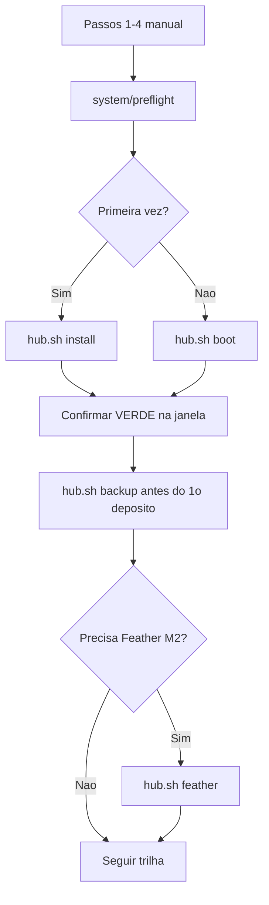

# Manual do Privacy-OS-Hub — scripts e repositório

> **Para quem?** Quem usa os scripts `.sh`, mantém o repo ou quer mapa rápido em 5 minutos.
>
> **Novato no curso?** Ignore este arquivo — abra [`🛡️ Privacy-OS-Hub - Versão 1.0.md`](../🛡️%20Privacy-OS-Hub%20-%20Versão%201.0.md) e siga os passos 1–12. Só use scripts **depois** dos passos **1–4** manuais (Tails no USB, Tor, persistência, admin).

**Partes:** [I — Mapa rápido](#parte-i--mapa-rápido) · [II — Scripts](#parte-ii--scripts-para-novato) · [III — Logs e export](#parte-iii--logs-validação-e-exportação)

Scripts no repo: [`automacao/tails/`](../automacao/tails/README.md) — instale com `sync-hub-scripts.sh` → **`~/Persistent/hub-scripts/`**.

> **Viu muitos `.sh`?** [Apêndice A — Catálogo](#apêndice-a--catálogo-de-cada-arquivo-iniciante) · resumo no **Apêndice A** do [canônico](../🛡️%20Privacy-OS-Hub%20-%20Versão%201.0.md).

---

<a id="parte-i--mapa-rápido"></a>

## Parte I — Mapa rápido

### Arquitetura v1.0

```text
Privacy-OS-Hub/
├── 🛡️ Privacy-OS-Hub - Versão 1.0.md   ← curso completo (passos 1–12)
├── 🏠 Home-Lab - Versão 1.0.md          ← opcional (Debian/Ubuntu)
├── README.md
├── automacao/                           ← scripts .sh → ~/Persistent/hub-scripts/
└── docs/                                ← manifesto, changelog, este manual
```

### Passo → onde ler no canônico

| Passo | Busque no canônico |
|:-----:|--------------------|
| 1 | `PASSO 1 — Bootstrap Tails` |
| 2 | `PASSO 2 — Haveno até o Verde` |
| 3 | `PASSO 3 — Cautela Pré-trade` |
| 4 | `PASSO 4 — Backup e Seed em Papel` |
| 5 | `PASSO 5 — Feather Wallet` |
| 6 | `PASSO 6 — Folheto` |
| 7 | `PASSO 7 — Rotina de Scripts` |
| 8 | `PASSO 8 — Porteiro` |
| 9 | `PASSO 9 — Ritual Seed` |
| 10 | `PASSO 10 — Whonix PGP` |
| 11 | `PASSO 11 — Modelo Frio-Quente` |
| 12A / 12B | `PASSO 12A` ou `PASSO 12B` |

Erros comuns: **Apêndice B** do canônico. Catálogo de scripts: **Apêndice A** do canônico + [Parte II](#parte-ii--scripts-para-novato) abaixo.

### Trilha linear (compacta)

| Passo | Foco |
|:-----:|------|
| **1–3** | Núcleo Haveno: Tails (1) → verde (2) → pré-trade (3) |
| **4–7** | Pré-M2: seed · Feather · folheto · rotina `boot` |
| **8–12** | Custódia fria (Whonix + cold-signing) |

Pré-req passo 8: passos 1–7 (Feather no 5). Passo 9: Tor OK. Passo 12: **air-gap** (sem rede).

### Opcionais (após 1–12)

| Quer… | Abrir |
|-------|--------|
| Nó Monero + mineração | [`🏠 Home-Lab`](../🏠%20Home-Lab%20-%20Versão%201.0.md) |
| Cofre / PGP / backup off-site | [Zero-Trust-Core](https://github.com/VIPs-com/Zero-Trust-Core) |
| Multisig manual | Apêndice F do canônico |

### Constantes (conferir releases)

| Item | Valor |
|------|-------|
| Tails mínimo | **7.9.1+** |
| Haveno (turma) | RetoSwap **`1.6.0-reto`** |
| PGP Reto | `DAA24D878B8D36C90120A897CA02DAC12DAE2D0F` |
| Feather PGP | `8185E158A33330C7FD61BC0D1F76E155CEFBA71C` |
| Whonix PGP | `916B8D99C38EAF5E8ADC7A2A8D66066A2EEACCDA` |
| Tor SOCKS (Tails) | **9050** |
| Monero proxy Haveno | **9062** |

### Scripts — superfície expert

Ponto de entrada: `hub.sh`. Matriz técnica: [automacao/tails/README.md](../automacao/tails/README.md). Validação estática: `system/qa-validate.sh` (host Linux; não substitui Tails real).

### O que este hub não cobre

Atualização do SO Tails por script · trades/disputas automatizados · cold-signing no lugar do humano · import automático de VM Whonix.

---

<a id="parte-ii--scripts-para-novato"></a>

## Parte II — Scripts para novato

## Qual comando eu uso? (é só isto)

> **Você só precisa de UM script: o `hub.sh`.** Ele chama os outros por
> dentro sozinho. Não precisa decorar os demais `.sh`.

Depois dos passos 1–4 manuais e de instalar os scripts (`sync-hub-scripts.sh` → `~/Persistent/hub-scripts/`):

| Quando | O que você digita |
|--------|-------------------|
| 🟢 **Instalar a 1ª vez** (do zero até o indicador **verde**) | `~/Persistent/hub-scripts/hub.sh install` |
| 🔁 **Toda vez que voltar** (desliguei o Tails e liguei de novo) | `~/Persistent/hub-scripts/hub.sh boot` |
| 💰 **Abrir a carteira Feather** (passo 5 / pré-requisito do M2) | `~/Persistent/hub-scripts/hub.sh feather` |

**Por que repetir o `boot` toda vez que ligo o Tails?**
O Tails **esquece tudo** quando desliga — só o que está em `~/Persistent` sobrevive.
Então, a cada vez que você liga, é preciso **re-ligar** o Haveno na sessão. O `hub.sh boot`
faz isso: é **rápido** e **não baixa nada de novo** (a carteira e o `.deb` já ficaram salvos).

**Resumo de bolso:**
- **Primeira vez na vida** → `hub.sh install`
- **Já instalei antes, voltei ao Tails** → `hub.sh boot`

Os scripts internos (`haveno/install.sh`, `haveno/boot.sh`, etc.) são chamados
automaticamente pelo `hub.sh` — ou para uso **avançado**. Ficha de
cada um: [Apêndice A](#apêndice-a--catálogo-de-cada-arquivo-iniciante).

---

## Antes de qualquer script (sempre manual)

Nenhum script grava o pendrive nem cria a persistência por você. **Termine isto na mão** (Passo 1 do [canônico](../🛡️%20Privacy-OS-Hub%20-%20Versão%201.0.md)):

| # | O quê | Por quê |
|---|--------|---------|
| 1 | Tails gravado no USB + boot | Os scripts só rodam **dentro** do Tails |
| 2 | Tor conectado | Download e Haveno dependem do Tor |
| 3 | Armazenamento persistente + **Dotfiles** | Scripts e carteira ficam em `~/Persistent/` |
| 4 | Senha de **administrador** na sessão (+ Mais opções no boot) | `install.sh` e onion-grater precisam de admin |

**Checagem automática:** `~/Persistent/hub-scripts/system/preflight.sh` — só **lê** o ambiente; não altera nada. (O `hub.sh` chama este script automaticamente antes de qualquer subcomando.)

**Validar com log:** [Parte III — Logs e export](#parte-iii--logs-validação-e-exportação) · [COMO-LER-SEUS-LOGS.md](../automacao/docs-aluno/COMO-LER-SEUS-LOGS.md).

---

## Regra de ouro (leia uma vez)

| Os scripts **fazem** | Os scripts **não fazem** |
|----------------------|---------------------------|
| Instalar/verificar Haveno e Feather (PGP) | Gravar USB, criar persistência, ativar admin |
| Abrir o Haveno e corrigir onion-grater | Garantir indicador **verde** (você confirma na janela) |
| Criar **novos** backups cifrados (com data no nome) | Anotar **seed** no papel (só na interface do app) |
| Atualizar o `.deb` do Haveno (com backup antes) | Atualizar o **sistema Tails** (use Tails Upgrader) |
| Verificar imagem Whonix no PC host (Linux) | Importar VM, cold-signing, trades, disputas |

**Instalar ≠ tradear.** Verde = instalação OK. Tradear é decisão sua, com cautela.

---

## Instalar os scripts (uma vez por persistência)

0. **Obter o repo no Tails:** Tor Browser → `https://github.com/VIPs-com/Privacy-OS-Hub` → **Code ▸ Download ZIP** → salve em `~/Persistent/` e extraia (ou copie a pasta de outro PC via pendrive). *(No Tails não há `git` pré-instalado para `git clone` sem configuração extra.)*
1. No repo baixado, rode o sincronizador — ele cria **`~/Persistent/hub-scripts/`** com todos os `.sh` organizados em subpastas + `lib/onion-grater.yml`, instala os atalhos **"Haveno — Iniciar"** e **"Haveno — Backup"** no menu GNOME (e em `~/Persistent/dotfiles/` se Dotfiles ativo), e oferece limpar versões antigas soltas na raiz (sem tocar nos seus dados):

```bash
cd ~/Persistent/Privacy-OS-Hub-main/automacao/tails
./sync-hub-scripts.sh
```

> **Por que uma pasta só (`hub-scripts/`)?** Mantém a raiz da `~/Persistent` limpa — seus
> **dados** (`haveno/`, `Backups/`, `feather/`, `qa-logs/`) não se misturam com os scripts,
> e atualizar é só re-rodar o `sync` (apaga/recria a pasta inteira sem risco).

**OK se:** `ls ~/Persistent/hub-scripts/hub.sh` existe e `~/Persistent/hub-scripts/system/preflight.sh` roda sem "permission denied".

> Copiar de novo por cima **só substitui os scripts** — não mexe em `~/Persistent/haveno/Data/` nem em carteiras Feather.

---

## Comando principal: `hub.sh`

> **Guia curto (ZIP + 1ª vez + reiniciar):** [TRES-PASSOS-HAVENO-TAILS.md](../automacao/docs-aluno/TRES-PASSOS-HAVENO-TAILS.md)

Use este **ponto de entrada** se você é novato. Ele chama os scripts internos na ordem certa.

### `install` (1ª vez — Haveno ainda não instalado)

```bash
~/Persistent/hub-scripts/hub.sh install
~/Persistent/hub-scripts/hub.sh install --install-only   # retoma: .deb já em Install/
~/Persistent/hub-scripts/hub.sh install --skip-backup    # pula backup pós-instalação
~/Persistent/hub-scripts/hub.sh install --qa-log         # + log em qa-logs/
```

**O que acontece:**

1. `system/preflight.sh` — valida passos 1–4
2. `haveno/install.sh` — baixa (se preciso), instala, abre Haveno, corrige onion-grater (auto-resume `--install-only` se `.deb` já está em `Install/`)
3. Pergunta se quer rodar **backup** agora — padrão **`S`** (Enter = sim, recomendado)
4. Na 1ª vez: pergunta se quer **finalizar QA** — padrão **`S`** (Enter = `qa validate` + `confirm-seed`)

Com `--qa-log`, grava `01-preflight-*` **e** `02-haveno-auto-*` em `~/Persistent/qa-logs/`.

**Quando usar:** passo **2** da trilha — primeira instalação até o verde.
**Rodar 2× por acidente:** na 2ª vez o Haveno **já está instalado** — o script **pula** o download (não apaga `Data/`). Pode abrir **outra** janela do Haveno; feche duplicatas no menu. **Nada é sobrescrito** na pasta de dados.

---

### `boot` (cada nova sessão no Tails)

```bash
~/Persistent/hub-scripts/hub.sh boot
~/Persistent/hub-scripts/hub.sh boot --qa-log
```

**O que acontece:** preflight → `haveno/boot.sh` (Playbook §7: `install.sh` + `exec.sh` + onion-grater). *(Nota: `install.sh` e `exec.sh` são scripts internos do pacote Haveno `.deb`, não fazem parte deste repositório.)*

**Quando usar:** passo **7** — todo boot depois que o Haveno já foi instalado **uma vez**.
**Por quê:** o Tails é amnésico; cada sessão precisa do ritual de boot do Haveno.
**Rodar 2×:** seguro para dados; pode pedir admin de novo e abrir o app outra vez. Feche janelas extras.

---

### `feather` (Feather no Tails — passo 5 / pré-requisito M2)

```bash
~/Persistent/hub-scripts/hub.sh feather
~/Persistent/hub-scripts/hub.sh feather --qa-log
```

**Fluxos comuns:**

| Comando | Significado |
|---------|-------------|
| `hub.sh feather` | Verificar/instalar Feather |
| `hub.sh boot` seguido de `hub.sh feather` | Sessão normal + Feather (sessão habitual) |
| `hub.sh install --skip-backup` seguido de `hub.sh feather` | 1ª vez sem perguntar backup + Feather |

**Antes de `hub.sh feather`:** baixe pelo **Tor Browser** em [featherwallet.org/download](https://featherwallet.org/download):

- `featherwallet.asc`
- `feather-…AppImage` + `feather-…AppImage.asc` (par da mesma versão)

O script **move** os arquivos de `~/Tor Browser/Browser/Downloads/` para `~/Persistent/feather/` e verifica PGP. **Não cria carteira** — isso é na interface do Feather (seed no papel).

**Rodar 2×:** se os arquivos já estão em `~/Persistent/feather/`, a 2ª execução **re-verifica** o mesmo par — não apaga carteiras em `wallets/`.

---

### `backup` (carteira Haveno)

```bash
~/Persistent/hub-scripts/hub.sh backup                    # cifrado em ~/Persistent/Backups/
~/Persistent/hub-scripts/hub.sh backup --usb              # escolhe USB montado
~/Persistent/hub-scripts/hub.sh backup --dest /caminho    # pasta fixa
~/Persistent/hub-scripts/hub.sh backup --restore ARQUIVO  # SOBRESCREVE Data/ — pede confirmacao
~/Persistent/hub-scripts/hub.sh backup --full --usb       # snapshot completo (3-2-1-1-0)
```

**`--full`** arquiva em um único `.gpg` cifrado: `haveno/Data/` + `feather/wallets/` + `dotfiles/` + **`my-locker/`** (se existir)
→ nome: `tails-persist-full-TIMESTAMP.tar.gz.gpg` · gravação **direta no destino** (`tar | gpg`, sem `/tmp`/RAM) · `chmod 444` após gravar.
`--restore` auto-detecta pelo nome do arquivo: full → extrai para `~/Persistent/`; parcial → só `haveno/Data/`.

**Três camadas de backup:**

| Camada | Comando | Quando |
|--------|---------|--------|
| Operacional | `hub.sh backup` | Antes de cada trade — histórico/chat para disputas |
| Periódico | `hub.sh backup --full --usb` | Semanal — inclui **`~/Persistent/my-locker/`** |
| Feather só | `feather/backup.sh` | Opcional após criar carteira |

**`my-locker/`:** criada automaticamente (`sync` + `install`) — `keepass/`, `comprovantes/`, `electrum/`, `LEIA-ME.txt` (subpastas extras via `mkdir`, ex. `bisq/`). Arquivos pessoais **só aqui**; fora = fora do `--full`. Alvo **&lt; ~500 MB**.

**Excluído do `--full` de propósito** (não duplicar / não conflitar na restore):

| Pasta | Motivo | Alternativa |
|-------|--------|-------------|
| `Backups/` | `.gpg` já gerados — backup-dentro-de-backup | Copiar `.gpg` para pendrive B **manual** ou `--usb` ao gerar |
| `qa-logs/` | Logs de suporte | `hub.sh qa export-logs --usb` |
| `hub-scripts/` | Recriável do repo | `sync-hub-scripts.sh` após restore |

| Ação | Perigoso? |
|------|-----------|
| `hub.sh backup` | **Não** — cria `haveno-data-TIMESTAMP.tar.gz.gpg` (novo arquivo) |
| `hub.sh backup --full` | **Não** — cria `tails-persist-full-TIMESTAMP.tar.gz.gpg` (novo arquivo) |
| `--restore` | **Sim, se confirmar** — salva `.bak-*` antes, mas pede `s/N` |
| Rodar backup 10× seguidas | **Não** — 10 arquivos diferentes (ocupa espaço) |

**Sempre feche o Haveno** antes do backup (o script avisa se o app estiver aberto).

**Senha:** o script pede a senha **duas vezes** antes de cifrar (evita `.gpg` irrecuperável por typo).

---

### `update` (novo release)

```bash
~/Persistent/hub-scripts/hub.sh update --url "URL_DO_DEB" --pgp "FINGERPRINT"
~/Persistent/hub-scripts/hub.sh update --url "URL" --pgp "FP" --qa-log
```

| Flag | Uso |
|------|-----|
| `--url` / `--pgp` | Obrigatórios para versão nova (**mesma rede**) |
| `--no-backup` | **Evite** — pula backup antes de atualizar |

---

### `hub.sh qa` — validação e confirmações humanas

Agrupa todos os scripts de QA em um ponto de entrada:

```bash
hub.sh qa validate        # valida scripts (sintaxe + PGP + YAML) — tela + log simultâneos
hub.sh qa confirm-seed    # confirma seed em papel (passo 4, sem gravar palavras)
hub.sh qa ritual-seed   # ritual 2× cópias físicas (passo 9, Tor OK)
hub.sh qa cold-sign  # pós cold-signing (passo 12, Tails sem rede)
hub.sh qa export-logs     # exporta qa-logs/ para pendrive USB
hub.sh qa finalize        # validate + confirm-seed (1ª instalação, 1 vez)
```

`hub.sh qa validate` usa `qa_log_tee_begin` — imprime em tempo real **e** grava em `~/Persistent/qa-logs/qa-validate-*.txt` simultaneamente. Não é necessário redirecionar a saída manualmente.

**`finalize`** é chamado automaticamente ao final de `hub.sh install` na 1ª vez (prompt `S/n`). Para revalidar depois: `hub.sh qa validate`.

---

### `--skip-backup`

Pula a pergunta "rodar backup agora?" no fluxo `install`. Use se você **já** fez backup ou fará logo depois com `hub.sh backup`.

**Não desativa** backup em `hub.sh update` — atualizar sem backup continua bloqueado lá (a menos que use `--no-backup` no update, **não recomendado**).

---

### Senha de admin: uma vez por sessão (padrão)

O Tails, de propósito, faz o `sudo` pedir a senha a **cada** comando (`timestamp_timeout=0`). O `hub.sh` ativa **automaticamente** um ajuste temporário de sessão que guarda a senha em cache até o script terminar e o **remove ao fim** (some também no reboot). Resultado: você digita a senha de admin **uma única vez** no início — e o resto roda sem interrupções.

Para desativar (avançado): `HAVENO_ONE_PASSWORD=0 hub.sh install`. Detalhe e por que `root` é bloqueado: **Apêndice B erro 14** no canônico.

---

## Tabela resumo: scripts Tails

Visão rápida. **Ficha completa por arquivo:** [Apêndice A](#apêndice-a--catálogo-de-cada-arquivo-iniciante).

| Comando / Script | Quando executar | Por quê | Rodar 2× sem apagar dados? |
|------------------|-----------------|---------|----------------------------|
| **`hub.sh install`** | 1ª instalação (do zero) | Preflight → verde | **Sim** — pula reinstall se já instalado |
| **`hub.sh boot`** | Cada sessão após instalar | Playbook §7 | **Sim** — pode abrir 2 janelas |
| **`hub.sh backup`** | Antes do 1º depósito; antes de cada trade | Proteger `Data/` | **Sim** — cada run gera arquivo **novo** com data/hora |
| **`hub.sh backup --full`** | Semanal ou após mudanças — para pendrive USB | Snapshot 3-2-1-1-0 (Data/ + wallets/ + dotfiles + my-locker/) | **Sim** — arquivo novo · disco direto |
| **`hub.sh update`** | Release novo da rede | `.deb` novo com PGP | **Sim** — faz backup **antes**; aborta se backup falhar |
| **`hub.sh feather`** | Após download no Tor Browser | PGP do Feather | **Sim** — não mexe em `wallets/` |
| **`feather/backup.sh`** | Após criar carteira Feather | Backup `wallets/` | **Sim** — arquivo novo com timestamp |
| **`haveno/verify-deb.sh`** | Dúvida se o `.deb` é autêntico | Auditoria Vol II §3 | **Sim** — só leitura |
| **`haveno/switch-network.sh`** | Trocar rede Haveno (ex. Aloha) | Vol II §8 | Cuidado: reinstall — **backup antes** (script pede) |
| **`system/post-session.sh`** | Depois de atualizar o **Tails** (SO) | Tor + onion-grater OK? | **Sim** — só checagens |

### Flags dos scripts individuais

#### `hub.sh install`

| Flag | Quando | Seguro 2×? |
|------|--------|------------|
| `--install-only` | Já tem `.deb` verificado em `Install/` (+ `App/utils/`) — só deps apt + `install.sh` | Sim |
| `--skip-backup` | Pular pergunta de backup pós-install | Sim |
| `--qa-log` | Grava toda a saída em `~/Persistent/qa-logs/02-haveno-auto-*.txt` | Sim |

> **`--qa-log` vale para todos os subcomandos do `hub.sh`** — `install`, `boot`, `backup`, `update`, `feather`. Via `hub.sh install --qa-log`, os scripts internos herdam e cada um grava seu `.txt`. Exporte tudo ao fim com `hub.sh qa export-logs --usb`.

**Atualizar scripts no Tails** (sem recomeçar o piloto):

```bash
cd ~/Persistent/Privacy-OS-Hub-main/automacao/tails
./sync-hub-scripts.sh
~/Persistent/hub-scripts/hub.sh install --install-only
```

**Durante o [6/9] (1ª vez):** o download do `.deb` pelo Tor pode levar **30–90 min**. A linha `Downloading Haveno from URL...` (script upstream) **não atualiza** — o hub mostra:

- **Barra ASCII** `[########----] NN%` a cada **10s** (1ª instalação, via `haveno-install.sh` upstream);
- **Barra curl** (`--progress-bar`) quando `App/utils/` já existe (download do `.deb`).

A **assinatura `.sig`** baixa só via Tor (`curl -fsSL`), com até **3 tentativas** e validação de tamanho. A `.sig` do release 1.6.0-reto é uma assinatura Ed25519 **binária** legítima (119 B, magic byte `0x88`) — o script aceita o formato correto.

O `.deb` cresce em `~/Persistent/haveno/.download/` (staging retomável). Após verificação PGP (`VALIDSIG`), o pacote é **movido** para `~/Persistent/haveno/Install/` (symlink `haveno.deb` se o nome for longo). No sucesso total, `.download/` é apagada — o `.deb` em `Install/` **permanece**. Arquivos de `.deb` com menos de 1 MB são apagados automaticamente (lixo de download). Não interrompa com Ctrl+C no meio do download.

| Pasta | Papel |
|-------|--------|
| `haveno/.download/` | Download em andamento (retoma após reboot) |
| `haveno/Install/` | `.deb` + `.sig` verificados; destino do `install.sh` |

**Falhou no [6/9]?**

| Situação | Comando |
|----------|---------|
| `.deb` completo só em `.download/` (ex.: ~266 MB) | `sync-hub-scripts.sh` + `hub.sh install --qa-log` (promove sem re-baixar) |
| `.deb` + `.sig` já em `Install/`, falhou no install | `hub.sh install --install-only --qa-log` |
| Ainda falha | [TRES-PASSOS — fallback atômico](../automacao/docs-aluno/TRES-PASSOS-HAVENO-TAILS.md) ou `steps/` (ver Apêndice A) |

**Relógio [5/9]:** se não houver `Date:` HTTP, o script mostra a hora atual e explica que `timedatectl` → `synchronized: no` é **normal no Tails** (sync via Tor, não NTP).

**Dependências [7/9]:** o `install.sh` upstream só faz `dpkg -i`. O hub instala libs Debian (FFmpeg, ICU, etc.) via `apt` **antes** — automático em `haveno/install.sh` e `haveno/boot.sh`. A cada **novo boot** o Tails pode precisar repetir o `apt` (rápido); opcional: **Software adicional** na persistência para manter pacotes. **Não** rode só `apt-get install -f` com haveno desconfigurado — pode **remover** o pacote.

**Copiar scripts no Tails:** prefira o **ZIP do GitHub** extraído no Tails (LF). Cópia direta do Windows/USB pode introduzir CRLF (`$'\r': comando não encontrado`) — use `dos2unix ~/Persistent/hub-scripts/*.sh` se necessário.

| Situação | Script certo |
|----------|----------------|
| **1ª instalação** | `hub.sh install` |
| **Cada sessão** | `hub.sh boot` |
| **Versão nova** (já tem `Data/`) | `hub.sh update --url "…" --pgp "…"` |

#### `haveno/switch-network.sh`

```bash
~/Persistent/hub-scripts/haveno/switch-network.sh --url "URL" --pgp "FP"
```

Pede confirmação, roda backup, depois `haveno/update.sh` com a nova rede. **Feche trades** antes.

---

## Fluxo visual (novato)



| Etapa no fluxo | Passo hub | Onde ler |
|---------------|:---------:|----------|
| Passos 1–4 manual | 1–4 | Canônico — passos 1–4 |
| `system/preflight` / install / boot | 2, 7 | Canônico — passos 2 e 7 |
| `hub.sh backup` | 4 | Canônico — passo 4 |
| Feather (M2) | 5 | Canônico — passo 5 |

Ordem oficial: [canônico](../🛡️%20Privacy-OS-Hub%20-%20Versão%201.0.md) · [README](../README.md).

---

## Whonix (host Linux — não é no Tails)

Rode no **computador onde você vai instalar VirtualBox/KVM** — Debian, Ubuntu, etc.

### `whonix-install-virtualbox.sh` (passo 10 — prep)

```bash
chmod +x whonix-install-virtualbox.sh
sudo ./whonix-install-virtualbox.sh -e -y   # -e = Extension Pack (USB passthrough)
```

| O quê | Detalhe |
|-------|---------|
| **Faz** | Oracle repo + GPG + `virtualbox-7.2` + grupo `vboxusers` |
| **Doc** | [`automacao/whonix-host/README.md`](../automacao/whonix-host/README.md) |

### `whonix-verify-image.sh` (passo 10 — só PGP)

```bash
chmod +x whonix-verify-image.sh
./whonix-verify-image.sh /caminho/Whonix-*.ova /caminho/Whonix-*.ova.asc
./whonix-verify-image.sh --kvm Whonix-*.libvirt.xz Whonix-*.libvirt.xz.asc
./whonix-verify-image.sh --qa-log /caminho/Whonix-*.ova /caminho/Whonix-*.ova.asc
```

| O quê | Detalhe |
|-------|---------|
| **Faz** | Baixa `derivative.asc`, confere fingerprint, `gpg --verify` da imagem |
| **Não faz** | Importar `.ova` no VirtualBox |
| **OK se** | `VALIDSIG` + fingerprint `916B8D99C38EAF5E8ADC7A2A8D66066A2EEACCDA` com seus olhos |

### `whonix-import-ova.sh` (passo 10 — verify + import)

```bash
chmod +x whonix-import-ova.sh
sudo ./whonix-import-ova.sh -i /caminho/Whonix-*.ova -s /caminho/Whonix-*.ova.asc --qa-log -b
```

| O quê | Detalhe |
|-------|---------|
| **Faz** | Mesma verificação PGP + `VBoxManage import` (+ `-b` inicia Gateway/Workstation) |
| **Fingerprint** | Padrão Hub (tabela acima); override com `-f` se a Whonix rotacionar a chave |
| **Ainda manual** | Anon Connection Wizard, updates dentro das VMs |

### `whonix-verificar-tor.sh` (passo 10 — Workstation)

Copie para a Whonix-Workstation após Gateway com Tor conectado:

```bash
chmod +x whonix-verificar-tor.sh
./whonix-verificar-tor.sh
```

| O quê | Detalhe |
|-------|---------|
| **Onde** | **Dentro** da Whonix-Workstation (não no host, não no Tails) |
| **Faz** | `systemcheck` + confirmação em check.torproject.org |
| **OK se** | Tor operacional antes do passo 11 |

Detalhe: [automacao/whonix-host/README.md](../automacao/whonix-host/README.md)

---

## O que **não** tem script (e por quê)

| Tarefa | Por quê manual |
|--------|----------------|
| Seed no papel / metal | Segurança física — humano anota |
| Trades, disputas, fiat | Julgamento e risco financeiro |
| Passo 9 (ritual 2× seed, Tor OK) | `hub.sh qa ritual-seed` — cópias físicas em locais separados |
| Passo 12 (cold-signing, **sem rede**) | Air-gap, USB entre máquinas, conferir destino antes de assinar · `hub.sh qa cold-sign` |
| Upgrade do **Tails** (SO) | Oficial só via Tails Upgrader |
| BIOS, Kleopatra (Windows), USB passthrough | GUI / hardware |

---

## FAQ — novato

### Rodei o script duas vezes sem querer. Perdi a carteira?

**Em geral, não.** Os scripts de install/boot **preservam** `~/Persistent/haveno/Data/`. Backup **adiciona** arquivos novos. O único fluxo que **substitui** dados é `hub.sh backup --restore` — e ele **pergunta** antes.

### O script pediu senha admin / GPG

- **Admin:** normal no Tails (+ Mais opções no boot).
- **GPG no backup:** senha **do arquivo de backup** que você escolheu — não é a seed.

### Preflight falhou

Corrija o item listado (Tor, Dotfiles, admin) no **Passo 1** do [canônico](../🛡️%20Privacy-OS-Hub%20-%20Versão%201.0.md). **Não** use `--no-backup` ou atalhos para "pular" preflight.

### Haveno abriu mas não está verde

Amarelo 5–20 min na 1ª vez é **normal**. Se persistir: **Apêndice B** do [canônico](../🛡️%20Privacy-OS-Hub%20-%20Versão%201.0.md). Rodar `hub.sh boot` de novo é seguro.

### Quero só Feather, Haveno já está verde

```bash
~/Persistent/hub-scripts/hub.sh feather
```

Ou, se já está na sessão habitual e quer boot + Feather juntos:

```bash
~/Persistent/hub-scripts/hub.sh boot
~/Persistent/hub-scripts/hub.sh feather
```

### Expert: posso ignorar este manual?

Sim. Use [Parte I](#parte-i--mapa-rápido) · [automacao/tails/README.md](../automacao/tails/README.md) · cabeçalhos `#!/bin/bash` de cada `.sh`.

---

<a id="apêndice-a--catálogo-de-cada-arquivo-iniciante"></a>

## Apêndice A — Catálogo de cada arquivo (iniciante)

Use esta seção quando abrir `automacao/tails/` (ou `~/Persistent/hub-scripts/` após `sync`) e não souber **para que serve** cada arquivo.

### Mapa da pasta (estrutura em `~/Persistent/hub-scripts/`)

```text
hub-scripts/
│
├── hub.sh                   ★ COMECE AQUI — único ponto de entrada do aluno
│
├── haveno/                  Haveno (carteira / app) — chamados pelo hub.sh
│   ├── install.sh           ✗ interno (hub.sh install)
│   ├── boot.sh              ✗ interno (hub.sh boot)
│   ├── backup.sh            ✗ interno (hub.sh backup)
│   ├── update.sh            ✗ interno (hub.sh update)
│   ├── verify-deb.sh        avançado — auditar .deb
│   └── switch-network.sh    avançado — trocar rede Haveno
│
├── feather/                 Feather Wallet (passo 5 / M2)
│   ├── install.sh           ✗ interno (hub.sh feather)
│   └── backup.sh            aluno roda diretamente
│
├── system/                  Ambiente Tails
│   ├── preflight.sh         ✗ interno (hub.sh chama automaticamente)
│   ├── post-session.sh      aluno roda após atualizar o SO Tails
│   └── qa-validate.sh      aluno/equipe · sintaxe + PGP + YAML (via hub.sh qa validate)
│
├── qa/                      Validação / QA — confirmações sem segredos
│   ├── confirm-seed.sh      aluno roda (passo 4)
│   ├── confirm-step9.sh     aluno roda (passo 9)
│   ├── confirm-step12.sh    aluno roda (passo 12)
│   └── export-logs.sh       exporta qa-logs/ para pendrive
│
├── lib/                     Biblioteca interna
│   ├── config.sh            ✗ NÃO EXECUTE — constantes (versão, PGP)
│   ├── common.sh            ✗ NÃO EXECUTE — funções compartilhadas
│   └── onion-grater.yml     filtro Tor do Haveno
│
├── steps/                   ★ FALLBACK Haveno-only (avançado)
│   ├── 01-setup-dirs.sh … 08-open-haveno.sh
│   └── run-all.sh
│
├── aliases/                 Atalhos numerados 00–20 → hub.sh
│
└── sync-hub-scripts.sh      Instala/atualiza hub-scripts/ (rodar no repo)

automacao/whonix-host/       (outro módulo — host Linux, não o pendrive)
├── whonix-install-virtualbox.sh
├── whonix-verify-image.sh
└── whonix-import-ova.sh

automacao/homelab/           ✗ Outro PC (Debian/Ubuntu) — não use no Tails
```

**Legenda das fichas:** **Novato roda sozinho?** = precisa digitar no terminal sem ser expert. **Rodar 2×** = apagar/sobrescrever carteira? **Disco** = pastas que o script mexe.

---

### ★ Ponto de entrada

#### `hub.sh`

| Campo | Detalhe |
|-------|---------|
| **Grupo** | Ponto de entrada único do aluno |
| **Passo hub** | **2** (`install`) · **7** (`boot`) · **5** (`feather`) · **4/7** (`backup`) |
| **Novato roda sozinho?** | **Sim** — é o único script que o aluno digita |
| **O que faz** | Chama scripts internos na ordem: preflight → haveno/install **ou** haveno/boot → (opcional) backup → (opcional) feather |
| **O que NÃO faz** | Não grava USB; não anota seed; não tradear |
| **Subcomandos** | `install` · `boot` · `backup` · `update` · `feather` · `qa` |
| **Flags** | `--install-only` · `--one-password` · `--skip-backup` · `--qa-log` · `--url` · `--pgp` |
| **Rodar 2×** | **Seguro** — ver seções [install](#install-1ª-vez--haveno-ainda-não-instalado) e [boot](#boot-cada-nova-sessão-no-tails) |
| **Disco** | Não apaga `~/Persistent/haveno/Data/` nem `feather/wallets/` |

---

### System — ambiente da sessão

#### `system/preflight.sh`

| Campo | Detalhe |
|-------|---------|
| **Grupo** | System (checagem) |
| **Passo hub** | **1–4** (pré-requisito de todos os scripts) |
| **Novato roda sozinho?** | Não precisa — o `hub.sh` chama automaticamente em todo subcomando |
| **O que faz** | Confere: Tails, usuário amnesia, admin, persistência, Dotfiles, Tor, UTC |
| **O que NÃO faz** | Não cria persistência; não conecta Tor por você |
| **Comando** | `~/Persistent/hub-scripts/system/preflight.sh` (se quiser rodar isolado) |
| **Rodar 2×** | **Sim** — só leitura; zero alteração em carteira |
| **Disco** | Nenhuma pasta de dados Haveno/Feather |
| **Se falhar** | Corrija o **Passo 1** do [canônico](../🛡️%20Privacy-OS-Hub%20-%20Versão%201.0.md) antes de continuar |

#### `system/post-session.sh`

| Campo | Detalhe |
|-------|---------|
| **Grupo** | System (pós-manutenção) |
| **Passo hub** | **7** (depois de atualizar o **SO** Tails) |
| **Novato roda sozinho?** | Sim, se acabou de usar Tails Upgrader |
| **O que faz** | Repete preflight + confere onion-grater; lembra de fazer backup |
| **O que NÃO faz** | Não atualiza o Tails (só o Upgrader oficial faz) |
| **Comando** | `~/Persistent/hub-scripts/system/post-session.sh` |
| **Rodar 2×** | **Sim** — só checagens |
| **Disco** | Não mexe em `Data/` |

---

### Haveno — scripts internos (não rodar diretamente)

Os scripts em `haveno/` são chamados pelo `hub.sh`. O aluno **não** precisa executá-los diretamente — use `hub.sh install`, `hub.sh boot`, `hub.sh backup`, `hub.sh update`.

#### `haveno/install.sh` (interno — use `hub.sh install`)

| Campo | Detalhe |
|-------|---------|
| **Grupo** | Haveno |
| **Passo hub** | **2** |
| **Novato roda sozinho?** | **Não** — prefira `hub.sh install` |
| **O que faz** | Espera Tor → baixa/instala `.deb` com PGP → `install.sh` + `exec.sh` → corrige onion-grater |
| **O que NÃO faz** | Não garante verde na janela; não inclui seed no backup |
| **Rodar 2×** | **Sim** — se já instalado, **pula** download; `Data/` intacto |
| **Disco** | Escreve em `~/Persistent/haveno/` (App, Install); **preserva** `Data/` |

#### `haveno/boot.sh` (interno — use `hub.sh boot`)

| Campo | Detalhe |
|-------|---------|
| **Grupo** | Haveno |
| **Passo hub** | **7** (cada sessão) |
| **Novato roda sozinho?** | **Não** — use `hub.sh boot` |
| **O que faz** | Playbook §7: preflight → `sudo install.sh` → `exec.sh` → onion-grater · monitor opcional do journal (`loaded filter: haveno` / `command allowed`) |
| **O que NÃO faz** | Não baixa versão nova do `.deb` |
| **Rodar 2×** | **Sim** — pode abrir 2 janelas Haveno; feche extras |
| **Disco** | Reaplica config em `/etc/onion-grater.d/`; **não apaga** `Data/` |

#### `haveno/backup.sh` (interno — use `hub.sh backup`)

| Campo | Detalhe |
|-------|---------|
| **Grupo** | Haveno |
| **Passo hub** | **4**, **7** |
| **Novato roda sozinho?** | **Não** — use `hub.sh backup` (mesmas flags) |
| **Rápido** | `hub.sh backup` — só `~/Persistent/haveno/Data/` (trades, chat, disputas) |
| **`--full`** | `Data/` + `feather/wallets/` + `dotfiles/` + **`my-locker/`** (se existir) |
| **`my-locker/`** | `~/Persistent/my-locker/` — **auto** no sync/install | KeePass, comprovantes, Electrum; **nunca seed**; subpastas personalizadas OK |
| **Gravação** | Cifrado: `tar -czf - \| gpg` **direto no destino** (`--usb`/`--dest`) — sem `/tmp`/RAM |
| **Excluído `--full`** | `Backups/`, `qa-logs/`, `hub-scripts/` — de propósito; `Backups/` → cópia manual pendrive B |
| **O que faz** | Compacta → cifra GPG → salva em `Backups/` ou USB · gera `.sha256` · `chmod 444` |
| **O que NÃO faz** | **Seed não entra** — anote no app (Account → Wallet seed) |
| **Rodar 2×** | **Sim** — cada execução cria arquivo **novo** com data/hora |
| **Disco** | Checa espaço livre no **destino**; `--restore` substitui pastas (pede `s/N`, salva `.bak-*`) |
| **Flags** | `--full` · `--usb` · `--dest` · `--restore` · `--no-encrypt` (exige `sim`) |

#### `haveno/update.sh` (interno — use `hub.sh update`)

| Campo | Detalhe |
|-------|---------|
| **Grupo** | Haveno |
| **Passo hub** | **7** · Vol II §8 |
| **Novato roda sozinho?** | **Não** — use `hub.sh update --url "…" --pgp "…"` |
| **O que faz** | Backup **obrigatório** → reinstala `.deb` com PGP → abre Haveno |
| **O que NÃO faz** | Não atualiza o sistema **Tails** |
| **Rodar 2×** | **Cuidado** — segunda vez reinstala de novo; `Data/` preservado se backup OK |
| **Disco** | Atualiza `Install/` e `App/`; **preserva** `Data/` |

#### `haveno/verify-deb.sh`

| Campo | Detalhe |
|-------|---------|
| **Grupo** | Haveno (auditoria) |
| **Passo hub** | **5** (Vol II §3) |
| **Novato roda sozinho?** | Só se desconfiar do `.deb` |
| **O que faz** | Verifica assinatura GPG do `.deb` em `haveno/Install/` |
| **O que NÃO faz** | Não instala nem remove nada |
| **Comando** | `~/Persistent/hub-scripts/haveno/verify-deb.sh` |
| **Rodar 2×** | **Sim** — só leitura |

#### `haveno/switch-network.sh`

| Campo | Detalhe |
|-------|---------|
| **Grupo** | Haveno (rede alternativa) |
| **Passo hub** | **5** (Vol II §8) |
| **Novato roda sozinho?** | **Não** — só se for mudar de rede Haveno de propósito |
| **O que faz** | Avisa → backup → chama `haveno/update.sh` com URL+PGP da **nova** rede · `haveno_guard_deb_url_pgp()` bloqueia mistura Reto↔não-Reto (exige `CONFIRMO` se incoerente) |
| **O que NÃO faz** | Não instala sem par URL+PGP coerente (guard fail-closed + prompt humano) |
| **Comando** | `~/Persistent/hub-scripts/haveno/switch-network.sh --url "…" --pgp "…"` |
| **Rodar 2×** | Reinstala de novo — feche trades antes |
| **Disco** | Igual ao update; backup antes |

---

### Feather — passo 5 e pré-requisito M2

#### `hub.sh feather` / `feather/install.sh` (interno)

| Campo | Detalhe |
|-------|---------|
| **Grupo** | Feather |
| **Passo hub** | **5** |
| **Novato roda sozinho?** | Sim — via `hub.sh feather`, **depois** de baixar AppImage + `.asc` no Tor Browser |
| **O que faz** | Move downloads → importa chave PGP → verifica AppImage → `chmod +x` |
| **O que NÃO faz** | Não cria carteira; não grava seed — faça na UI do Feather |
| **Nota** | Backup `.wallet` / `wallets/` **≠ seed** — a seed das 25 palavras fica **só em papel** |
| **Comando** | `~/Persistent/hub-scripts/hub.sh feather` |
| **Rodar 2×** | **Sim** — re-verifica; **não apaga** `~/Persistent/feather/wallets/` |
| **Disco** | `~/Persistent/feather/` (AppImage, chaves) |

#### `feather/backup.sh`

| Campo | Detalhe |
|-------|---------|
| **Grupo** | Feather |
| **Passo hub** | **5** |
| **Novato roda sozinho?** | Sim, após criar carteira no Feather |
| **O que faz** | Backup cifrado de `~/Persistent/feather/wallets/` · `tar -czf - \| gpg` **direto no destino** (sem `/tmp`/RAM) |
| **O que NÃO faz** | **Seed não entra** — anote no Feather (wallet ≠ seed) |
| **Comando** | `~/Persistent/hub-scripts/feather/backup.sh` · `--usb` (seleção numerada se vários volumes) · `--restore` |
| **Flags** | `--no-encrypt` exige digitar `sim` (não recomendado) |
| **Rodar 2×** | **Sim** — arquivos novos com timestamp · `chmod 444` + `.sha256` |
| **Disco** | `wallets/` → `Backups/` ou USB; restore pede confirmação |

---

### `atalho desktop` — `haveno-backup.desktop`

| Campo | Detalhe |
|-------|---------|
| **Grupo** | Haveno (atalho) |
| **Passo hub** | **4**, **7** |
| **Novato roda sozinho?** | Opcional — clique no menu em vez do terminal |
| **O que faz** | Atalho que chama `hub.sh backup` (igual ao subcomando) |
| **Rodar 2×** | Igual ao backup |
| **Disco** | Igual ao backup |

---

### `steps/` — fallback atômico Haveno (avançado)

> **Somente Haveno.** Estes scripts cobrem **apenas** o fluxo de instalação do Haveno (passos equivalentes ao `hub.sh install`). Use como fallback se `hub.sh install` falhar e você quiser rodar cada etapa isolada para diagnosticar.

```bash
cd ~/Persistent/hub-scripts/steps
./run-all.sh                          # roda 01→08, para no 1º FAIL
./02-download-deb.sh                  # só o download
./05-verify-sig.sh                    # só a assinatura PGP
./07-install-deb.sh --force-depends   # install ignorando libs Ubuntu-only
```

| Campo | Detalhe |
|-------|---------|
| **Grupo** | Fallback Haveno (avançado) |
| **Passo hub** | **2** (equivalente ao `hub.sh install`) |
| **Novato roda sozinho?** | **Não** — use `hub.sh install` primeiro; só aqui se falhar e quiser diagnosticar |
| **O que faz** | Etapas 01–08 atômicas: pastas → clock → Tor → download → sig → deps → install → abrir |
| **Rodar 2×** | Sim — cada script é idempotente |
| **Disco** | Mesmo que `hub.sh install` — `haveno/.download/`, `haveno/Install/`, `haveno/App/` |

---

### Não execute / outro contexto

#### `lib/config.sh` e `lib/common.sh`

| Campo | Detalhe |
|-------|---------|
| **Grupo** | Biblioteca interna |
| **Novato roda sozinho?** | **Nunca** — não são programas; outros scripts carregam via `source` |
| **O que fazem** | `config.sh`: constantes de release — `HAVENO_VERSION`, `HAVENO_PGP_FPR`, `INSTALL_SCRIPT_HASH` (sha256 do `haveno-install.sh`), `INSTALL_SCRIPT_URL` (pin em commit GitHub, não `master` mutável). Deriva URLs do `.deb` via `_HAVENO_VER_NUM` (TAG com sufixo `-reto` / prefixo `v` opcional). `common.sh`: funções compartilhadas (preflight, onion-grater, `haveno_guard_deb_url_pgp()`, `haveno_sig_valid_format()`) |
| **Mantenedor** | A cada release RetoSwap: atualizar versão + FPR + hash + URL pin do install script (ver comentários em `config.sh`) · aluno usa `sync-hub-scripts.sh` + `hub.sh update` |
| **Rodar 2×** | N/A — não rode diretamente |

#### `automacao/homelab/` (pasta)

| Campo | Detalhe |
|-------|---------|
| **Grupo** | Infraestrutura (Debian/Ubuntu) |
| **Passo hub** | Trilha opcional (nó, P2Pool, mineração) |
| **Novato no Tails?** | **Ignore** na 1ª passagem — **não roda no Tails** |
| **O que contém** | `00-verificar-requisitos.sh` … `04-setup-xmrig.sh` |
| **Onde ler** | [automacao/homelab/README.md](../automacao/homelab/README.md) |

---

### Whonix — host Linux (não está em `automacao/tails/`)

#### `whonix-install-virtualbox.sh`

| Campo | Detalhe |
|-------|---------|
| **Passo hub** | **10** (prep) |
| **O que faz** | Oracle VirtualBox verificado (repo + GPG + DKMS) |
| **Comando** | `sudo ./whonix-install-virtualbox.sh -e -y` |

#### `whonix-verify-image.sh`

| Campo | Detalhe |
|-------|---------|
| **Grupo** | Whonix (PC host) |
| **Passo hub** | **10** |
| **Onde fica** | `../automacao/whonix-host/` — **não** copie para `~/Persistent/` do Tails |
| **Novato roda sozinho?** | Sim, no Linux onde vai instalar VirtualBox/KVM |
| **O que faz** | PGP da imagem `.ova` ou `.libvirt.xz` |
| **O que NÃO faz** | Não importa VM; não configura Tor na Gateway |
| **Comando** | `./whonix-verify-image.sh --qa-log imagem.ova imagem.ova.asc` |
| **Rodar 2×** | **Sim** — só verifica de novo |
| **Detalhe** | [Seção Whonix](#whonix-host-linux--não-é-no-tails) |

#### `whonix-import-ova.sh`

| Campo | Detalhe |
|-------|---------|
| **Passo hub** | **10** |
| **O que faz** | Verify PGP + `VBoxManage import` (+ `-b` boot VMs) |
| **Comando** | `sudo ./whonix-import-ova.sh -i imagem.ova -s imagem.ova.asc --qa-log` |
| **Alternativa** | `whonix-verify-image.sh` + import manual na GUI |

---

### Validação / QA — confirmações sem segredos

#### `qa/confirm-seed.sh`

| Campo | Detalhe |
|-------|---------|
| **Passo hub** | **4** (após anotar seed no papel) |
| **O que faz** | Perguntas s/N → grava `04-seed-papel-*.txt` |
| **O que NÃO faz** | Nunca pede nem grava as 25 palavras |
| **Comando** | `~/Persistent/hub-scripts/hub.sh qa confirm-seed` |

#### `qa/confirm-step9.sh`

| Campo | Detalhe |
|-------|---------|
| **Passo hub** | **9** |
| **Rede** | Tails **com Tor** OK |
| **O que faz** | Confirma 2× cópias físicas em locais separados |
| **Comando** | `~/Persistent/hub-scripts/hub.sh qa ritual-seed` |

#### `qa/confirm-step12.sh`

| Campo | Detalhe |
|-------|---------|
| **Passo hub** | **12** (trilha **A ou B**) |
| **Rede** | Tails **sem** Wi‑Fi/cabo |
| **O que faz** | Confirma cold-signing; TX ID só prefixo + `[BORRADO]` |
| **Comando** | `~/Persistent/hub-scripts/hub.sh qa cold-sign` |

#### `qa/export-logs.sh`

| Campo | Detalhe |
|-------|---------|
| **Uso** | Copia `~/Persistent/qa-logs/*.txt` para pendrive `--usb` |
| **Quando** | Entregar evidências à equipe ou outro PC |
| **Comando** | `~/Persistent/hub-scripts/hub.sh qa export-logs --usb` |

Guia completo: [COMO-LER-SEUS-LOGS.md](../automacao/docs-aluno/COMO-LER-SEUS-LOGS.md)

---

### Índice rápido: "preciso rodar?"

| Comando / Arquivo | Iniciante precisa rodar manualmente? |
|-------------------|--------------------------------------|
| `hub.sh install` | **Sim** (1ª vez) |
| `hub.sh boot` | **Sim** (cada sessão após instalar) |
| `hub.sh backup` | **Sim** (antes do 1º depósito) |
| `hub.sh feather` | **Sim** (passo 5) |
| `hub.sh qa finalize` | **Sim** (ao final do install — 1ª vez) |
| `hub.sh qa validate` | Opcional (revalidar scripts) |
| `hub.sh qa confirm-seed` | **Sim** (após passo 4) |
| `hub.sh qa ritual-seed` | **Sim** (passo 9) |
| `hub.sh qa cold-sign` | **Sim** (após passo 12) |
| `hub.sh qa export-logs` | Opcional (entregar logs) |
| `feather/backup.sh` | **Sim** (após carteira Feather) |
| `whonix-install-virtualbox.sh` | **Sim** (passo 10 prep, `sudo`) |
| `whonix-verify-image.sh` | **Sim** (passo 10 verify, no PC host) |
| `whonix-import-ova.sh` | **Sim** (passo 10 verify+import, `sudo`) |
| `whonix-verificar-tor.sh` | **Sim** (passo 10 pós-boot, dentro da Workstation) |
| `system/post-session.sh` | Só após atualizar o SO Tails |
| `haveno/verify-deb.sh` | Só se desconfiar do `.deb` (avançado) |
| `haveno/switch-network.sh` | Só ao trocar de rede Haveno (avançado) |
| `steps/` | Fallback se `hub.sh install` falhar (avançado) |
| Scripts em `haveno/install.sh`, `haveno/boot.sh`, `haveno/backup.sh`, `haveno/update.sh`, `feather/install.sh` | **Não** — chamados automaticamente pelo `hub.sh` |
| `lib/config.sh`, `lib/common.sh` | **Nunca** — biblioteca interna |
| `automacao/homelab/*` | **Não** (outro computador) |

---

<a id="parte-iii--logs-validação-e-exportação"></a>

## Parte III — Logs, validação e exportação

Depois de instalar os scripts (`sync-hub-scripts.sh` → `~/Persistent/hub-scripts/`):

```bash
# 1ª instalação com evidência:
~/Persistent/hub-scripts/hub.sh install --qa-log
# → ao final, Enter nos dois prompts (S/n) para fazer backup + qa finalize

# Ou, se pulou o qa finalize na instalação:
~/Persistent/hub-scripts/hub.sh qa finalize    # validate + confirm-seed, 1 vez

# Revalidar scripts a qualquer momento (tela + log):
~/Persistent/hub-scripts/hub.sh qa validate

# Passo 9 — duas cópias físicas (Tails pode estar com Tor):
~/Persistent/hub-scripts/hub.sh qa ritual-seed

# Passo 12 — depois do cold-signing offline:
~/Persistent/hub-scripts/hub.sh qa cold-sign

# Entregar à equipe (2º pendrive):
~/Persistent/hub-scripts/hub.sh qa export-logs --usb
```

| O log **contém** | O log **nunca contém** |
|------------------|------------------------|
| `RESULTADO: PASS` ou `FAIL` | As 25 palavras da seed |
| `Backup concluido:` · `Fingerprint OK:` | Senhas ou chaves completas |
| `CONFIRMACAO_HUMANA: ...=SIM` | TX ID completo |

**Glossário:** "offline" no hub pode ser **papel** (passo 4) ou **sem rede** (passo 12) — ver [canônico](../🛡️%20Privacy-OS-Hub%20-%20Versão%201.0.md).

**Como interpretar cada linha:** [COMO-LER-SEUS-LOGS.md](../automacao/docs-aluno/COMO-LER-SEUS-LOGS.md).

### Exportar logs (`hub.sh qa export-logs`)

| Campo | Detalhe |
|-------|---------|
| **Uso** | Copia `~/Persistent/qa-logs/*.txt` para pendrive `--usb` |
| **Quando** | Piloto B+, entregar evidências à equipe ou outro PC |
| **Comando** | `~/Persistent/hub-scripts/hub.sh qa export-logs --usb` |

---

## Checklist de segurança antes de depositar XMR

- [ ] `system/preflight.sh` OK (ou `hub.sh install` passou sem erros)
- [ ] Indicador **verde** (ou amarelo temporário entendido)
- [ ] `hub.sh backup` executado pelo menos uma vez
- [ ] **Seed** anotada no papel (Account → Wallet seed) — **fora** do backup automático
- [ ] `hub.sh qa confirm-seed` → log com 3 confirmações `=SIM`
- [ ] (M2) `hub.sh qa ritual-seed` antes de mover valor relevante
- [ ] Se for tradear: leu **Passo 3** e canais oficiais da rede no [canônico](../🛡️%20Privacy-OS-Hub%20-%20Versão%201.0.md)

---

*Manual · Privacy-OS-Hub · v1.0.7 · jun/2026 · [docs/MANUAL.md](MANUAL.md)*
