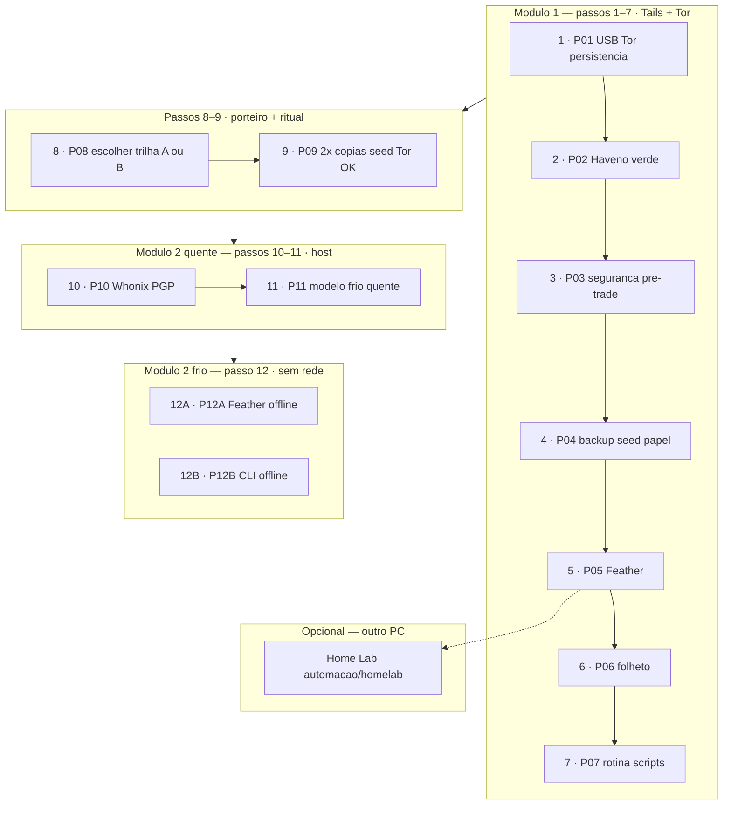
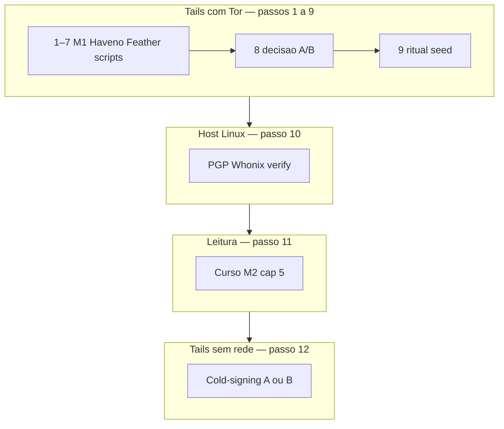

# Diagrama mestre — modos do hub (FIG-1)

> **Figura canônica** — outras páginas devem **linkar** aqui, não redesenhar com nomes diferentes.  
> **v2:** cartões → [passos/](../passos/README.md) · comandos → [processos/](../../processos/README.md) · livros → [modulos/](../../modulos/m1-tails-haveno/README.md).

---

## Trilha completa 1–12 (P01–P12)



---

## Visão por módulo e rede (compacta)



---

## Tabela rede × passo

| Passo | Processo | Onde roda | Rede | Ferramenta principal |
|:-----:|:--------:|-----------|------|----------------------|
| 1 | P01 | Tails | **Tor** | USB · persistência |
| 2 | P02 | Tails | **Tor** | Haveno → verde |
| 3 | P03 | Tails | **Tor** | Leitura Cap. 4 |
| 4 | P04 | Tails | **Tor** | Backup · seed papel |
| 5 | P05 | Tails | **Tor** | Feather |
| 6 | P06 | — | — | Folheto |
| 7 | P07 | Tails | **Tor** | Scripts `automacao/tails/` |
| 8 | P08 | Leitura | Tor OK | Escolha trilha A/B |
| 9 | P09 | Tails | **Tor** (OK) | Ritual 2× seed |
| 10 | P10 | **Host** | Internet | `whonix-verify-image.sh` |
| 11 | P11 | Leitura | — | Curso M2 §5 |
| 12 | P12A/B | Tails | **Sem rede** | Feather **ou** CLI |

Cartões: [passos/](../passos/README.md) · Comandos: [processos/](../../processos/README.md)

---

<a id="fig-3-usb-frio-quente"></a>

## O que cruza por USB (passo 12) — FIG-3

```text
  TAILS offline (FRIO)              WHONIX online (QUENTE)
  carteira COMPLETA                 view-only
        │  outputs / tx unsigned ──────►│
        │◄──── tx signed ─────────────────│
   ASSINA aqui                    TRANSMITE via Tor
```

Detalhe: [Trilha A](../../modulos/m2-whonix-custodia/Trilha-A-Feather/Playbook-Feather-GUI.md) · [Trilha B](../../modulos/m2-whonix-custodia/Trilha-B-CLI/Playbook-monero-wallet-cli.md)

---

## Links

- [Glossário online/offline](glossario.md) — FIG-2
- [Cartões por passo](../passos/README.md)
- [Trilhas por modo](../trilhas/README.md)
- [Arquitetura v2 do repo](../../README.md#como-o-hub-esta-organizado-v2) — FIG-4

---

*FIG-1 · trilha/mapa-modos · v2 · mai/2026*
