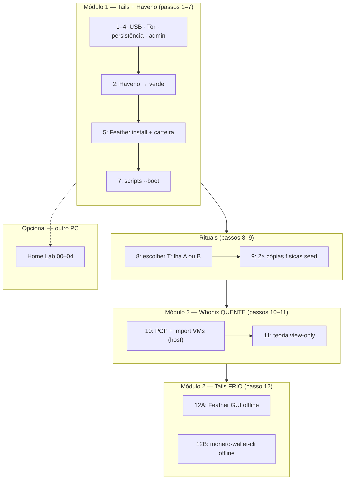

# Diagrama mestre — modos do hub (FIG-1)

> **Figura canônica** — outras páginas devem **linkar** aqui, não redesenhar com nomes diferentes.

---

## Visão por módulo e rede



---

## Tabela rede × passo

| Passo | Onde roda | Rede | Ferramenta principal |
|:-----:|-----------|------|----------------------|
| 1–7 | Tails | **Tor** | Haveno · Feather |
| 8 | Leitura | — | Decisão A/B |
| 9 | Tails | **Tor** (OK) | Ritual papel |
| 10 | **Host** Linux | Internet | `whonix-verify-image.sh` |
| 11 | Leitura | — | Curso M2 §5 |
| 12 | Tails | **Sem rede** | Feather **ou** CLI |

---

## O que cruza por USB (passo 12)

```text
  TAILS offline (FRIO)              WHONIX online (QUENTE)
  carteira COMPLETA                 view-only
        │  outputs / tx unsigned ──────►│
        │◄──── tx signed ─────────────────│
   ASSINA aqui                    TRANSMITE via Tor
```

Detalhe: [Trilha A](../../modulos/m2-whonix-custodia/Trilha-A-Feather/Playbook-Feather-GUI.md) · [Trilha B](../../modulos/m2-whonix-custodia/Trilha-B-CLI/Playbook-monero-wallet-cli.md)

---

## Links

- [Glossário](glossario.md)
- [Cartões por passo](../passos/README.md)
- [Trilhas por modo](../trilhas/README.md)

---

*FIG-1 · trilha/mapa-modos · jun/2026*
